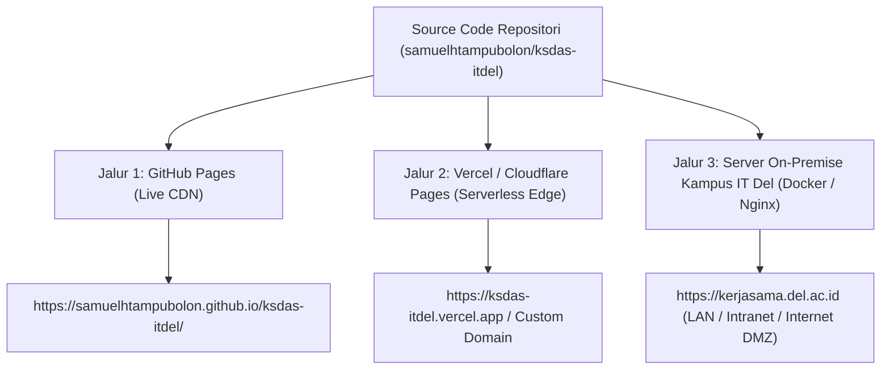
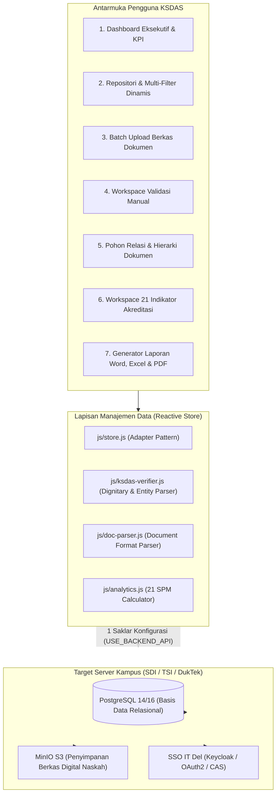

# KSDAS IT DEL &bull; Kerja Sama Data & Analytics System
### Sistem Informasi Manajemen Dokumen Kemitraan & Basis Data Tata Kelola Kerjasama On-Premise Institut Teknologi Del

<p align="center">
  
  
  
  
  
  
  
</p>

<p align="center">
  <strong>Platform Terpadu Sistem Informasi Manajemen Kemitraan Strategis, Repositori Basis Data Naskah Perjanjian, Pemantauan Masa Berlaku Kontrak, dan Pemetaan 21 Indikator Akreditasi SPM / AMI Institut Teknologi Del (IT Del), Sitoluama, Laguboti, Kabupaten Toba.</strong><br>
  <em>Solusi basis data relasional on-premise kampus untuk kedaulatan data hukum, menggantikan ketergantungan riskan pada Google Drive, OneDrive, Google Sheets, Microsoft 365, maupun Notion.</em>
</p>

<p align="center">
  🌐 <strong>Live Demo GitHub Pages:</strong> <a href="https://samuelhtampubolon.github.io/ksdas-itdel/">https://samuelhtampubolon.github.io/ksdas-itdel/</a> &bull;
  📂 <strong>Panduan Uji Coba Dokumen Sendiri:</strong> <a href="https://github.com/samuelhtampubolon/ksdas-itdel/blob/main/docs/PANDUAN_UJI_COBA_DOKUMEN_LOKAL.md">docs/PANDUAN_UJI_COBA_DOKUMEN_LOKAL.md</a> &bull;
  ⚡ <strong>Panduan Delivery & Deployment:</strong> <a href="https://github.com/samuelhtampubolon/ksdas-itdel/blob/main/docs/PANDUAN_DELIVERY_DEPLOYMENT.md">docs/PANDUAN_DELIVERY_DEPLOYMENT.md</a> &bull;
  🏛️ <strong>Panduan Integrasi SDI/TSI:</strong> <a href="https://github.com/samuelhtampubolon/ksdas-itdel/blob/main/docs/PANDUAN_INTEGRASI_SDI_TSI.md">docs/PANDUAN_INTEGRASI_SDI_TSI.md</a> &bull;
  ⚖️ <strong>Berkas Pendaftaran Hak Cipta DJKI:</strong> <a href="https://github.com/samuelhtampubolon/ksdas-itdel/blob/main/docs/HAK_CIPTA_LEGAL_DJKI.md">docs/HAK_CIPTA_LEGAL_DJKI.md</a>
</p>

---

## 🏛️ Mengapa Google Drive, OneDrive, Google Sheets, M365 & Notion Tidak Ideal untuk Kasus Ini?

Dalam tata kelola kemitraan perguruan tinggi dan akreditasi institusi, dokumen kerja sama (MoU, MoA/PKS, Implementation Arrangement) adalah **dokumen hukum resmi berkekuatan perdata** yang mengikat institusi dengan pihak luar. Mengandalkan penyimpanan awan publik (*public cloud storage*) seperti Google Drive, OneDrive, spreadsheet Google Sheets / Excel, Microsoft 365, atau Notion memiliki kelemahan mendasar:

```mermaid
graph TD
    subgraph Masalah_Cloud_Publik ["Risiko Penggunaan Google Drive / OneDrive / Google Sheets / Notion"]
        M1["1. Fragmentasi Berkas & Data Silos (File terpisah di folder pribadi dosen/staf)"]
        M2["2. Ketiadaan Integritas Relasional (MoU Induk tidak terhubung otomatis ke PKS dan IA)"]
        M3["3. Kehilangan Metadata Akreditasi (Hanya menyimpan nama file, tanpa 21 indikator SPM/BAN-PT)"]
        M4["4. Risiko Hukum & Kebocoran Data Sensitif (NIK pejabat, nomor rekening, klausul rahasia di cloud pihak ketiga)"]
        M5["5. Tidak Ada Jejak Audit Sah (Siapa yang memvalidasi pejabat dan mengesahkan data resmi)"]
    end

    subgraph Solusi_KSDAS_OnPremise ["Keunggulan KSDAS On-Premise Kampus IT Del"]
        S1["Basis Data Relasional Terpusat (PostgreSQL / MariaDB Internal IT Del)"]
        S2["Hierarki Dokumen Otomatis (MoU -> PKS -> IA -> Laporan Kegiatan Terhubung Nyata)"]
        S3["Pemetaan Langsung ke 21 Indikator Akreditasi SPM / LAM-INFOKOM"]
        S4["Kedaulatan Penuh Data Kampus (Server Lokal Intranet SDI/TSI, Zero Data Leakage)"]
        S5["Ekspor Resmi Ber-Kop Surat Langsung ke Microsoft Word (.doc), Excel (.xls), dan PDF (.pdf)"]
    end

    M1 & M2 & M3 & M4 & M5 -.->|"KSDAS Menggantikan & Menyempurnakan"| S1 & S2 & S3 & S4 & S5
```



| Aspek Tata Kelola | Google Drive / OneDrive / Sheets / Notion | KSDAS IT Del (Sistem Informasi On-Premise) |
| :--- | :--- | :--- |
| **Penyimpanan & Kedaulatan Data** | Cloud publik pihak ketiga (server luar negeri, tunduk pada kebijakan vendor komersial). | **Server lokal internal kampus IT Del** di bawah kendali penuh Direktorat SDI / TSI / DukTek. |
| **Struktur Relasi Dokumen** | Parsial / tidak ada. Berkas MoU terpisah dari berkas PKS turunannya. | **Relasional ketat**: Pohon silsilah naskah kerja sama (`Mitra` $\rightarrow$ `MoU` $\rightarrow$ `PKS` $\rightarrow$ `IA` $\rightarrow$ `Kegiatan`). |
| **Kesiapan Audit Akreditasi** | Manual & menyita waktu berhari-hari untuk merekap tabel. | **Otomatis seketika**: Menghitung 21 indikator SPM, rasio DTPS, dan persentase PDDikti / MBKM. |
| **Proteksi Nama Pejabat Sah** | Tidak ada filter verifikasi identitas pejabat. | **Zero-Hallucination Name Verification**: Memblokir data instansi/tim agar tidak disalahartikan sebagai orang. |
| **Format Unduhan Luaran** | Link publik atau spreadsheet mentah rawan rusak. | **Dokumen resmi institusi**: Word (.doc) ber-Kop Surat Del, Excel (.xls) 20 kolom terstruktur, dan PDF (.pdf). |

---

## 📢 Berita & Pembaruan Rilis Terkini

- **[2026-10-03] 🏛️ Transformasi Murni ke Sistem Informasi & Basis Data Konvensional:** Menghapus seluruh konsep dan ketergantungan pada AI, ML, dan OCR. Platform kini beroperasi murni sebagai Sistem Informasi Manajemen (SIM) Kerjasama dan basis data relasional perguruan tinggi yang kokoh, terstruktur, dan mudah dipahami.
- **[2026-10-03] 📁 10 Dokumen Naskah Resmi Terverifikasi:** Menyederhanakan data contoh menjadi tepat **10 naskah kerja sama utama** yang nyata, berbobot, dan representatif bagi IT Del (mencakup Huawei, Bank Mandiri, UTM Malaysia, Pemprov Sumut, Astra International, Pemkab Toba, PT Telkom Indonesia, SMK Negeri 1 Laguboti, PT Toba Pulp Lestari, dan Microsoft Asia Pacific).
- **[2026-10-03] 🛡️ Verifikasi Nama Pejabat Sah (*Zero-Hallucination*):** Deteksi identitas pejabat mitra dan penandatangan IT Del dengan blacklist instansi/panitia ketat. Dokumen tanpa penandatangan sah diwajibkan melalui verifikasi manual dan diblokir dari persetujuan instan (*approval gate*).
- **[2026-10-03] 📊 10 Editable Fields Baru & Dasbor 21 Indikator Akreditasi:** Penambahan 10 parameter akreditasi pada formulir validasi manual serta peluncuran dasbor 21 Indikator SPM / LAM-INFOKOM (rasio DTPS, MBKM, PDDikti %, tindak lanjut MoU ke PKS, dan filter prodi S1 Informatika).
- **[2026-10-03] 📥 Unduhan Resmi Word, Excel, dan PDF (Bukan JSON):** Menghapus opsi unduhan JSON mentah bagi pengguna akhir dan menggantinya dengan generator dokumen Word (.doc) ber-Kop Surat IT Del, Excel (.xls) matriks 20 kolom, dan PDF (.pdf) siap cetak.

---

## 📑 Daftar Isi

1. [Mulai Cepat (Quick Start dalam 1 Menit)](#-mulai-cepat-quick-start-dalam-1-menit)
2. [Pilihan Jalur Delivery Sistem](#-pilihan-jalur-delivery-sistem)
3. [Daftar 10 Naskah Kerja Sama Resmi IT Del](#-daftar-10-naskah-kerja-sama-resmi-it-del)
4. [Arsitektur Solusi & Alur Data On-Premise](#-arsitektur-solusi--alur-data-on-premise)
5. [Fitur-Fitur Utama Sistem Informasi KSDAS](#-fitur-fitur-utama-sistem-informasi-ksdas)
6. [Panduan Integrasi untuk Tim SDI / TSI / DukTek IT Del](#-panduan-integrasi-untuk-tim-sdi--tsi--duktek)
7. [Keamanan Siber & Perlindungan Data](#-keamanan-siber--perlindungan-data)
8. [Dokumen Legal Pengajuan Hak Cipta (DJKI Kemenkumham)](#-dokumen-legal-pengajuan-hak-cipta-djki-kemenkumham)
9. [Tata Kelola, Hak Cipta & Lisensi](#-tata-kelola-hak-cipta--lisensi)

---

## ⚡ Mulai Cepat (Quick Start dalam 1 Menit)

Prototipe ini dirancang sebagai **Zero-Build Application** (HTML5, Vanilla CSS, dan ES6 Modular), sehingga dapat dijalankan seketika tanpa memerlukan kompilasi rumit seperti `npm run build`.

### Opsi A: Akses Demo Langsung di Peramban (Tanpa Instalasi)
Buka langsung melalui peramban:  
👉 **[https://samuelhtampubolon.github.io/ksdas-itdel/](https://samuelhtampubolon.github.io/ksdas-itdel/)**

### Opsi B: Menjalankan Secara Lokal di Komputer Anda
```bash
# 1. Kloning repositori
git clone https://github.com/samuelhtampubolon/ksdas-itdel.git
cd ksdas-itdel

# 2. Jalankan server lokal sederhana (pilih salah satu)
python -m http.server 8080      # Menggunakan Python 3
# atau: npx serve .             # Menggunakan Node.js
# atau: php -S localhost:8080   # Menggunakan PHP

# 3. Kunjungi http://localhost:8080 pada peramban Anda
```

---

## 🌐 Pilihan Jalur Delivery Sistem

Sistem mendukung 3 metode pengiriman (*delivery*) produksi selain localhost:



| Metode Delivery | Tipe Infrastruktur | Kesiapan | URL Akses |
| :--- | :--- | :---: | :--- |
| **1. GitHub Pages** | Global CDN Edge (Static) | ✅ **Aktif Langsung** | [samuelhtampubolon.github.io/ksdas-itdel/](https://samuelhtampubolon.github.io/ksdas-itdel/) |
| **2. Vercel Edge** | Serverless Edge (Bukan Localhost) | ✅ **Siap 1-Click (`vercel.json`)** | Otomatis di `https://[nama-proyek].vercel.app` |
| **3. Server Kampus IT Del** | Docker Compose On-Premise (LAN & DMZ) | ⚙️ **Siap Deploy (`docker-compose.yml`)** | `https://kerjasama.del.ac.id` |

*Panduan teknis konfigurasi lengkap tersedia di [docs/PANDUAN_DELIVERY_DEPLOYMENT.md](https://github.com/samuelhtampubolon/ksdas-itdel/blob/main/docs/PANDUAN_DELIVERY_DEPLOYMENT.md).*

---

## 📂 Daftar 10 Naskah Kerja Sama Resmi IT Del

Sistem ini dikonfigurasikan dengan **10 naskah kerja sama utama** yang realistis dan mencakup seluruh tingkatan kerjasama (Internasional, Nasional, Wilayah/Lokal), multi-fakultas, multi-prodi, dan multi-WR:

1. **PT Huawei Tech Investment** (`DOC-2024-MOU-001`): MoU Tingkat Internasional, FITE (S1 Informatika & SI), WR 3 & WR 1, Beasiswa Talenta Digital & Sertifikasi HCIA.
2. **Universiti Teknologi Malaysia (UTM)** (`DOC-2024-MOU-002`): MoU Tingkat Internasional, FITE (S1 Informatika & TE), Joint Research, Student Exchange, dan Pembimbingan Tugas Akhir.
3. **PT Bank Mandiri (Persero) Tbk** (`DOC-2024-MOA-003`): PKS Tingkat Nasional, FTI & FITE (S1 MR & SI), Beasiswa Ikatan Dinas & Laboratorium Perbankan Digital.
4. **Pemerintah Provinsi Sumatera Utara** (`DOC-2024-MOA-004`): PKS Tingkat Wilayah/Lokal, FITE & FB, Digitalisasi Promosi Pariwisata & GIS Budaya Danau Toba.
5. **PT Astra International Tbk** (`DOC-2024-IA-005`): Implementation Arrangement (IA) Tingkat Nasional, FTI & FITE, Program Magang MBKM 20 SKS & Rekrutmen Kampus.
6. **Pemerintah Kabupaten Toba** (`DOC-2025-MOU-006`): MoU Tingkat Wilayah/Lokal, Seluruh Fakultas, Sinergi Tri Dharma, Smart Regency, dan PkM Danau Toba.
7. **PT Telkom Indonesia (Persero) Tbk** (`DOC-2025-MOA-007`): PKS Tingkat Nasional, FITE (S1 TE & IF), Riset Bersama Jaringan Sensor IoT Kualitas Air Danau Toba.
8. **SMK Negeri 1 Laguboti** (`DOC-2025-IA-008`): IA Tingkat Wilayah/Lokal, FITE (S1 IF), Pelatihan Pemrograman Berkelanjutan & Literasi Digital Siswa Kejuruan.
9. **PT Toba Pulp Lestari Tbk** (`DOC-2025-MOA-009`): PKS Tingkat Wilayah/Lokal, FB (S1 Bioteknologi), Riset Pemanfaatan Biomassa Serat Kayu untuk Bioplastik.
10. **Microsoft Asia Pacific** (`DOC-2026-MOU-010`): MoU Tingkat Internasional, FITE (S1 IF & SI), Kurikulum Perangkat Lunak Skala Global & Akselerasi Cloud Computing.

---

## 🏛️ Arsitektur Solusi & Alur Data On-Premise

Sistem menerapkan arsitektur modular yang memisahkan antarmuka pengguna, *state management* reaktif, dan lapisan penyimpanan data kampus:



---

## 🎯 Fitur-Fitur Utama Sistem Informasi KSDAS

1. **Role-Based Access Control (RBAC):** Simulasi 8 peran institusi (Staf Kerja Sama, Kepala Biro, WR 3, Rektor/Dekan, SPM, Fakultas, Prodi, Unit Internal).
2. **Dashboard Eksekutif & Peringatan Kontrak:** Kartu metrik KPI, bilah peringatan masa berlaku kritis (<90 hari), dan status implementasi naskah.
3. **Master Direktori Mitra:** Basis data direktori mitra terstruktur (Industri, BUMN, Perguruan Tinggi, Pemerintah, Yayasan) beserta kontak PIC.
4. **Repositori Naskah Terpusat:** Repositori pencarian cepat dokumen dengan multi-filter dinamis (Tahun, Mitra, Jenis, Status, Multi-Fakultas, Multi-Prodi, Tri Dharma).
5. **Batch Upload Dokumen Mandiri:** Pengunggahan dokumen naskah secara massal dengan pemrosesan lokal di memori peramban tanpa kirim ke cloud pihak ketiga.
6. **Ekstraksi Format Standar:** Pengambilan nomor naskah, judul, nama mitra, tanggal berlaku, anggaran, dan klausul naskah.
7. **Zero-Hallucination Legal NER:** Verifikasi nama pejabat sah yang menolak nama lembaga/tim sebagai orang, dan memberlakukan *Approval Gate* jika nama mitra belum terverifikasi.
8. **Workspace Validasi Manual:** Tinjauan *side-by-side* naskah dokumen asli berdampingan dengan 20 field parameter yang dapat diedit (*editable fields*).
9. **Penugasan Multi-Entitas:** Satu dokumen dapat terhubung ke banyak Fakultas, banyak Prodi, banyak Wakil Rektor, banyak Unit, dan banyak Dharma.
10. **Pohon Relasi Dokumen:** Visualisasi hierarki (`Mitra` $\rightarrow$ `MoU` $\rightarrow$ `PKS` $\rightarrow$ `IA` $\rightarrow$ `Kegiatan`) serta deteksi naskah yatim (*orphan agreement*).
11. **Pelacakan Tri Dharma:** Pemetaan implementasi pada Pendidikan, Penelitian / Riset, Pengabdian kepada Masyarakat (PkM), dan Tata Kelola.
12. **Repositori Bukti Fisik (Evidence):** Pengarsipan bukti pendukung (laporan kegiatan, foto, SK, sertifikat) dengan verifikasi mutu oleh SPM.
13. **Dasbor 21 Indikator Akreditasi & SPM (2026):** Perhitungan komprehensif 21 butir instrumen BAN-PT & LAM-INFOKOM (rasio DTPS, MBKM %, PDDikti %, dan filter Prodi S1 Informatika).
14. **Generator Laporan Resmi Word (.doc):** Pembuatan naskah dosir ber-Kop Surat resmi IT Del dan tabel 20 parameter siap tandatangan.
15. **Ekspor Spreadsheet Rekapitulasi Excel (.xls):** Spreadsheet matriks komprehensif 20 kolom siap audit.
16. **Cetak / Ekspor PDF Resmi (.pdf):** Format dokumen cetak resmi berstandar lembar evaluasi penjaminan mutu SPM / AMI.
17. **Audit Trail Mutlak:** Catatan riwayat transaksi yang mencatat tanggal, jam, pengguna, dan histori koreksi data.

---

## 🔌 Panduan Integrasi untuk Tim SDI / TSI / DukTek

Dokumen teknis telah disiapkan agar tim teknis kampus dapat **dengan sangat mudah menjelaskan, memahami, dan mengintegrasikan sistem** ke server kampus IT Del:

- Panduan integrasi teknis lengkap: [`docs/PANDUAN_INTEGRASI_SDI_TSI.md`](https://github.com/samuelhtampubolon/ksdas-itdel/blob/main/docs/PANDUAN_INTEGRASI_SDI_TSI.md).
- Skrip skema database PostgreSQL 18 tabel: [`docs/schema_production_postgres.sql`](https://github.com/samuelhtampubolon/ksdas-itdel/blob/main/docs/schema_production_postgres.sql).
- Konfigurasi server Docker Compose: [`docker-compose.yml`](https://github.com/samuelhtampubolon/ksdas-itdel/blob/main/docker-compose.yml).
- Konfigurasi Web Server Reverse Proxy: [`nginx.conf`](https://github.com/samuelhtampubolon/ksdas-itdel/blob/main/nginx.conf).

---

## 🛡️ Keamanan Siber & Perlindungan Data

- **Zero Data Leakage:** Berkas yang diunggah diproses secara aman di sisi klien pada memori lokal pengguna tanpa dikirimkan ke server publik luar.
- **Kepatuhan Regulasi:** Memenuhi standar kedaulatan data dan privasi sesuai UU Perlindungan Data Pribadi (UU PDP No. 27/2022).
- **Laporan Evaluasi Keamanan Siber:** Tersedia pada berkas [`docs/CYBERSECURITY_AUDIT.md`](https://github.com/samuelhtampubolon/ksdas-itdel/blob/main/docs/CYBERSECURITY_AUDIT.md).

---

## ⚖️ Dokumen Legal Pengajuan Hak Cipta (DJKI Kemenkumham)

Karya cipta program komputer ini telah dilengkapi berkas administratif lengkap untuk permohonan Surat Pencatatan Ciptaan ke Direktorat Jenderal Kekayaan Intelektual (DJKI) Kementerian Hukum dan HAM Republik Indonesia:
- **Judul Ciptaan:** KSDAS IT Del - Program Komputer Tata Kelola Kemitraan Strategis, Repositori Naskah Kerja Sama, dan Pemetaan Akreditasi
- **Pencipta & Pemegang Hak Cipta:** Samuel Hasudungan Tampubolon
- **Tahun Pertama Diumumkan:** 2026 (Sitoluama, Laguboti, Toba)
- **Dokumentasi Lengkap:** [`docs/HAK_CIPTA_LEGAL_DJKI.md`](https://github.com/samuelhtampubolon/ksdas-itdel/blob/main/docs/HAK_CIPTA_LEGAL_DJKI.md)

---

## 📄 Tata Kelola, Hak Cipta & Lisensi

Seluruh kode sumber, arsitektur data, kamus metadata, dan dokumentasi sistem ini dilindungi hak cipta:

**Copyright &copy; 2026 Samuel Hasudungan Tampubolon. All rights reserved.**  
*Institut Teknologi Del, Jl. Sisingamangaraja, Sitoluama, Laguboti, Kabupaten Toba, Sumatera Utara 22381.*
