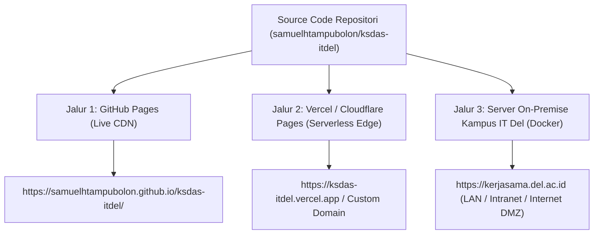
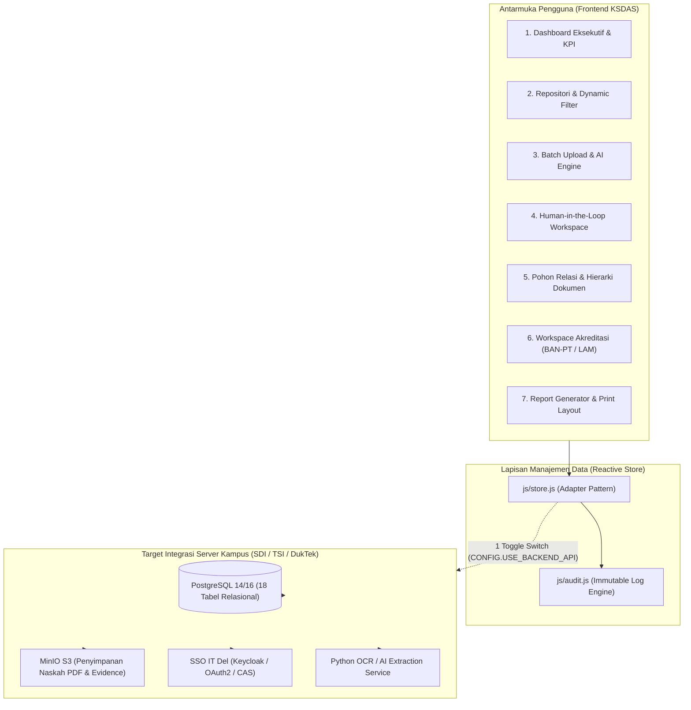
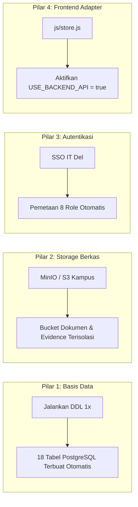

# KSDAS IT DEL &bull; Kerja Sama Data & Analytics System

<p align="center">
  
  
  
  
  
  
  
  
</p>

<p align="center">
  <strong>Platform Terpadu Tata Kelola Kemitraan Strategis, Repositori Naskah Perjanjian, Ekstraksi Metadata AI, Pemantauan Masa Berlaku, dan Pemetaan Instrumen Akreditasi Institut Teknologi Del (IT Del), Laguboti, Kabupaten Toba.</strong><br>
  <em>Dirancang untuk transisi mulus dan integrasi mudah ke infrastruktur server Direktorat SDI / TSI / DukTek IT Del, baik pada jaringan lokal (intranet/LAN) maupun jaringan internet publik.</em>
</p>

<p align="center">
  🌐 <strong>Live Demo GitHub Pages:</strong> <a href="https://samuelhtampubolon.github.io/ksdas-itdel/">https://samuelhtampubolon.github.io/ksdas-itdel/</a> &bull;
  ⚡ <strong>Panduan Delivery & Deployment:</strong> <a href="docs/PANDUAN_DELIVERY_DEPLOYMENT.md">docs/PANDUAN_DELIVERY_DEPLOYMENT.md</a> &bull;
  🏛️ <strong>Panduan Integrasi SDI/TSI:</strong> <a href="docs/PANDUAN_INTEGRASI_SDI_TSI.md">docs/PANDUAN_INTEGRASI_SDI_TSI.md</a> &bull;
  ⚖️ <strong>Berkas Pendaftaran Hak Cipta DJKI:</strong> <a href="docs/HAK_CIPTA_LEGAL_DJKI.md">docs/HAK_CIPTA_LEGAL_DJKI.md</a>
</p>

---

## 📢 Berita & Pembaruan Terkini (News & Release Highlights)

- **[2026-10-03] 📱 Mobile Optimization & Smartphone Native Experience:** Antarmuka disempurnakan secara menyeluruh untuk perangkat ponsel pintar (*smartphone*): laci navigasi *off-canvas* dengan efek *backdrop blur*, penutupan otomatis laci saat bernavigasi, *touch target* 44px, kartu KPI adaptif, serta tabel dengan pengguliran horizontal lancar (*smooth touch momentum*).
- **[2026-10-03] 🌐 Multi-Channel Delivery Ready (Bukan Localhost):** Selain GitHub Pages, sistem kini mendukung opsi delivery serverless instan melalui **Vercel / Cloudflare Pages** ([`vercel.json`](vercel.json)) dan penerapan server on-premise kampus IT Del via **Docker Compose** ([`docker-compose.yml`](docker-compose.yml)).
- **[2026-10-03] ⚖️ Kesiapan Berkas Pengajuan Hak Cipta Resmi DJKI:** Telah disusun berkas legal formal pengajuan Hak Cipta Program Komputer ke Ditjen KI Kemenkumham RI ([`docs/HAK_CIPTA_LEGAL_DJKI.md`](docs/HAK_CIPTA_LEGAL_DJKI.md)) atas nama **Samuel Hasudungan Tampubolon**.
- **[2026-10-03] 🛡️ Laporan Audit Keamanan Siber & Bebas Bahaya:** Diterbitkan sertifikasi evaluasi keamanan ([`docs/CYBERSECURITY_AUDIT.md`](docs/CYBERSECURITY_AUDIT.md)) yang menjamin sistem *zero harm to local environment*, 100% bebas malware/trojan, bebas jejak berbahaya, aman pada jaringan lokal maupun internet, dan patuh UU PDP No. 27/2022.
- **[2026-10-03] 🚀 Kesiapan Handoff Server Kampus (SDI/TSI/DukTek):** Paket integrasi server resmi telah siap pakai, mencakup skrip migrasi DDL PostgreSQL 18 tabel ([`docs/schema_production_postgres.sql`](docs/schema_production_postgres.sql)), konfigurasi lingkungan ([`.env.example`](.env.example)), dan reverse proxy ([`nginx.conf`](nginx.conf)).

---

## 📑 Daftar Isi

1. [Mulai Cepat (Quick Start dalam 1 Menit)](#-mulai-cepat-quick-start-dalam-1-menit)
2. [Pilihan Jalur Delivery (GitHub Pages, Cloud Edge, & Server Kampus)](#-pilihan-jalur-delivery-sistem)
3. [Latar Belakang & Nilai Tambah Sistem](#-latar-belakang--nilai-tambah-sistem)
4. [Arsitektur Solusi & Alur Data](#-arsitektur-solusi--alur-data)
5. [23 Fitur Wajib yang Telah Terimplementasi](#-23-fitur-wajib-yang-telah-terimplementasi)
6. [Panduan Integrasi untuk Tim SDI / TSI / DukTek IT Del](#-panduan-integrasi-untuk-tim-sdi--tsi--duktek)
7. [Kesiapan & Keindahan Antarmuka Mobile (UI/UX Smartphone)](#-kesiapan--keindahan-antarmuka-mobile-uiux-smartphone)
8. [Keamanan Siber & Perlindungan Data (Cybersecurity & Safety Clearance)](#-keamanan-siber--perlindungan-data)
9. [Skenario Pengujian Penerimaan (Acceptance Demo)](#-skenario-pengujian-penerimaan-acceptance-demo)
10. [Dokumen Legal Pengajuan Hak Cipta (DJKI Kemenkumham)](#-dokumen-legal-pengajuan-hak-cipta-djki-kemenkumham)
11. [Daftar Dokumentasi Lengkap Repositori](#-daftar-dokumentasi-lengkap-repositori)
12. [Tata Kelola, Hak Cipta & Lisensi](#-tata-kelola-hak-cipta--lisensi)

---

## ⚡ Mulai Cepat (Quick Start dalam 1 Menit)

Prototipe ini dirancang sebagai **Zero-Build Application** (HTML5, Vanilla CSS, dan ES6 Modular), sehingga dapat dijalankan seketika tanpa memerlukan kompilasi rumit seperti `npm run build`.

### Opsi A: Akses Demo Langsung di Peramban (Tanpa Instalasi)
Buka langsung melalui peramban:  
👉 **[https://samuelhtampubolon.github.io/ksdas-itdel/](https://samuelhtampubolon.github.io/ksdas-itdel/)**

### Opsi B: Menjalankan Secara Lokal di Komputer Anda
```bash
# 1. Kloning repositori
git clone https://github.com/samuelhtampubolon/ksdas-itdel.git
cd ksdas-itdel

# 2. Jalankan server lokal sederhana (pilih salah satu)
python -m http.server 8080      # Menggunakan Python 3
# atau: npx serve .             # Menggunakan Node.js
# atau: php -S localhost:8080   # Menggunakan PHP

# 3. Buka di peramban
# Kunjungi http://localhost:8080
```

---

## 🌐 Pilihan Jalur Delivery Sistem

Sistem mendukung 3 metode pengiriman (*delivery*) produksi selain localhost:



| Metode Delivery | Tipe Infrastruktur | Kesiapan | URL Akses |
| :--- | :--- | :---: | :--- |
| **1. GitHub Pages** | Global CDN Edge (Static) | ✅ **Aktif Langsung** | [samuelhtampubolon.github.io/ksdas-itdel/](https://samuelhtampubolon.github.io/ksdas-itdel/) |
| **2. Vercel Edge** | Serverless Edge (Bukan Localhost) | ✅ **Siap 1-Click (`vercel.json`)** | Otomatis di `https://[nama-proyek].vercel.app` |
| **3. Server Kampus IT Del** | Docker Compose On-Premise (LAN & DMZ) | ⚙️ **Siap Deploy (`docker-compose.yml`)** | `https://kerjasama.del.ac.id` |

*Panduan teknis konfigurasi lengkap tersedia di [docs/PANDUAN_DELIVERY_DEPLOYMENT.md](docs/PANDUAN_DELIVERY_DEPLOYMENT.md).*

---

## 📌 Latar Belakang & Nilai Tambah Sistem

Unit Kerja Sama Institut Teknologi Del mengelola portofolio kemitraan aktif dengan mitra industri terkemuka (Huawei, Microsoft, PT Astra International, Bank Mandiri), perguruan tinggi mitra (ITB, UI, National University of Singapore), serta instansi pemerintah (Pemkab Toba, Pemprov Sumut).

Sebelum adanya KSDAS, pengelolaan naskah kerja sama menghadapi kendala berkas yang tersebar, proses rekapitulasi data akreditasi SPM/Prodi yang memakan waktu berhari-hari, serta sulitnya mendeteksi naskah yang mendekati masa kedaluwarsa. KSDAS mentransformasikan proses manual tersebut menjadi alur data cerdas:

$$\mathbf{DOCUMENTS} \longrightarrow \mathbf{STRUCTURED\ DATA} \longrightarrow \mathbf{INFORMATION} \longrightarrow \mathbf{ANALYTICS} \longrightarrow \mathbf{EVIDENCE} \longrightarrow \mathbf{REPORT}$$

---

## 🏛️ Arsitektur Solusi & Alur Data

Sistem menerapkan arsitektur modular yang memisahkan lapisan presentasi antarmuka, *state management* reaktif, dan lapisan penyimpanan data:



---

## 🎯 23 Fitur Wajib yang Telah Terimplementasi

| No | Modul Fungsional | Deskripsi Kemampuan | Status |
| :---: | :--- | :--- | :---: |
| 1 | **Role-Based Demo Access** | Simulasi 8 peran institusi (Staf, Kabiro, WR3, Rektor/Dekan, SPM, Fakultas, Prodi, Unit) | ✅ 100% |
| 2 | **Dashboard Eksekutif** | Kartu metrik KPI, bilah peringatan masa berlaku kritis (<90 hari), dan *Implementation Funnel* | ✅ 100% |
| 3 | **Master Mitra** | Direktori mitra terstruktur (Industri swasta, BUMN, PT, Pemda, Yayasan) beserta kontak PIC | ✅ 100% |
| 4 | **Repositori Dokumen** | Manajemen terpadu naskah perjanjian dengan multi-filter dinamis, sortir, dan rincian lengkap | ✅ 100% |
| 5 | **Batch Upload AI** | Pengunggahan banyak file sekaligus (*multi-select/drag-drop*) dengan **10 Dokumen Sampel IT Del** | ✅ 100% |
| 6 | **Klasifikasi Cerdas** | Pendeteksian tipe naskah otomatis (`MOU_LOI`, `PKS_MOA`, `IA`, `PROPOSAL`, `FINAL_REPORT`) | ✅ 100% |
| 7 | **Ekstraksi 26 Field** | Penangkapan nomor naskah, perihal, penandatangan mitra/Del, masa berlaku, anggaran, luaran | ✅ 100% |
| 8 | **Confidence Score** | Persentase keyakinan ekstraksi AI (0-100%) disertai nomor halaman dan kutipan naskah sumber | ✅ 100% |
| 9 | **Human-in-the-Loop Validation** | Tinjauan *side-by-side* teks berkas vs formulir koreksi, approval bertingkat, dan *Bulk Approve* | ✅ 100% |
| 10 | **Pohon Relasi Dokumen** | Visualisasi hierarki (`Mitra` &rarr; `MoU` &rarr; `PKS` &rarr; `IA` &rarr; `Laporan`) & deteksi dokumen yatim (*orphan*) | ✅ 100% |
| 11 | **Pelacakan Tri Dharma** | Pemantauan implementasi pada bidang Pendidikan, Penelitian & Inovasi, PKM, dan Tata Kelola | ✅ 100% |
| 12 | **Output, Outcome & Impact** | Pencatatan luaran terukur (sertifikasi industri, publikasi Scopus, penyerapan kerja lulusan) | ✅ 100% |
| 13 | **Repositori Bukti Fisik (Evidence)** | Pengarsipan bukti pendukung (sertifikat, foto, SK, draf artikel) dengan verifikasi oleh SPM | ✅ 100% |
| 14 | **Analitik Tabulasi Silang** | Matriks Fakultas vs Tri Dharma, pemantauan masa berlaku (*expiry*), dan analisis *follow-up gap* | ✅ 100% |
| 15 | **Penyaringan Dinamis** | Filter instan gabungan (Tahun, Mitra, Tipe Dokumen, Status, Fakultas, Prodi, Tri Dharma, PIC) | ✅ 100% |
| 16 | **Visualisasi Interaktif** | Grafik tren tahunan, diagram donat Tri Dharma, dan distribusi kategori mitra berbasis Chart.js | ✅ 100% |
| 17 | **Generator Laporan Resmi** | Cetak Laporan Eksekutif WR3/Rektor dan Paket Bukti Akreditasi siap cetak (*Print/PDF layout*) | ✅ 100% |
| 18 | **Workspace Akreditasi & AMI** | Pemetaan otomatis naskah dan bukti ke instrumen BAN-PT (IAPS 4.0 / IAPT 3.0) & LAM-INFOKOM | ✅ 100% |
| 19 | **Pusat Pemberitahuan** | Notifikasi kontrak mendekati kedaluwarsa (<90 hari), naskah pending validasi, dan orphan alert | ✅ 100% |
| 20 | **Audit Trail Mutlak** | Rekam jejak transaksi sistem mencatat tanggal, jam, pengguna, dan riwayat revisi data | ✅ 100% |
| 21 | **Natural Language Query (AI)** | Parser kueri bahasa alami Indonesia menerjemahkan teks bebas menjadi parameter filter repositori | ✅ 100% |
| 22 | **Ekspor & Impor Cadangan JSON** | Pencadangan penuh (*full-state backup*) dan pemulihan data instan dengan proteksi validasi skema | ✅ 100% |
| 23 | **Reset Basis Data Demo** | Pengembalian basis data peramban ke kondisi awal otentik kampus IT Del Sitoluama Laguboti | ✅ 100% |

---

## 🔌 Panduan Integrasi untuk Tim SDI / TSI / DukTek

Dokumen ini disusun agar tim teknis kampus dapat **dengan sangat mudah menjelaskan, memahami, dan mengeksekusi integrasi sistem** ke server kampus IT Del, baik untuk **jaringan lokal (intranet/LAN)** maupun **jaringan internet publik**.

Panduan langkah per langkah yang komprehensif tersedia pada [`docs/PANDUAN_INTEGRASI_SDI_TSI.md`](docs/PANDUAN_INTEGRASI_SDI_TSI.md).

### 4 Pilar Kemudahan Integrasi:



### Langkah Cepat Penerapan di Server Kampus:

#### 1. Eksekusi Skrip Database PostgreSQL (1 Perintah)
```bash
psql -U ksdas_app -d ksdas_db -f docs/schema_production_postgres.sql
```

#### 2. Konfigurasi Lingkungan (`.env`)
Salin template konfigurasi resmi:
```bash
cp .env.example .env
# Sesuaikan kredensial database kampus, MinIO storage, dan SSO IT Del
```

#### 3. Jalankan Kontainer Produksi (Docker Compose)
Seluruh stack server (Nginx Web Server, PostgreSQL 16, dan MinIO S3) aktif dalam satu perintah:
```bash
docker compose up -d
```

#### 4. Menghubungkan Antarmuka ke REST API Kampus
Buka [`js/store.js`](js/store.js), ubah satu baris konfigurasi:
```javascript
const KSDAS_API_CONFIG = {
  USE_BACKEND_API: true, // Diaktifkan saat terhubung ke backend kampus
  API_BASE_URL: "/api/v1"
};
```
Antarmuka UI, grafik analitik, formulir koreksi, dan tampilan laporan langsung terhubung ke database kampus tanpa perlu menulis ulang antarmuka (*Zero UI Re-write*).

---

## 📱 Kesiapan & Keindahan Antarmuka Mobile (UI/UX Smartphone)

Antarmuka KSDAS IT Del telah diuji dan dirancang khusus memenuhi kenyamanan penggunaan pada perangkat ponsel pintar (*mobile phone*):

```
┌──────────────────────────────────────┐
│  ☰ DEL  [Cari...]  [Staf Kerjasama▼] │  <- Header ringkas & hemat ruang
├──────────────────────────────────────┤
│  Peringatan: 2 Kontrak Expiring      │  <- Bilah alert kontras tinggi
├──────────────────────────────────────┤
│  ┌───────────────┐ ┌───────────────┐ │
│  │ 8 Mitra Aktif │ │ 30 Perjanjian │ │  <- KPI Grid 2 kolom responsif
│  └───────────────┘ └───────────────┘ │
│  ┌─────────────────────────────────┐ │
│  │ Tabel Dokumen (Scroll Horizontal│ │  <- Tabel dengan touch-momentum
│  └─────────────────────────────────┘ │
└──────────────────────────────────────┘
```

1. **Laci Navigasi Geser (*Off-Canvas Drawer*):** Menekan tombol hamburger (☰) memunculkan sidebar navigasi dari kiri dengan latar belakang gelap (*backdrop blur overlay*). Mengetuk tautan menu atau mengetuk area luar otomatis menutup laci navigasi secara halus.
2. **Kartu KPI Adaptif:** Berubah otomatis dari 4 kolom di desktop menjadi 2 kolom di tablet/ponsel sedang, dan 1 kolom di ponsel layar kecil.
3. **Pengguliran Tabel Sentuh (*Touch-Friendly Horizontal Scroll*):** Wadah tabel dilengkapi aturan `-webkit-overflow-scrolling: touch` sehingga pengguna ponsel dapat menggeser tabel data yang lebar tanpa merusak lebar layar ponsel.
4. **Modal Validasi Vertikal (*Stacked Responsive Modal*):** Tampilan validasi *side-by-side* secara otomatis ditata vertikal di ponsel (teks OCR di atas, formulir isian di bawah) dengan tinggi fleksibel agar mudah diisi dengan jempol.
5. **Ukuran Sentuh Ergonomis (*Ergonomic Touch Targets*):** Semua tombol dan kontrol seleksi memiliki tinggi minimal 40-44px untuk mencegah salah tekan saat menggunakan ponsel layar sentuh.

---

## 🛡️ Keamanan Siber & Perlindungan Data

Keamanan sistem dan keselamatan perangkat pengguna diverifikasi secara formal dalam [`docs/CYBERSECURITY_AUDIT.md`](docs/CYBERSECURITY_AUDIT.md):

- **Nol Kerusakan pada Perangkat Lokal (*Zero Harm to Host*):** Tidak ada manipulasi registry, tidak ada kode berisiko trojan/miner, tidak ada pembacaan berkas lokal di luar direktori, dan tidak memerlukan akses administrator/root.
- **Pembersihan Jejak Berbahaya (*Erase Dangerous Tracks*):** Berkas `.gitignore` aktif mencegah log debug, berkas `.env`, kredensial privat, dan file temporer masuk ke git.
- **Perlindungan Terhadap Serangan XSS & Injeksi:** Seluruh luaran teks dinamis disanitasi menggunakan `escapeHtml()`.
- **Content Security Policy (CSP):** Membatasi eksekusi skrip hanya dari `'self'` dan CDN resmi yang terverifikasi.
- **Kepatuhan UU PDP No. 27/2022:** Repositori publik hanya menggunakan **data simulasi sintetis** institusi Del tanpa memuat NIK, data keuangan riil, atau klausul rahasia.

---

## 🧪 Skenario Pengujian Penerimaan (Acceptance Demo)

Pengujian fungsional sistem dapat dilakukan mengikuti 4 skenario standar berikut:

```
[Skenario A: Batch Processing & Validasi Staf]
  1. Pilih peran: "Staff Unit Kerja Sama"
  2. Buka menu "Batch Upload AI" -> Klik "Muat 10 Dokumen Sampel Demo"
  3. Klik "Mulai Ekstraksi AI & Deteksi Relasi"
  4. Buka "Validasi Manusia" -> Setujui naskah -> Data masuk ke Dashboard Eksekutif

[Skenario B: Filter Dinamis Multidimensi]
  1. Buka menu "Repositori Dokumen"
  2. Terapkan filter: PKS/MoA + Penelitian + Tahun 2026
  3. Sistem menyaring instan dokumen PKS Riset Astra 2026

[Skenario C: Pemeriksaan Bukti Akreditasi oleh SPM]
  1. Ubah peran di header ke: "SPM (Satuan Penjaminan Mutu)"
  2. Buka "Akreditasi & AMI" -> Pilih framework "LAM-INFOKOM"
  3. Pilih kriteria C.1.4.a -> Klik "Filter Data" untuk meninjau bukti fisik terkait

[Skenario D: Dashboard Monitoring oleh Pimpinan (WR3)]
  1. Ubah peran di header ke: "Wakil Rektor III (Kemitraan)"
  2. Tinjau bilah peringatan kontrak kritis (<90 hari)
  3. Buka "Analitik Eksekutif" -> Analisis Expiry Timeline & Follow-up Gap
```

Panduan pengujian langkah per langkah terperinci tersedia di [`docs/DEMO_SCRIPTS.md`](docs/DEMO_SCRIPTS.md).

---

## ⚖️ Dokumen Legal Pengajuan Hak Cipta (DJKI Kemenkumham)

Untuk keperluan **pencatatan Hak Cipta resmi secara legal dan formal** ke Direktorat Jenderal Kekayaan Intelektual (DJKI) Kementerian Hukum dan HAM RI:

- **Dokumen Spesifikasi Permohonan Ciptaan:** Tersedia pada berkas [`docs/HAK_CIPTA_LEGAL_DJKI.md`](docs/HAK_CIPTA_LEGAL_DJKI.md).
- **Jenis Ciptaan:** Program Komputer (Pasal 40 ayat (1) huruf s UU No. 28 Tahun 2014 tentang Hak Cipta).
- **Judul Ciptaan:** *Kerja Sama Data & Analytics System (KSDAS) Institut Teknologi Del*.
- **Pencipta & Pemegang Hak Cipta:** **Samuel Hasudungan Tampubolon**.
- **Tanggal & Tempat Diumumkan Pertama Kali:** 3 Oktober 2026 di Sitoluama, Laguboti, Kabupaten Toba, Sumatera Utara.

---

## 📚 Daftar Dokumentasi Lengkap Repositori

| Berkas Dokumentasi | Peruntukan Utama | Deskripsi Isi |
| :--- | :--- | :--- |
| 📘 [`docs/RUNBOOK_INTEGRASI_SDI_TSI_V03.md`](docs/RUNBOOK_INTEGRASI_SDI_TSI_V03.md) | Tim SDI / TSI / DukTek | **Runbook Integrasi Resmi Versi 0.3.0 (31 Bab):** Topologi produksi, Firewall matrix, Reverse proxy, SSO claim mapping, Kontrak API `/api/v1/`, UAT-01 s/d UAT-10, Rollback, dan 14 Keputusan Terbuka (TBD). |
| 🛡️ [`docs/SECURITY_THREAT_MODEL_V03.md`](docs/SECURITY_THREAT_MODEL_V03.md) | Tim Keamanan & Jaringan | **Arsitektur Keamanan & Model Ancaman Versi 0.3.0 (12 Bab):** Analisis 22 vektor risiko (OWASP + Kampus), Trust boundaries, Sanitasi AI pasif, Sandboxing parser, Audit trail tamper-resistant, dan 10 Security Test Cases. |
| 🎓 [`docs/STANDAR_MUTU_SPM_AMI_AKREDITASI_V03.md`](docs/STANDAR_MUTU_SPM_AMI_AKREDITASI_V03.md) | SPM, AMI & Biro Kerja Sama | **Pedoman Penjaminan Mutu & Akreditasi Nasional (8 Bab):** Kepatuhan Permendikbudristek No. 53 Tahun 2023, IKU 6 Mitra Kelas Dunia, Siklus PPEPP, Matriks BAN-PT & LAM-INFOKOM, serta Eliminasi *Pseudo-Compliance*. |
| 🎨 [`docs/UI_UX_DESIGN_SYSTEM_V03.md`](docs/UI_UX_DESIGN_SYSTEM_V03.md) | Desainer & Front-End Dev | **Sistem Desain UI/UX & Human Factors Versi 0.3.0 (26 Bab):** 8 Persona pengguna, 15 Arsitektur Informasi, Alur Batch Upload 8 Langkah, Split-screen validation, Tree hierarchy model, Preset filter, dan Pedoman Aksesibilitas. |
| ⚙️ [`backend/`](backend/) | Tim SDI / Backend Dev | **Layanan REST API Resmi (FastAPI):** Endpoint `/health`, `/ready`, `/api/v1/partners`, `/api/v1/documents`, validasi Pydantic v2, sanitasi XSS, dan integrasi Docker Compose. |
| 🚀 [`docs/PANDUAN_DELIVERY_DEPLOYMENT.md`](docs/PANDUAN_DELIVERY_DEPLOYMENT.md) | Tim Teknis / DevOps | Panduan penerapan di GitHub Pages, Vercel Edge, dan Server Kampus IT Del (Docker on-premise) |
| 🏛️ [`docs/PANDUAN_INTEGRASI_SDI_TSI.md`](docs/PANDUAN_INTEGRASI_SDI_TSI.md) | Tim SDI / TSI / DukTek | Panduan teknis integrasi database, MinIO, SSO IT Del, dan REST API |
| ⚖️ [`docs/HAK_CIPTA_LEGAL_DJKI.md`](docs/HAK_CIPTA_LEGAL_DJKI.md) | Legal / Kemenkumham | Naskah resmi pengajuan pencatatan Hak Cipta Program Komputer ke DJKI Kemenkumham RI |
| 🛡️ [`docs/CYBERSECURITY_AUDIT.md`](docs/CYBERSECURITY_AUDIT.md) | Tim Keamanan Siber | Laporan audit keamanan siber, no-harm certificate, zero malware, dan kepatuhan UU PDP |
| 📄 [`docs/HANDOFF_SPEC_SDI_TSI.md`](docs/HANDOFF_SPEC_SDI_TSI.md) | Manajemen & Tim Kampus | Spesifikasi formal serah terima kebutuhan dari Unit Kerja Sama (19 Bab) |
| 📐 [`docs/ARCHITECTURE.md`](docs/ARCHITECTURE.md) | Solution Architect | Arsitektur modul, diagram alur data, ERD Mermaid, dan batasan REST API |
| 📚 [`docs/DATA_DICTIONARY.md`](docs/DATA_DICTIONARY.md) | Database Administrator | Kamus data lengkap dan definisi tipe kolom untuk 18 entitas relasional |
| 💾 [`docs/schema_production_postgres.sql`](docs/schema_production_postgres.sql) | Database Administrator | Skrip DDL resmi PostgreSQL 14/16 (Tabel, Index, Trigger, dan Views) |
| 🤖 [`docs/AI_PROCESSING_SPEC.md`](docs/AI_PROCESSING_SPEC.md) | Pengembang Backend / AI | Spesifikasi mesin ekstraksi 26 field, confidence score, dan parser NLP |
| 🧪 [`docs/DEMO_SCRIPTS.md`](docs/DEMO_SCRIPTS.md) | Penguji Sistem (QA / Staf) | Panduan langkah per langkah pengujian skenario penerimaan (A, B, C, D) |

---

## ⚖️ Tata Kelola, Hak Cipta & Lisensi

- **Hak Cipta (Copyright):** **Copyright &copy; 2026 Samuel Hasudungan Tampubolon**. Seluruh rancangan arsitektur sistem, desain antarmuka modular, algoritma ekstraksi data cerdas, serta prototipe KSDAS dilindungi atas nama **Samuel Hasudungan Tampubolon**.
- **Institusi Sasaran:** Dikembangkan untuk dan diselaraskan dengan kebutuhan tata kelola data kemitraan **Institut Teknologi Del (IT Del)**, Sitoluama, Laguboti, Kabupaten Toba, Sumatera Utara.
- **Karya Produksi Kampus:** Penerapan implementasi operasional resmi, basis data institusi kampus terpadu, dan integrasi SSO diserahkan kepada Institut Teknologi Del bersama Direktorat SDI / TSI / DukTek sesuai [Spesifikasi Handoff SDI/TSI](docs/HANDOFF_SPEC_SDI_TSI.md).
- **Lisensi Kode Sumber:** [MIT License](LICENSE) &bull; Hak Cipta &copy; 2026 Samuel Hasudungan Tampubolon.

---

<p align="center">
  <strong>Kerja Sama Data & Analytics System (KSDAS) IT Del</strong><br>
  Dikembangkan oleh <strong>Samuel Hasudungan Tampubolon</strong> untuk <strong>Institut Teknologi Del</strong>.<br>
  <em>Laguboti, Kabupaten Toba, Sumatera Utara &bull; 2026</em>
</p>
