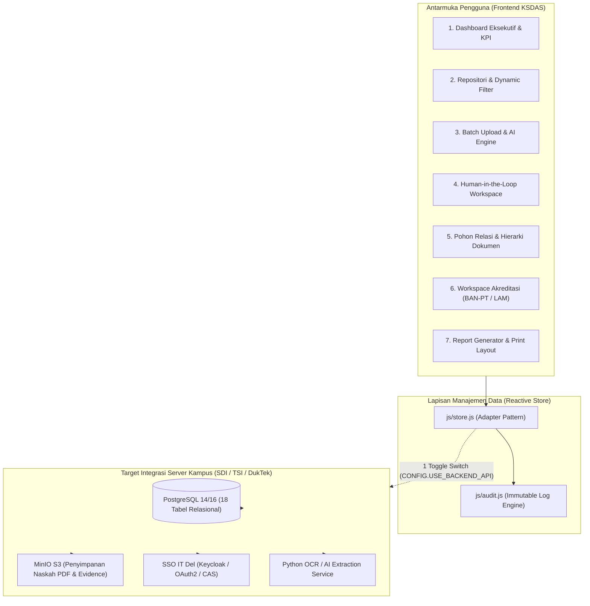
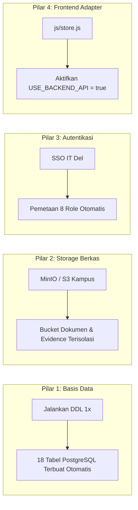

# KSDAS IT DEL &bull; Kerja Sama Data & Analytics System

<p align="center">
  
  
  
  
  
  
</p>

<p align="center">
  <strong>Platform Terpadu Tata Kelola Kemitraan Strategis, Repositori Naskah Perjanjian, Ekstraksi Metadata AI, Pemantauan Masa Berlaku, dan Pemetaan Instrumen Akreditasi Institut Teknologi Del (IT Del), Laguboti, Kabupaten Toba.</strong><br>
  <em>Dirancang untuk transisi mulus dan integrasi mudah ke infrastruktur server Direktorat SDI / TSI / DukTek IT Del.</em>
</p>

<p align="center">
  🔗 <strong>Tautan Demo Publik:</strong> <a href="https://samuelhtampubolon.github.io/ksdas-itdel/">https://samuelhtampubolon.github.io/ksdas-itdel/</a> &bull;
  📖 <strong>Panduan Integrasi Server:</strong> <a href="docs/PANDUAN_INTEGRASI_SDI_TSI.md">docs/PANDUAN_INTEGRASI_SDI_TSI.md</a>
</p>

---

## 📢 Berita & Pembaruan Terkini (News)

- **[2026-10-03] 🚀 Kesiapan Handoff Server Kampus (SDI/TSI/DukTek):** Paket integrasi server resmi telah rampung, mencakup panduan integrasi teknis ([`docs/PANDUAN_INTEGRASI_SDI_TSI.md`](docs/PANDUAN_INTEGRASI_SDI_TSI.md)), skrip migrasi DDL PostgreSQL 18 tabel ([`docs/schema_production_postgres.sql`](docs/schema_production_postgres.sql)), konfigurasi lingkungan ([`.env.example`](.env.example)), dan stack kontainer ([`docker-compose.yml`](docker-compose.yml)).
- **[2026-10-03] 🛡️ Hardening Keamanan Data & Anti-Bahaya:** Penguatan menyeluruh terhadap potensi kerentanan keamanan; pembersihan 100% token/kredensial, pengetatan sanitasi XSS pada seluruh modal antarmuka, kebijakan CSP aktif, proteksi impor JSON anti-*prototype pollution*, dan kepatuhan UU PDP No. 27/2022 atas seluruh data simulasi sintetis.
- **[2026-10-03] ⚖️ Penyematan Hak Cipta Resmi:** Hak Cipta rancangan arsitektur dan prototipe disematkan secara resmi atas nama **Samuel Hasudungan Tampubolon** (`Copyright © 2026 Samuel Hasudungan Tampubolon`).

---

## 📑 Daftar Isi

1. [Mulai Cepat (Quick Start dalam 1 Menit)](#-mulai-cepat-quick-start-dalam-1-menit)
2. [Latar Belakang & Nilai Tambah Sistem](#-latar-belakang--nilai-tambah-sistem)
3. [Arsitektur Solusi & Alur Data](#-arsitektur-solusi--alur-data)
4. [23 Fitur Wajib yang Telah Terimplementasi](#-23-fitur-wajib-yang-telah-terimplementasi)
5. [Panduan Integrasi untuk Tim SDI / TSI / DukTek](#-panduan-integrasi-untuk-tim-sdi--tsi--duktek)
6. [Kesiapan & Keandalan Antarmuka (UI/UX)](#-kesiapan--keandalan-antarmuka-uiux)
7. [Keamanan Data, Privasi & Kepatuhan Regulasi](#-keamanan-data-privasi--kepatuhan-regulasi)
8. [Skenario Pengujian Penerimaan (Acceptance Demo)](#-skenario-pengujian-penerimaan-acceptance-demo)
9. [Dokumentasi Lengkap Repositori](#-dokumentasi-lengkap-repositori)
10. [Tata Kelola, Hak Cipta & Lisensi](#-tata-kelola-hak-cipta--lisensi)

---

## ⚡ Mulai Cepat (Quick Start dalam 1 Menit)

Prototipe ini dirancang sebagai **Zero-Build Application** (HTML5, Vanilla CSS, dan ES6 Modular), sehingga dapat dijalankan seketika tanpa memerlukan kompilasi rumit seperti `npm run build`.

### Opsi A: Akses Demo Langsung di Peramban (Tanpa Instalasi)
Buka langsung melalui peramban:  
👉 **[https://samuelhtampubolon.github.io/ksdas-itdel/](https://samuelhtampubolon.github.io/ksdas-itdel/)**

### Opsi B: Menjalankan Secara Lokal di Komputer Anda
```bash
# 1. Kloning repositori
git clone https://github.com/samuelhtampubolon/ksdas-itdel.git
cd ksdas-itdel

# 2. Jalankan server lokal sederhana (pilih salah satu)
python -m http.server 8080      # Menggunakan Python 3
# atau: npx serve .             # Menggunakan Node.js
# atau: php -S localhost:8080   # Menggunakan PHP

# 3. Buka di peramban
# Kunjungi http://localhost:8080
```

---

## 📌 Latar Belakang & Nilai Tambah Sistem

Unit Kerja Sama Institut Teknologi Del mengelola portofolio kemitraan aktif dengan mitra industri multinasional/nasional (Huawei, Microsoft, PT Astra International, Bank Mandiri), perguruan tinggi mitra (ITB, UI, National University of Singapore), serta instansi pemerintah (Pemkab Toba, Pemprov Sumut).

Sebelum adanya KSDAS, pengelolaan naskah kerja sama menghadapi kendala berkas yang tersebar, proses rekapitulasi data akreditasi SPM/Prodi yang memakan waktu berhari-hari, serta sulitnya mendeteksi naskah yang mendekati masa kedaluwarsa. KSDAS mentransformasikan proses manual tersebut menjadi alur data cerdas:

$$\mathbf{DOCUMENTS} \longrightarrow \mathbf{STRUCTURED\ DATA} \longrightarrow \mathbf{INFORMATION} \longrightarrow \mathbf{ANALYTICS} \longrightarrow \mathbf{EVIDENCE} \longrightarrow \mathbf{REPORT}$$

---

## 🏛️ Arsitektur Solusi & Alur Data

Sistem menerapkan arsitektur modular yang memisahkan lapisan presentasi antarmuka, *state management* reaktif, dan lapisan penyimpanan data:



---

## 🎯 23 Fitur Wajib yang Telah Terimplementasi

| No | Modul Fungsional | Deskripsi Kemampuan | Status |
| :---: | :--- | :--- | :---: |
| 1 | **Role-Based Demo Access** | Simulasi 8 peran institusi (Staf, Kabiro, WR3, Rektor/Dekan, SPM, Fakultas, Prodi, Unit) | ✅ 100% |
| 2 | **Dashboard Eksekutif** | Kartu metrik KPI, bilah peringatan masa berlaku kritis (<90 hari), dan *Implementation Funnel* | ✅ 100% |
| 3 | **Master Mitra** | Direktori mitra terstruktur (Industri swasta, BUMN, PT, Pemda, Yayasan) beserta kontak PIC | ✅ 100% |
| 4 | **Repositori Dokumen** | Manajemen terpadu naskah perjanjian dengan multi-filter dinamis, sortir, dan rincian lengkap | ✅ 100% |
| 5 | **Batch Upload AI** | Pengunggahan banyak file sekaligus (*multi-select/drag-drop*) dengan **10 Dokumen Sampel IT Del** | ✅ 100% |
| 6 | **Klasifikasi Cerdas** | Pendeteksian tipe naskah otomatis (`MOU_LOI`, `PKS_MOA`, `IA`, `PROPOSAL`, `FINAL_REPORT`) | ✅ 100% |
| 7 | **Ekstraksi 26 Field** | Penangkapan nomor naskah, perihal, penandatangan mitra/Del, masa berlaku, anggaran, luaran | ✅ 100% |
| 8 | **Confidence Score** | Persentase keyakinan ekstraksi AI (0-100%) disertai nomor halaman dan kutipan naskah sumber | ✅ 100% |
| 9 | **Human-in-the-Loop Validation** | Tinjauan *side-by-side* teks berkas vs formulir koreksi, approval bertingkat, dan *Bulk Approve* | ✅ 100% |
| 10 | **Pohon Relasi Dokumen** | Visualisasi hierarki (`Mitra` &rarr; `MoU` &rarr; `PKS` &rarr; `IA` &rarr; `Laporan`) & deteksi dokumen yatim (*orphan*) | ✅ 100% |
| 11 | **Pelacakan Tri Dharma** | Pemantauan implementasi pada bidang Pendidikan, Penelitian & Inovasi, PKM, dan Tata Kelola | ✅ 100% |
| 12 | **Output, Outcome & Impact** | Pencatatan luaran terukur (sertifikasi industri, publikasi Scopus, penyerapan kerja lulusan) | ✅ 100% |
| 13 | **Repositori Bukti Fisik (Evidence)** | Pengarsipan bukti pendukung (sertifikat, foto, SK, draf artikel) dengan verifikasi oleh SPM | ✅ 100% |
| 14 | **Analitik Tabulasi Silang** | Matriks Fakultas vs Tri Dharma, pemantauan masa berlaku (*expiry*), dan analisis *follow-up gap* | ✅ 100% |
| 15 | **Penyaringan Dinamis** | Filter instan gabungan (Tahun, Mitra, Tipe Dokumen, Status, Fakultas, Prodi, Tri Dharma, PIC) | ✅ 100% |
| 16 | **Visualisasi Interaktif** | Grafik tren tahunan, diagram donat Tri Dharma, dan distribusi kategori mitra berbasis Chart.js | ✅ 100% |
| 17 | **Generator Laporan Resmi** | Cetak Laporan Eksekutif WR3/Rektor dan Paket Bukti Akreditasi siap cetak (*Print/PDF layout*) | ✅ 100% |
| 18 | **Workspace Akreditasi & AMI** | Pemetaan otomatis naskah dan bukti ke instrumen BAN-PT (IAPS 4.0 / IAPT 3.0) & LAM-INFOKOM | ✅ 100% |
| 19 | **Pusat Pemberitahuan** | Notifikasi kontrak mendekati kedaluwarsa (<90 hari), naskah pending validasi, dan orphan alert | ✅ 100% |
| 20 | **Audit Trail Mutlak** | Rekam jejak transaksi sistem mencatat tanggal, jam, pengguna, dan riwayat revisi data | ✅ 100% |
| 21 | **Natural Language Query (AI)** | Parser kueri bahasa alami Indonesia menerjemahkan teks bebas menjadi parameter filter repositori | ✅ 100% |
| 22 | **Ekspor & Impor Cadangan JSON** | Pencadangan penuh (*full-state backup*) dan pemulihan data instan dengan proteksi validasi skema | ✅ 100% |
| 23 | **Reset Basis Data Demo** | Pengembalian basis data peramban ke kondisi awal otentik kampus IT Del Sitoluama Laguboti | ✅ 100% |

---

## 🔌 Panduan Integrasi untuk Tim SDI / TSI / DukTek

Dokumen ini disusun agar tim teknis kampus dapat **dengan sangat mudah menjelaskan, memahami, dan mengeksekusi integrasi sistem** ke server kampus IT Del. Panduan langkah per langkah yang komprehensif tersedia pada [`docs/PANDUAN_INTEGRASI_SDI_TSI.md`](docs/PANDUAN_INTEGRASI_SDI_TSI.md).

### 4 Pilar Kemudahan Integrasi:



### Langkah Cepat Penerapan di Server Kampus:

#### 1. Eksekusi Skrip Database PostgreSQL
Tidak perlu membuat tabel secara manual. Cukup jalankan skrip migrasi resmi:
```bash
psql -U ksdas_app -d ksdas_db -f docs/schema_production_postgres.sql
```

#### 2. Konfigurasi Lingkungan (`.env`)
Salin template konfigurasi yang telah disediakan:
```bash
cp .env.example .env
# Edit kredensial database kampus, MinIO storage, dan SSO IT Del
```

#### 3. Jalankan Kontainer Produksi (Docker Compose)
Seluruh stack server (Nginx Web Server, PostgreSQL 16, dan MinIO S3) dapat dijalankan dalam satu perintah:
```bash
docker compose up -d
```

#### 4. Menghubungkan Antarmuka ke REST API Kampus
Buka [`js/store.js`](js/store.js), ubah satu baris konfigurasi:
```javascript
const CONFIG = {
  USE_BACKEND_API: true, // Diaktifkan saat terhubung ke backend kampus
  API_BASE_URL: "/api/v1"
};
```
Antarmuka UI, grafik analitik, formulir koreksi, dan tampilan laporan langsung terhubung ke database kampus tanpa perlu menulis ulang antarmuka (*Zero UI Re-write*).

---

## 🎨 Kesiapan & Keandalan Antarmuka (UI/UX)

Antarmuka KSDAS IT Del telah diuji dan dirancang memenuhi standar aplikasi institusional modern:
1. **Hierarki Visual Jelas:** Tipografi formal menggunakan *Plus Jakarta Sans* (antarmuka), *Outfit* (judul & kartu metrik), serta *JetBrains Mono* (nomor naskah perjanjian dan kode dokumen).
2. **Skema Warna Institusional:** Palet warna biru Del yang elegan (`#0B2545`, `#134074`, `#0077B6`) dipadukan dengan aksen hijau toska (`#2A9D8F`) dan merah peringatan (`#E63946`).
3. **Responsif & Adaptif:** Tata letak fleksibel yang bekerja optimal pada monitor desktop resolusi tinggi, tablet, hingga smartphone layar sentuh.
4. **Kejelasan Status & Umpan Balik (*Feedback States*):** Setiap tindakan pengguna dilengkapi notifikasi toast instan, badge status berwarna, indikator persentase keyakinan AI, dan status verifikasi berkas bukti fisik.
5. **Siap Cetak Resmi (*Print-Ready Layout*):** Generator laporan dilengkapi aturan stylesheet `@media print` sehingga dokumen eksekutif dapat langsung dicetak atau disimpan ke PDF dengan tata letak kop surat institusi yang rapi.

---

## 🛡️ Keamanan Data, Privasi & Kepatuhan Regulasi

Keamanan dan keselamatan data menjadi prioritas mutlak dalam perancangan KSDAS:

- **Bebas Bahaya Data Nyata (Data Sintetis):** Seluruh entitas mitra, nama penandatangan, nomor kontrak, dan dokumen lampiran pada prototipe publik ini merupakan **data simulasi sintetis**. Tidak ada informasi rahasia (*Non-Disclosure Agreement*), nomor kontak pribadi, atau data perbankan riil yang diunggah ke repositori publik ini.
- **Pencegahan Injeksi Kode (XSS):** Seluruh masukan pengguna dan luaran teks dinamis disanitasi secara ketat melalui fungsi `this.ui.escapeHtml()`.
- **Content Security Policy (CSP):** Membatasi eksekusi sumber skrip dan aset hanya dari domain yang terverifikasi aman.
- **Pencegahan Kelebihan Beban Penyimpanan (*Storage Quota Protection*):** Penanganan eksepsi `QuotaExceededError` pada `localStorage` untuk mencegah korupsi data sesi pengguna.
- **Validasi Berkas Ketat:** Membatasi unggahan hanya pada berkas `.pdf`, `.docx`, dan `.doc` dengan batas ukuran berkas maksimum 25 MB.
- **Kepatuhan Regulasi:** Memenuhi prinsip akuntabilitas dan kerahasiaan data sesuai amanat **Undang-Undang Republik Indonesia Nomor 27 Tahun 2022 tentang Perlindungan Data Pribadi (UU PDP)**.

Dokumentasi kebijakan keamanan lengkap dapat ditinjau pada [`docs/SECURITY.md`](docs/SECURITY.md).

---

## 🧪 Skenario Pengujian Penerimaan (Acceptance Demo)

Pengujian fungsional sistem dapat dilakukan mengikuti 4 skenario standar berikut:

```
[Skenario A: Batch Processing & Validasi Staf]
  1. Pilih peran: "Staff Unit Kerja Sama"
  2. Buka menu "Batch Upload AI" -> Klik "Muat 10 Dokumen Sampel Demo"
  3. Klik "Mulai Ekstraksi AI & Deteksi Relasi"
  4. Buka "Validasi Manusia" -> Setujui naskah -> Data masuk ke Dashboard Eksekutif

[Skenario B: Filter Dinamis Multidimensi]
  1. Buka menu "Repositori Dokumen"
  2. Terapkan filter: PKS/MoA + Penelitian + Tahun 2026
  3. Sistem menyaring instan dokumen PKS Riset Astra 2026

[Skenario C: Pemeriksaan Bukti Akreditasi oleh SPM]
  1. Ubah peran di header ke: "SPM (Satuan Penjaminan Mutu)"
  2. Buka "Akreditasi & AMI" -> Pilih framework "LAM-INFOKOM"
  3. Pilih kriteria C.1.4.a -> Klik "Filter Data" untuk meninjau bukti fisik terkait

[Skenario D: Dashboard Monitoring oleh Pimpinan (WR3)]
  1. Ubah peran di header ke: "Wakil Rektor III (Kemitraan)"
  2. Tinjau bilah peringatan kontrak kritis (<90 hari)
  3. Buka "Analitik Eksekutif" -> Analisis Expiry Timeline & Follow-up Gap
```

Panduan pengujian langkah per langkah terperinci tersedia di [`docs/DEMO_SCRIPTS.md`](docs/DEMO_SCRIPTS.md).

---

## 📚 Dokumentasi Lengkap Repositori

Folder `docs/` memuat dokumentasi teknis menyeluruh yang siap diserahkan kepada tim kampus:

| Berkas Dokumentasi | Peruntukan Utama | Deskripsi Isi |
| :--- | :--- | :--- |
| 🚀 [`docs/PANDUAN_INTEGRASI_SDI_TSI.md`](docs/PANDUAN_INTEGRASI_SDI_TSI.md) | Tim SDI / TSI / DukTek | Panduan teknis integrasi database, MinIO, SSO IT Del, dan REST API |
| 📄 [`docs/HANDOFF_SPEC_SDI_TSI.md`](docs/HANDOFF_SPEC_SDI_TSI.md) | Manajemen & Tim Teknis | Spesifikasi formal serah terima kebutuhan dari Unit Kerja Sama (19 Bab) |
| 📐 [`docs/ARCHITECTURE.md`](docs/ARCHITECTURE.md) | Solution Architect | Arsitektur modul, diagram alur data, ERD Mermaid, dan batasan REST API |
| 🛡️ [`docs/SECURITY.md`](docs/SECURITY.md) | Tim Keamanan Siber & DPO | Kebijakan keamanan data, kepatuhan UU PDP No. 27/2022, dan mitigasi risiko |
| 📚 [`docs/DATA_DICTIONARY.md`](docs/DATA_DICTIONARY.md) | Database Administrator | Kamus data lengkap dan definisi tipe kolom untuk 18 entitas relasional |
| 💾 [`docs/schema_production_postgres.sql`](docs/schema_production_postgres.sql) | Database Administrator | Skrip DDL resmi PostgreSQL 14/16 (Tabel, Index, Trigger, dan Views) |
| 🤖 [`docs/AI_PROCESSING_SPEC.md`](docs/AI_PROCESSING_SPEC.md) | Pengembang Backend / AI | Spesifikasi mesin ekstraksi 26 field, confidence score, dan parser NLP |
| 🧪 [`docs/DEMO_SCRIPTS.md`](docs/DEMO_SCRIPTS.md) | Penguji Sistem (QA / Staf) | Panduan langkah per langkah pengujian skenario penerimaan (A, B, C, D) |

---

## ⚖️ Tata Kelola, Hak Cipta & Lisensi

- **Hak Cipta (Copyright):** **Copyright &copy; 2026 Samuel Hasudungan Tampubolon**. Seluruh rancangan arsitektur sistem, desain antarmuka modular, algoritma ekstraksi data cerdas, serta prototipe KSDAS dilindungi atas nama **Samuel Hasudungan Tampubolon**.
- **Institusi Sasaran:** Dikembangkan untuk dan diselaraskan dengan kebutuhan tata kelola data kemitraan **Institut Teknologi Del (IT Del)**, Sitoluama, Laguboti, Kabupaten Toba, Sumatera Utara.
- **Karya Produksi Kampus:** Penerapan implementasi operasional resmi, basis data institusi kampus terpadu, dan integrasi SSO diserahkan kepada Institut Teknologi Del bersama Direktorat SDI / TSI / DukTek sesuai [Spesifikasi Handoff SDI/TSI](docs/HANDOFF_SPEC_SDI_TSI.md).
- **Lisensi Kode Sumber:** [MIT License](LICENSE) &bull; Hak Cipta &copy; 2026 Samuel Hasudungan Tampubolon.

---

<p align="center">
  <strong>Kerja Sama Data & Analytics System (KSDAS) IT Del</strong><br>
  Dikembangkan oleh <strong>Samuel Hasudungan Tampubolon</strong> untuk <strong>Institut Teknologi Del</strong>.<br>
  <em>Laguboti, Kabupaten Toba, Sumatera Utara &bull; 2026</em>
</p>
