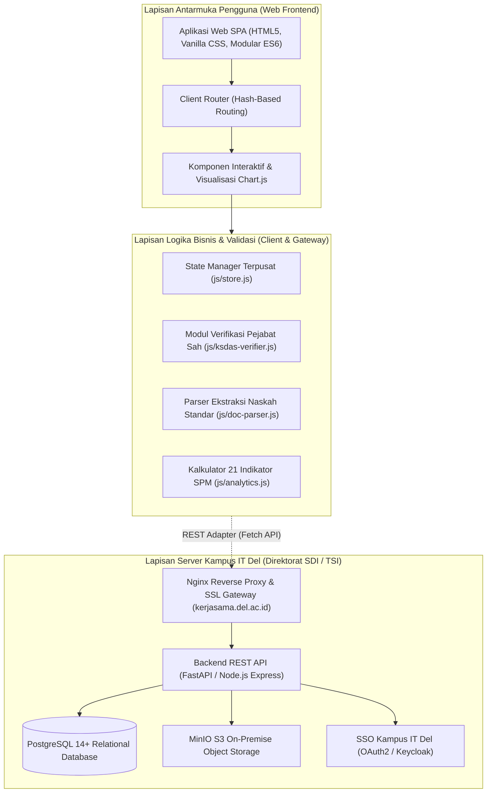
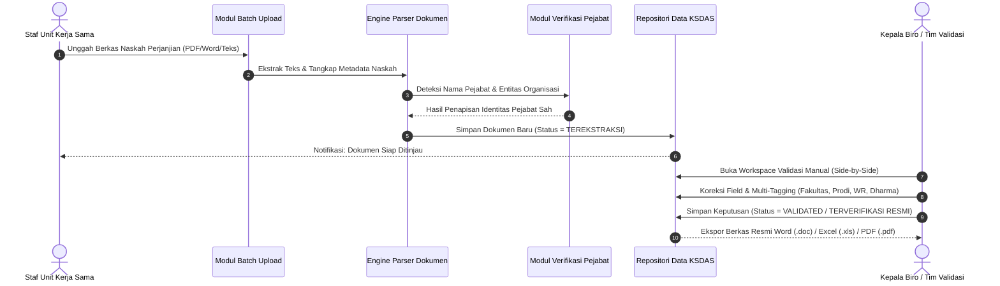

# DOKUMEN ARSITEKTUR SISTEM (SYSTEM ARCHITECTURE SPECIFICATION)
## Kerja Sama Data & Analytics System (KSDAS) Institut Teknologi Del

**Penyusun & Arsitek Solusi:** Samuel Hasudungan Tampubolon  
**Hak Cipta:** Copyright &copy; 2026 Samuel Hasudungan Tampubolon. All rights reserved.  
**Institusi:** Institut Teknologi Del, Sitoluama, Laguboti, Kabupaten Toba, Sumatera Utara  
**Versi:** 0.3.0  
**Target Pengguna:** Direktorat SDI/TSI, Unit Kerja Sama, Biro Kemitraan, Satuan Penjaminan Mutu (SPM), dan Auditor Akreditasi.

---

## 📌 DAFTAR ISI
1. [Prinsip Desain & Filosofi Sistem](#1-prinsip-desain--filosofi-sistem)
2. [Mengapa KSDAS On-Premise Menggantikan Cloud Publik (GDrive, OneDrive, Notion)](#2-mengapa-ksdas-on-premise-menggantikan-cloud-publik)
3. [Arsitektur Konseptual Tingkat Tinggi](#3-arsitektur-konseptual-tingkat-tinggi)
4. [Alur Pemrosesan Dokumen & Siklus Hidup Data](#4-alur-pemrosesan-dokumen--siklus-hidup-data)
5. [Skema Basis Data Relasional Terpusat](#5-skema-basis-data-relasional-terpusat)
6. [Keamanan, Hak Akses (RBAC) & Audit Trail](#6-keamanan-hak-akses-rbac--audit-trail)
7. [Spesifikasi Kontrak REST API Backend Kampus](#7-spesifikasi-kontrak-rest-api-backend-kampus)
8. [Rencana Transisi & Deployment Produksi](#8-rencana-transisi--deployment-produksi)

---

## 1. PRINSIP DESAIN & FILOSOFI SISTEM

KSDAS IT Del dibangun atas 5 prinsip dasar tata kelola sistem informasi perguruan tinggi:

1. **Kedaulatan Data Penuh (*Data Sovereignty*):** Naskah perjanjian kerja sama memuat hak perdata, komitmen anggaran, NIK pimpinan, dan klausul kerahasiaan. Seluruh data disimpan di server internal kampus IT Del (on-premise), bukan di awan publik komersial luar negeri.
2. **Keteraturan Relasional (*Strict Relational Integrity*):** Dokumen kerja sama tidak disimpan sebagai berkas lepas (*isolated files*), melainkan terstruktur hierarkis: `Mitra Strategis` $\rightarrow$ `MoU Induk` $\rightarrow$ `PKS / MoA Operasional` $\rightarrow$ `Implementation Arrangement (IA)` $\rightarrow$ `Laporan Kegiatan & Bukti Fisik`.
3. **Penyelarasan Akreditasi Otomatis (*Accreditation-Driven Data Modeling*):** Setiap naskah langsung memetakan 21 indikator SPM, BAN-PT, LAM-INFOKOM, PDDikti, dan MBKM sejak pertama kali diregistrasi.
4. **Verifikasi Pejabat Sah (*Zero-Hallucination Legal Verification*):** Sistem menyaring data secara presisi sehingga nama panitia/tim/instansi tidak pernah tertukar sebagai nama penandatangan orang nyata.
5. **Format Unduhan Resmi Standar Institusi:** Dokumen luaran diterbitkan langsung dalam format Microsoft Word (.doc) ber-Kop Surat resmi IT Del, Excel (.xls) matriks rekapitulasi, dan PDF (.pdf) siap cetak.

---

## 2. MENGAPA KSDAS ON-PREMISE MENGGANTIKAN CLOUD PUBLIK

Penggunaan Google Drive, OneDrive, Google Sheets, Microsoft 365, atau Notion memiliki kelemahan kritis:
- **Data Fragmentation:** Berkas hukum tersebar di akun pribadi dosen tanpa relasi basis data.
- **Compliance & Privacy Risk:** Pelanggaran regulasi kedaulatan data dan UU PDP No. 27/2022 jika naskah rahasia diunggah ke pihak ketiga.
- **Metadata Loss:** Cloud folder hanya mencatat nama file dan tanggal upload, tanpa pemetaan ke 21 instrumen akreditasi SPM/BAN-PT.
- **No Legal Audit Trail:** Ketiadaan bukti autentik siapa pejabat kampus yang memvalidasi keabsahan naskah.

KSDAS hadir sebagai substitusi on-premise mandiri yang menyelesaikan seluruh kelemahan tersebut.

---

## 3. ARSITEKTUR KONSEPTUAL TINGKAT TINGGI

---

## 4. ALUR PEMROSESAN DOKUMEN & SIKLUS HIDUP DATA

---

## 5. SKEMA BASIS DATA RELASIONAL TERPUSAT

Struktur tabel utama pada basis data kampus IT Del (`ksdas_db`):

| Nama Tabel | Peran Utama | Keterangan Relasi |
| :--- | :--- | :--- |
| `partners` | Direktori Master Mitra Kerjasama | Relasi 1-ke-banyak ke `documents` |
| `documents` | Tabel Induk Naskah Perjanjian | Menyimpan 20 metadata, self-reference `parent_id` (hierarki MoU-PKS-IA) |
| `document_entities` | Tabel Multi-Tagging Entitas | Menyimpan asosiasi multi-fakultas, multi-prodi, multi-WR, dan multi-unit |
| `signatories` | Pejabat Penandatangan Sah | Menyimpan nama pejabat orang nyata terverifikasi beserta jabatan resmi |
| `activities` | Realisasi Program & Kegiatan | Terhubung ke naskah `document_id` |
| `evidences` | Bukti Fisik Pendukung | Pengarsipan berkas luaran yang diverifikasi oleh SPM |
| `accreditation_metrics` | Pemetaan 21 Indikator SPM/AMI | Menghitung capaian realisasi instrumen secara otomatis |
| `audit_logs` | Jejak Audit Transaksi Mutlak | Pencatatan mutlak (*append-only*) setiap perubahan status dan data |

---

## 6. KEAMANAN, HAK AKSES (RBAC) & AUDIT TRAIL

Sistem menerapkan **Role-Based Access Control (RBAC)** dengan pemisahan tugas (*separation of duties*):
- **Staf Unit Kerja Sama (`ADMIN_STAFF`):** Hak mengunggah dokumen, mengisi metadata, dan menjalankan verifikasi awal.
- **Kepala Biro Kemitraan (`BUREAU_HEAD`):** Hak validasi manual akhir, pengesahan status resmi, dan pemantauan masa berlaku kontrak.
- **Wakil Rektor 3 (`WR3`):** Akses dasbor eksekutif, persetujuan strategis, dan laporan berkala rektorat.
- **Satuan Penjaminan Mutu (`QUALITY_REVIEWER`):** Akses khusus evaluasi 21 indikator SPM, verifikasi bukti fisik, dan audit akreditasi.
- **Fakultas / Program Studi (`FACULTY_VIEWER` / `PROGRAM_VIEWER`):** Akses baca terisolasi untuk data naskah yang relevan dengan keilmuan unit masing-masing.

---

## 7. SPESIFIKASI KONTRAK REST API BACKEND KAMPUS

| Metode | Endpoint | Deskripsi Fungsi |
| :--- | :--- | :--- |
| `GET` | `/api/v1/documents` | Mengambil daftar naskah kerja sama dengan filter multidimensi |
| `GET` | `/api/v1/documents/{id}` | Mengambil rincian naskah, pohon hierarki, dan bukti fisik terkait |
| `POST` | `/api/v1/documents` | Menambahkan dokumen naskah hasil ekstraksi baru |
| `PUT` | `/api/v1/documents/{id}/validate` | Mengesahkan status naskah menjadi `VALIDATED` melalui validasi manual |
| `GET` | `/api/v1/accreditation/indicators` | Mengambil kalkulasi komparatif 21 indikator SPM / AMI |
| `GET` | `/api/v1/reports/export/excel` | Mengunduh berkas spreadsheet rekapitulasi naskah (.xls) |
| `GET` | `/api/v1/reports/export/word` | Mengunduh berkas dosir resmi ber-Kop Surat IT Del (.doc) |

---

## 8. RENCANA TRANSISI & DEPLOYMENT PRODUKSI

1. **Eksekusi DDL Database:** Menjalankan [`docs/schema_production_postgres.sql`](schema_production_postgres.sql) di server database kampus.
2. **Penerapan Container:** Mengaktifkan layanan melalui [`docker-compose.yml`](../docker-compose.yml) di lingkungan intranet kampus.
3. **Konfigurasi Reverse Proxy Nginx:** Menerapkan [`nginx.conf`](../nginx.conf) dengan sertifikat SSL/TLS kampus IT Del.
4. **Verifikasi Sistem:** Menjalankan acceptance test menggunakan 10 naskah kerja sama resmi IT Del yang telah teruji.

---
*KSDAS IT Del &bull; Copyright &copy; 2026 Samuel Hasudungan Tampubolon. All rights reserved.*
