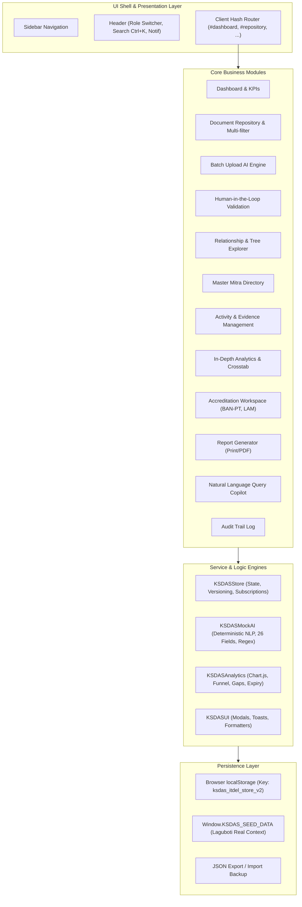
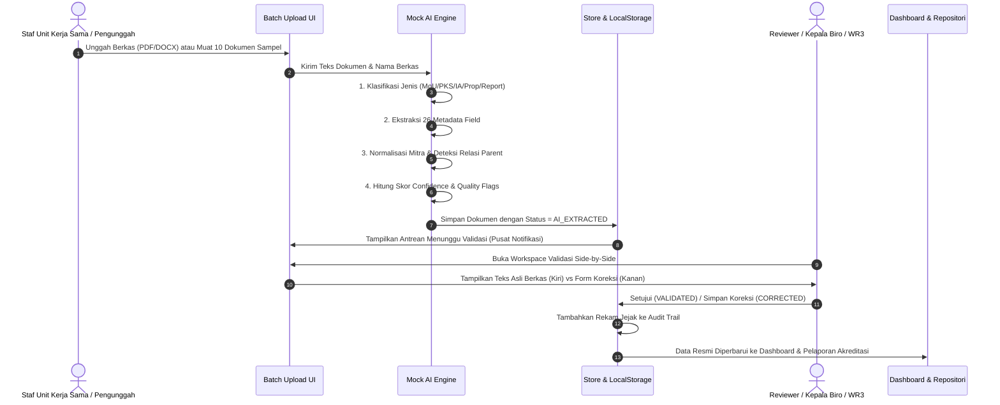
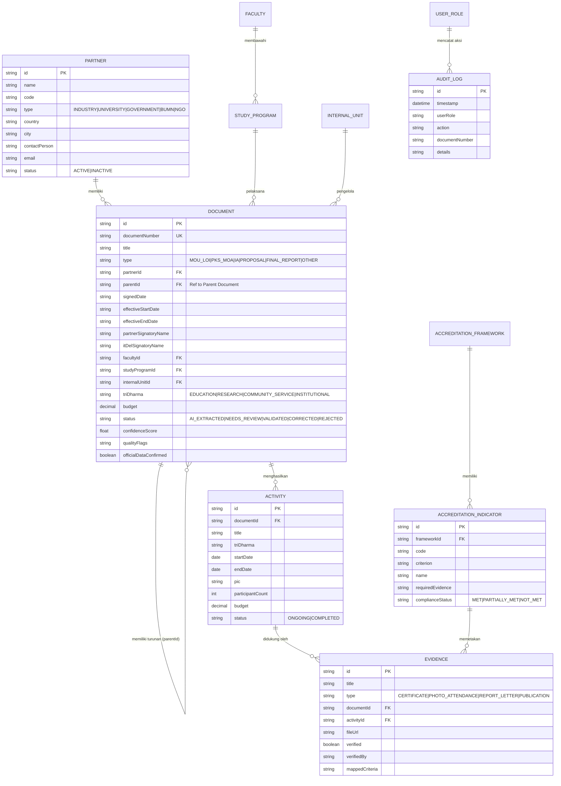

# KSDAS IT DEL - System Architecture & Engineering Specification

**Sistem Informasi Kerja Sama & Analitik Data (KSDAS)**  
**Institut Teknologi Del (IT Del), Laguboti, Kabupaten Toba**  
**Versi Dokumen:** 0.2.0  
**Target Pembaca:** Direktorat SDI / TSI / Tim Duktek / Unit Kerja Sama  

---

## 1. Ringkasan Eksekutif

KSDAS IT Del dirancang untuk mentransformasikan pengelolaan dokumen kemitraan yang sebelumnya terfragmentasi menjadi satu ekosistem data terpadu:

$$\text{Documents} \longrightarrow \text{Structured Data} \longrightarrow \text{Information} \longrightarrow \text{Analytics} \longrightarrow \text{Evidence} \longrightarrow \text{Accreditation Report}$$

Prototype ini berjalan pada **GitHub Pages** sebagai aplikasi satu halaman (*Single-Page Application / SPA*) tanpa dependensi backend wajib pada fase pembuktian konsep (*Proof-of-Concept*), dengan persistensi lokal `localStorage` serta kapabilitas ekspor/impor JSON penuh.

---

## 2. Arsitektur Komponen & Modul (SPA Prototype)

---

## 3. Alur Data (Data Flow Diagram)

---

## 4. Entity Relationship Diagram (ERD)

---

## 5. Batasan Antarmuka Produksi (API Boundary for Production)

Ketika SDI/TSI memindahkan aplikasi ini ke server produksi institusi IT Del, antarmuka REST API berikut direkomendasikan untuk menggantikan `KSDASStore`:

| Endpoint | Metode | Peran Otorisasi | Keterangan |
| :--- | :---: | :---: | :--- |
| `/api/v1/auth/sso/login` | POST | Publik | Autentikasi terintegrasi SSO IT Del |
| `/api/v1/documents` | GET | Semua Role | Pengambilan daftar dokumen dengan pagination & query params |
| `/api/v1/documents` | POST | Staff, Biro, WR3 | Pembuatan dokumen baru atau penyimpanan manual |
| `/api/v1/documents/{id}` | GET | Semua Role | Rincian metadata dan salinan bukti dokumen |
| `/api/v1/documents/{id}/validate` | PUT | Staff, Biro, WR3 | Persetujuan validasi manusia (AI_EXTRACTED &rarr; VALIDATED) |
| `/api/v1/documents/batch-upload` | POST | Staff | Unggah multipart file berkas ke MinIO/S3 + antrean worker |
| `/api/v1/ai/extract` | POST | Worker/Service | Service backend OCR (Tesseract / Gemini Document AI) |
| `/api/v1/partners` | GET, POST, PUT | Staff, Viewer | Pengelolaan data master mitra kerja sama |
| `/api/v1/analytics/kpis` | GET | Semua Role | Agregasi KPI eksekutif teroptimasi database |
| `/api/v1/accreditation/mapping`| GET, POST | SPM, Staff | Pemetaan indikator akreditasi ke evidence |
| `/api/v1/audit-trail` | GET | Biro, WR3, Auditor | Pengambilan rekam jejak sistem |

---

## 6. Rencana Transisi Menuju Produksi (SDI / TSI Roadmap)

1. **Database:** Migrasi skema JSON ke tabel relasional **PostgreSQL 16** dengan indexing pada `document_number`, `partner_id`, dan `status`.
2. **Penyimpanan Berkas:** Ganti referensi file simulasi dengan penyimpanan objek privat **MinIO / AWS S3** dengan presigned URLs dan antivirus scanning.
3. **Autentikasi:** Integrasikan sistem masuk tunggal (SSO) IT Del berbasis **OAuth2 / OpenID Connect**.
4. **Ekstraksi AI Produksi:** Gunakan service microservice Python FastAPI yang menggabungkan OCR (Tesseract / PDFPlumber) dan LLM API terotorisasi institusi (Vertex AI / Google Gemini) untuk ekstraksi dokumen naskah asli berbahasa Indonesia.
5. **Hosting:** Deploy frontend containerized (Nginx) di jaringan intranet kampus Del.
