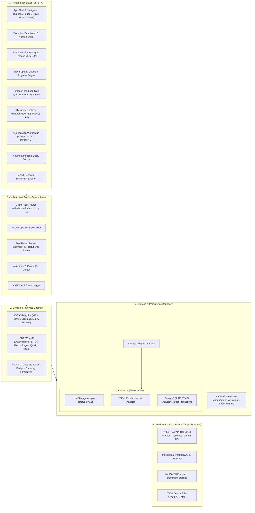
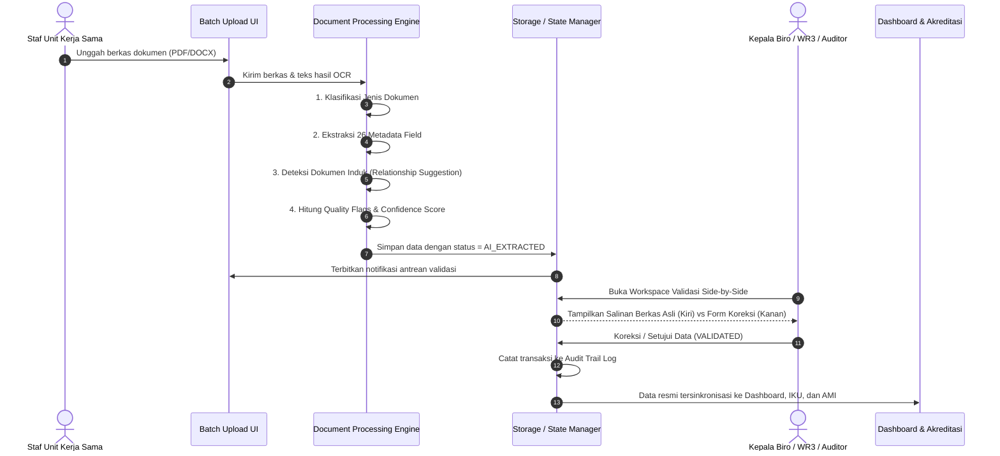
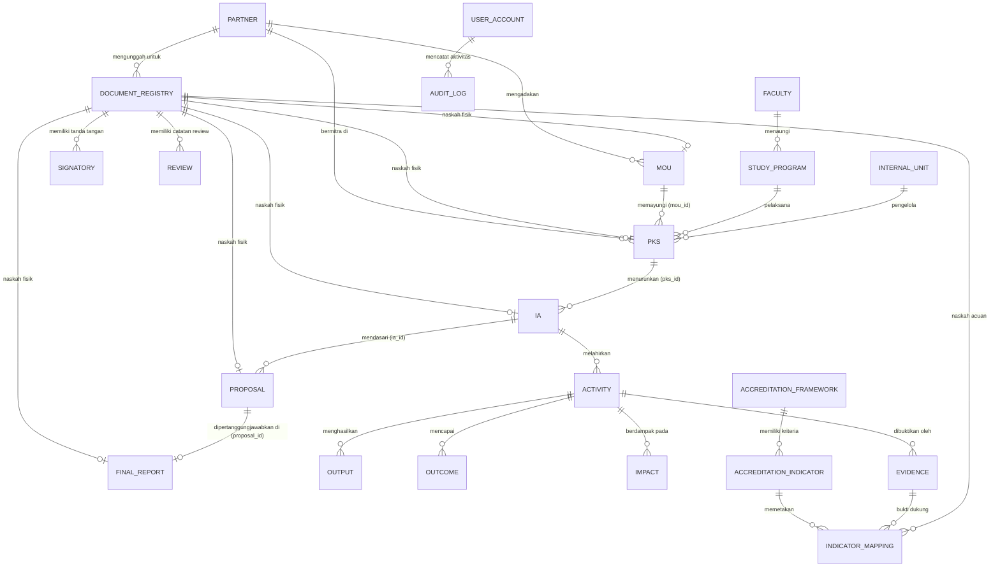

# KSDAS IT DEL - SOLUTION ARCHITECTURE SPECIFICATION V0.2

**Sistem Informasi Kerja Sama & Analitik Data (KSDAS)**  
**Institut Teknologi Del, Laguboti, Kabupaten Toba, Sumatera Utara**  
**Author & Solution Architect:** Samuel Hasudungan Tampubolon  
**Copyright:** Copyright &copy; 2026 Samuel Hasudungan Tampubolon  
**Versi:** 0.2.0  
**Target:** Tim Teknis SDI / TSI / Tim Pengembang / Stakeholder Institusi  

---

## 1. VISI SISTEM & KONTEKS INSTITUSI

KSDAS IT Del dirancang sebagai platform holistik untuk mengelola seluruh daur hidup kerja sama, kemitraan strategis, kolaborasi Tri Dharma Perguruan Tinggi, dokumen naskah, repositori bukti fisik (*evidence*), analitik eksekutif, dan otomasi pemrosesan cerdas.

### Prinsip Utama Tata Kelola:
1. **Pemisahan Peran Bisnis & Teknis:**
   - *Unit Kerja Sama:* Menentukan **WHAT + WHY + WORKFLOW**.
   - *Direktorat SDI / TSI:* Menentukan **HOW + INFRASTRUCTURE + DEPLOYMENT**.
2. **Human-in-the-Loop:** Sistem ekstraksi tidak menetapkan data resmi institusi secara otonom. Output awal berstatus `SUGGESTION` hingga divalidasi manual.
3. **Penyimpanan Bertahap:** GitHub Pages + `localStorage` adalah **Prototype / Bukti Konsep**, bukan basis data produksi permanen.
4. **Integritas Provenance:** Koreksi manusia tidak pernah menghapus riwayat teks dan metadata sumber ekstraksi.

---

## 2. ARSITEKTUR MODUL SISTEM (MODULAR ARCHITECTURE)

Sistem dibagi menjadi 5 lapisan arsitektur modular yang terisolasi dengan rapi:

---

## 3. ALUR DATA SISTEM (DATA FLOW ARCHITECTURE)

### A. Alur Ingesti Dokumen & Validasi Berjenjang:

---

## 4. ENTITY RELATIONSHIP DIAGRAM (ERD V0.2 LENGKAP)

Mencakup seluruh entitas inti sesuai **KSDAS Data Dictionary V0.2 (Seksi A sampai V)**:

---

## 5. BATASAN ANTARMUKA PRODUKSI (REST / OPENAPI SPECIFICATION)

Ketika tim SDI / TSI mengimplementasikan backend produksi, kontrak REST API berikut dirancang untuk menggantikan modul penyimpanan lokal:

| HTTP Verb | Path Endpoint | Peran Otorisasi | Deskripsi & Payload |
| :---: | :--- | :--- | :--- |
| `POST` | `/api/v1/auth/login-sso` | Publik | Pertukaran token SSO IT Del dengan sesi JWT |
| `GET` | `/api/v1/documents` | Semua Role | Pengambilan daftar naskah dengan filter multidimensi & pagination |
| `POST` | `/api/v1/documents/batch` | Staf Kerja Sama | Unggah multipart berkas naskah ke antrean pemrosesan worker |
| `GET` | `/api/v1/documents/{id}` | Semua Role | Rincian lengkap 26 metadata field, silsilah relasi, dan berkas fisik |
| `PUT` | `/api/v1/documents/{id}/validate` | Staf, Biro, WR3 | Transisi status validasi manual (`AI_EXTRACTED` &rarr; `VALIDATED`) |
| `PUT` | `/api/v1/documents/{id}/correct` | Staf, Biro | Menyimpan koreksi manual tanpa menghapus metadata provenance AI |
| `PUT` | `/api/v1/documents/{id}/link-parent` | Staf, Biro | Menautkan dokumen *orphan* ke ID dokumen induk |
| `GET` | `/api/v1/partners` | Semua Role | Mengambil direktori mitra kerja sama |
| `POST` | `/api/v1/partners` | Staf Kerja Sama | Mendaftarkan profil mitra baru |
| `GET` | `/api/v1/analytics/kpis` | Semua Role | Menghitung metrik KPI eksekutif, *funnel*, dan sebaran Tri Dharma |
| `GET` | `/api/v1/analytics/expiry` | Semua Role | Mengambil *expiry monitoring timeline* dan *follow-up gap analysis* |
| `POST` | `/api/v1/ai/nlp-query` | Semua Role | Mesin penerjemah bahasa alami ke query filter terstruktur |
| `GET` | `/api/v1/accreditation/matrix`| SPM, Pimpinan | Mengambil rekapitulasi keterpenuhan bukti instrumen akreditasi |
| `GET` | `/api/v1/audit-trail` | Biro, WR3, SPM | Pengambilan log rekam jejak transaksi institusi |

---

## 6. PEMISAHAN FITUR MOCK DAN REAL PRODUKSI

Untuk transparansi dan tata kelola sistem, tabel berikut memetakan batasan antara fungsionalitas prototype GitHub Pages saat ini dan target implementasi produksi oleh SDI/TSI:

| Komponen Fungsional | Implementasi Prototype v0.2 (Saat Ini) | Target Sistem Produksi (SDI / TSI) |
| :--- | :--- | :--- |
| **Penyimpanan Data** | Browser `localStorage` + JSON Import/Export | Basis Data Relasional PostgreSQL 16 Terkelola |
| **Penyimpanan Berkas** | Simulasi referensi file lokal & mock viewer | Server Penyimpanan Objek Terenkripsi (MinIO / S3) |
| **Autentikasi Pengguna**| Pengalih peran instan di header (8 peran demo) | Single Sign-On (SSO) Kampus Del (OAuth2 / SAML) |
| **Mesin Ekstraksi AI** | Heuristic NLP & Regex Deterministik Client-Side | Python FastAPI Worker + OCR Tesseract + LLM API Resmi |
| **Logika Analitik** | Komputasi client-side JavaScript + Chart.js | Query View / Agregasi SQL Database + Chart.js |
| **Generator Laporan** | Cetak CSS responsif peramban (`window.print()`) | Mesin Rendering PDF Server-Side (WeasyPrint / Puppeteer) |
| **Hosting Aplikasi** | GitHub Pages (Frontend Statis) | Intranet Kampus IT Del (Nginx / Docker Container) |

---

## 7. FLEKSIBILITAS INSTRUMEN AKREDITASI (ANTI HARD-CODING)

Sesuai instruksi architect nomor 6, indikator akreditasi **tidak boleh di-hardcode** dalam logika kode, karena instrumen akreditasi (BAN-PT, LAM-INFOKOM, LAM-TEKNIK, IABEE) berubah secara berkala.

### Desain Solusi:
1. Skema database menggunakan tabel terpisah: `AccreditationFramework`, `AccreditationIndicator`, dan `IndicatorMapping`.
2. Penambahan instrumen akreditasi baru (misal: *Instrumen Akreditasi Baru 2027*) cukup dilakukan melalui pengisian data master atau impor file konfigurasi JSON tanpa perlu mengubah kode sumber aplikasi.
3. Hubungan antara dokumen/evidence dan kriteria mutu menggunakan relasi banyak-ke-banyak (*many-to-many*).

---

## 8. INTEGRITAS KEPUTUSAN AI & PROVENANCE PELACAKAN DATA

Setiap pengambilan keputusan oleh mesin AI tunduk pada 3 prinsip integritas data:
1. **Status Saran (*Suggestion Status*):** Output AI selalu berstatus `AI_EXTRACTED` atau `NEEDS_REVIEW`.
2. **Preservasi Nilai Sumber (*Source Provenance Preservation*):** Ketika staf mengoreksi nilai yang salah diekstrak, sistem mempertahankan objek `extractions[field]` asli (`source_text`, `source_page`, `confidence_score` awal) dan menyimpan nilai baru bersama penanda `source_type: MANUAL`.
3. **Audit Trail Mutlak:** Perubahan nilai dicatat dalam entri `AuditLog` yang mencakup nilai lama (*old_value*), nilai baru (*new_value*), identitas staf, dan waktu transaksi.

---

## 9. MATRIKS RISIKO TEKNIS & TATA KELOLA (RISK MATRIX)

| Kategori Risiko | Deskripsi Potensi Risiko | Tingkat Risiko | Strategi Mitigasi Arsitektural |
| :--- | :--- | :---: | :--- |
| **Teknis: Storage Limit** | Kapasitas `localStorage` peramban terbatas (~5 MB) | Sedang | Fitur ekspor/impor cadangan JSON otomatis dan pembatasan penyimpanan teks ringkasan |
| **Teknis: Ekstraksi OCR** | Dokumen hasil scan berkualitas rendah / miring | Tinggi | Antarmuka validasi *side-by-side* wajib verifikasi staf sebelum data masuk laporan resmi |
| **Governance: Kerahasiaan**| Naskah perjanjian memuat klausul rahasia (*NDA*) | Tinggi | Pada produksi, implementasi RBAC ketat dan penyimpanan berkas terenkripsi (*encryption at rest*) |
| **Governance: Hak Cipta** | Klaim kepemilikan kode sumber perseorangan | Rendah | Penegasan kepemilikan institusional penuh atas nama **Institut Teknologi Del** pada berkas LICENSE |
| **Operasional: Pasif MoU** | MoU ditandatangani tetapi tidak ada PKS/kegiatan | Sedang | Modul *Follow-up Gap Analysis* dan notifikasi peringatan proaktif kepada WR3 |

---

## 10. KRITERIA PENERIMAAN PENGUJIAN (ACCEPTANCE CRITERIA)

Prototype dinyatakan memenuhi spesifikasi arsitektur apabila:
1. **Scenario A:** Mampu memproses antrean 10 dokumen sekaligus, mengidentifikasi jenisnya, mengekstrak 26 field, menyarankan relasi parent, dan menyediakan antarmuka persetujuan staf.
2. **Scenario B:** Mampu menyaring secara instan kombinasi filter *Industri + Riset + 2026*.
3. **Scenario C:** SPM dapat memilih indikator akreditasi dan melihat dokumen naskah serta berkas bukti fisik pendukung yang terverifikasi.
4. **Scenario D:** WR3 dapat memantau dokumen yang akan kedaluwarsa dalam 90 hari, mendeteksi naskah yatim (*orphan*), dan mengunduh laporan eksekutif resmi.
