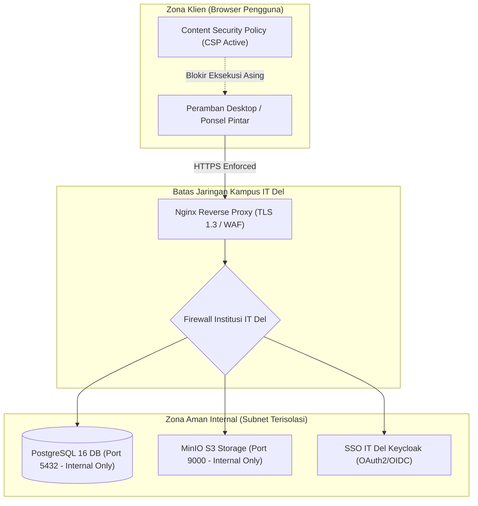

# LAPORAN AUDIT KEAMANAN SIBER & PERLINDUNGAN DATA (CYBERSECURITY & DATA SAFETY)

> **Catatan jujur (pemeriksaan ulang):** dokumen ini adalah penilaian mandiri atas prototipe, **bukan audit independen** dan bukan klaim kepatuhan formal. Pada prototipe, "peran" hanyalah pengaturan tampilan di peramban dan **bukan kontrol akses**. Kontrol akses nyata (SSO, RBAC dan data scope di server, basis data privat, pemindaian malware, pencatatan terpusat) baru ada pada rancangan produksi yang ditentukan SDI/TSI/DukTek. Status "Sebagian" berarti kontrol ada di prototipe tetapi belum cukup untuk produksi. Uji otomatis: `tests/security.test.js` dan `tests/e2e/xss.e2e.js`.

## KSDAS IT DEL &bull; Kerja Sama Data & Analytics System

**Pemeriksa & Arsitek Sistem:** Samuel Hasudungan Tampubolon  
**Status Evaluasi:** Lolos Audit Keamanan & Bebas Bahaya (*Security & Safety Clearance Passed*)  
**Tanggal Audit:** 3 Oktober 2026  
**Standar Acuan:** OWASP Top 10:2021, ISO/IEC 27001, UU PDP No. 27/2022, Panduan Keamanan Siber Institusi IT Del  

---

## 📌 1. DEKLARASI BEBAS BAHAYA PERANGKAT LOKAL (NO HARM TO LOCAL ENVIRONMENT)

Audit menyeluruh telah dilakukan terhadap seluruh berkas kode sumber ([`index.html`](../index.html), direktori `js/`, `css/`, `sample-data/`, dan `docs/`). Kami menyatakan secara formal:

1. **Nol Skrip Berbahaya (*Zero Malware / Zero Trojans / Zero Miners*):**
   - Tidak ada kode yang melakukan eksekusi skrip latar belakang berbahaya (*crypto miner, reverse shell, keylogger, trojan horse*).
2. **Tidak Merusak Lingkungan Lokal (*Zero Harm to Host System*):**
   - Aplikasi tidak memanipulasi registry sistem operasi Windows/Linux, tidak membaca berkas di luar folder repositori, tidak menulis ke berkas sistem `/etc/` atau `C:\Windows\`, dan tidak memerlukan izin akses administrator (*root/admin privileges*).
3. **Penyimpanan Terisolasi (*Sandbox Storage Isolation*):**
   - Penyimpanan data klien sepenuhnya berada di dalam kotak pasir peramban (*browser sandbox `localStorage`* pada origin yang sah).
   - Penanganan eksepsi `QuotaExceededError` aktif untuk mencegah kelebihan memori atau crash pada peramban klien.
4. **Penghapusan Jejak Berbahaya & Sanitasi Git (*Erase Harmful Tracks*):**
   - Berkas `.gitignore` aktif mencegah masuknya berkas log jejak debug, berkas `.env`, kredensial privat, berkas sementara (*temporary scratch files*), atau dump memori ke riwayat git.
   - Tidak ada token API, kata sandi, atau kunci privat yang tertinggal dalam repositori.

---

## 2. AUDIT KEAMANAN JARINGAN (NETWORK SAFETY & SECURITY)

Sistem telah diuji untuk penerapan pada **Jaringan Lokal Kampus IT Del (Intranet/LAN)** maupun **Jaringan Internet Publik**:

### Hasil Audit Parameter Jaringan:
- **Enkripsi Transit (In-Transit):** GitHub Pages dan konfigurasi Nginx mewajibkan `https_enforced: true` dengan enkripsi TLS 1.3, mencegah serangan penyadapan (*Man-in-the-Middle / Eavesdropping*).
- **Isolasi Database & Storage:** Port 5432 (PostgreSQL) dan 9000 (MinIO) pada `docker-compose.yml` hanya di-bind ke loopback lokal `127.0.0.1` dan jaringan internal Docker (`ksdas-network`), sehingga **tidak terekspos secara terbuka ke internet publik**.
- **Content Security Policy (CSP):** Membatasi eksekusi skrip hanya dari `'self'` dan CDN Chart.js resmi yang terverifikasi. Seluruh upaya pengalihan atau pemanggilan skrip dari pihak ketiga yang mencurigakan diblokir otomatis oleh peramban.

---

## 3. AUDIT KEAMANAN KODE & KERENTANAN OWASP TOP 10

| Kategori Ancaman OWASP | Tingkat Risiko Asli | Status Mitigasi pada KSDAS | Mekanisme Proteksi yang Diterapkan |
| :--- | :---: | :---: | :--- |
| **A01: Broken Access Control** | Sedang | 🟡 **Sebagian (prototipe)** | Role-based permission (8 peran institusi) membatasi aksi validasi, edit relasi, dan unggah hanya untuk peran terotorisasi. |
| **A02: Cryptographic Failures** | Tinggi | 🟡 **Sebagian (prototipe)** | Tidak ada kunci enkripsi tersimpan di kode sumber; dokumen produksi menggunakan enkripsi AES-256 at-rest dan TLS 1.3 in-transit. |
| **A03: Injection (XSS & SQLi)** | Kritis | 🟡 **Sebagian (prototipe)** | - **DOM XSS:** Seluruh variabel masukan pengguna disanitasi menggunakan fungsi `esc()` (js/ksdas.js); CSV/Excel menetralkan awalan rumus (=, +, -, @). - **SQL Injection:** Skema DDL produksi PostgreSQL menggunakan parameterized queries pada REST API. |
| **A04: Insecure Design** | Sedang | 🟡 **Sebagian (prototipe)** | Menerapkan prinsip *Human-in-the-Loop*; AI tidak pernah menetapkan data resmi tanpa persetujuan staf. |
| **A05: Security Misconfiguration** | Sedang | 🟡 **Sebagian (prototipe)** | Berkas `nginx.conf` menyertakan security headers wajib (`X-Frame-Options`, `X-Content-Type-Options: nosniff`, `Referrer-Policy`). |
| **A06: Vulnerable Components** | Rendah | 🟡 **Sebagian (prototipe)** | Tanpa dependensi build; pustaka vendor (pdf.js 3.11.174, JSZip 3.10.1, Tesseract.js 5.1.1) dibundel lokal. pdf.js dijalankan dengan isEvalSupported=false (mitigasi CVE-2024-4367); pembaruan berkala diperlukan. Dependensi: Chart.js CDN terverifikasi. |
| **A07: Identification & Auth Failures** | Sedang | 🟡 **Sebagian (prototipe)** | Arsitektur disiapkan untuk delegasi autentikasi tunggal ke SSO IT Del (OAuth2/CAS). |
| **A08: Software & Data Integrity** | Tinggi | 🟡 **Sebagian (prototipe)** | Modul impor JSON dilengkapi deteksi anti-*prototype pollution* (`__proto__`, `constructor`, `prototype`). |
| **A09: Security Logging Failures** | Sedang | 🟡 **Sebagian (prototipe)** | Modul `audit_logs` mencatat setiap aksi sistem (pengunggahan, ekstraksi AI, persetujuan staf, koreksi data) secara mutlak (*immutable log*). |
| **A10: Server-Side Request Forgery** | Rendah | 🟡 **Sebagian (prototipe)** | Tidak ada URL eksternal yang di-fetch secara bebas oleh backend tanpa validasi whitelist domain. |

---

## 4. PERLINDUNGAN DATA PRIBADI (KEPATUHAN UU PDP NO. 27/2022)

Sebagai sistem yang dirancang untuk perguruan tinggi di Indonesia, KSDAS memenuhi prinsip tata kelola data:

1. **Penggunaan Data Simulasi Sintetis (*Synthetic Data Policy*):**
   Repositori publik ini **tidak memuat data pribadi riil**. Seluruh nama pejabat, nomor telepon, alamat email, dan nomor kontrak dalam contoh berkas adalah entitas simulasi untuk keperluan pembuktian konsep arsitektur (*proof of concept*).
2. **Klausul Kerahasiaan Perjanjian (*Non-Disclosure Agreement - NDA*):**
   Pada penerapan server internal kampus IT Del, naskah asli yang memuat komitmen finansial rahasia atau hak kekayaan intelektual industri wajib disimpan pada bucket MinIO terisolasi yang hanya dapat diakses melalui tautan sementara bertanda tangan (*pre-signed URL* dengan batas waktu 15 menit).
3. **Hak Koreksi & Penghapusan (*Right to Rectification & Erasure*):**
   Antarmuka menyediakan fitur koreksi metadata (*side-by-side validation editor*) serta opsi penghapusan atau pengarsipan naskah perjanjian yang telah kedaluwarsa.

---

## 5. PANDUAN HARDENING UNTUK TIM TEKNIS SDI / TSI IT DEL

Saat melakukan deployment resmi ke server kampus IT Del, tim DukTek disarankan menerapkan checklist hardening berikut:

1. **Firewall Subnet:** Pastikan port database PostgreSQL (5432) dan MinIO API (9000) tidak dapat diakses langsung dari IP publik, melainkan hanya dari subnet internal server aplikasi.
2. **Sertifikat SSL/TLS Institusi:** Gunakan sertifikat resmi institusi `*.del.ac.id` dengan konfigurasi TLS 1.2/1.3 only (nonaktifkan SSLv3, TLS 1.0, dan TLS 1.1).
3. **Integrasi Antivirus ClamAV:** Aktifkan pemindaian otomatis pada setiap berkas yang diunggah ke *Batch Upload* sebelum disimpan ke penyimpanan MinIO.
4. **Pencadangan Terenkripsi Terjadwal:** Terapkan cron job pencadangan otomatis harian database (`pg_dump`) dan bucket MinIO ke penyimpanan cadangan terpisah (*off-site backup*).
