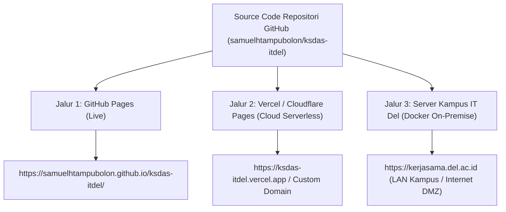

# PANDUAN PENGIRIMAN & PENERAPAN SISTEM (DELIVERY & DEPLOYMENT GUIDE)
## KSDAS IT DEL &bull; Kerja Sama Data & Analytics System

**Penyusun & Arsitek:** Samuel Hasudungan Tampubolon  
**Hak Cipta:** Copyright &copy; 2026 Samuel Hasudungan Tampubolon  
**Peruntukan:** Unit Kerja Sama, Tim SDI / TSI / DukTek Institut Teknologi Del, dan Pihak Terkait  
**Versi:** 0.2.0  

---

## 📌 DAFTAR ISI
1. [Ringkasan Pilihan Delivery Sistem](#1-ringkasan-pilihan-delivery-sistem)
2. [Jalur Delivery 1: GitHub Pages (Live Static Edge)](#2-jalur-delivery-1-github-pages-live-static-edge)
3. [Jalur Delivery 2: Vercel / Cloudflare Pages (Cloud Serverless Edge - Bukan Localhost)](#3-jalur-delivery-2-vercel--cloudflare-pages-cloud-serverless-edge---bukan-localhost)
4. [Jalur Delivery 3: Server Produksi Kampus IT Del (Docker Compose On-Premise)](#4-jalur-delivery-3-server-produksi-kampus-it-del-docker-compose-on-premise)
5. [Konfigurasi Dual-Network: Jaringan Lokal (Intranet/LAN) vs Jaringan Internet (Publik)](#5-konfigurasi-dual-network-jaringan-lokal-intranetlan-vs-jaringan-internet-publik)
6. [Matriks Perbandingan Jalur Delivery](#6-matriks-perbandingan-jalur-delivery)

---

## 1. RINGKASAN PILIHAN DELIVERY SISTEM

Sistem KSDAS IT Del dirancang dengan fleksibilitas deployment tinggi (*Multi-Channel Delivery*). Anda memiliki 3 jalur penerapan resmi:



---

## 2. JALUR DELIVERY 1: GITHUB PAGES (LIVE STATIC EDGE)

Jalur ini adalah jalur penerapan statis gratis yang telah aktif dan terverifikasi:

- **Tautan Langsung:** [https://samuelhtampubolon.github.io/ksdas-itdel/](https://samuelhtampubolon.github.io/ksdas-itdel/)
- **Karakteristik:**
  - Terhubung langsung dengan branch `main` pada repositori GitHub.
  - Setiap kali ada `git push`, GitHub Pages secara otomatis memicu proses build dan memperbarui situs dalam 30-60 detik.
  - Otomatis menggunakan HTTPS (Sertifikat SSL/TLS gratis dari Let's Encrypt / GitHub).
  - Tidak memerlukan server backend (seluruh logika berjalan di sisi peramban klien).

---

## 3. JALUR DELIVERY 2: VERCEL / CLOUDFLARE PAGES (CLOUD SERVERLESS EDGE - BUKAN LOCALHOST)

Jika menginginkan penerapan cloud modern independen di luar GitHub Pages yang memiliki kecepatan CDN global, proteksi DDoS kelas dunia, serta kemudahan menghubungkan domain kustom sendiri (*custom domain*), gunakan **Vercel** atau **Cloudflare Pages**.

### Opsi 2A: Penerapan via Vercel (1-Click / CLI)
Konfigurasi resmi telah disediakan pada berkas [`vercel.json`](../vercel.json).

#### Cara Menerapkan melalui Dashboard Vercel:
1. Masuk ke [https://vercel.com](https://vercel.com) menggunakan akun GitHub Anda.
2. Klik **"Add New Project"** &rarr; Pilih repositori **`samuelhtampubolon/ksdas-itdel`**.
3. Pada bagian **Framework Preset**, biarkan **"Other"**.
4. Klik tombol **"Deploy"**.
5. Dalam 20 detik, sistem akan aktif di URL:  
   `https://ksdas-itdel.vercel.app` (atau nama proyek yang Anda pilih).

#### Keuntungan Jalur Vercel:
- Otomatis mengaktifkan HTTP Security Headers (CSP, X-Frame-Options, XSS Protection).
- Caching cerdas untuk aset gambar, stylesheet, dan modul JavaScript.
- Dukungan domain institusi kustom dengan 1 klik (misal: `ksdas.del.ac.id`).

---

### Opsi 2B: Penerapan via Cloudflare Pages
1. Masuk ke [Cloudflare Dashboard](https://dash.cloudflare.com/) &rarr; Menu **Workers & Pages**.
2. Klik **"Create application"** &rarr; Tab **"Pages"** &rarr; **"Connect to Git"**.
3. Pilih repositori `ksdas-itdel` &rarr; Branch `main`.
4. Build setting: Biarkan kosong (Build command: *kosong*, Output directory: `/`).
5. Klik **"Save and Deploy"**.

---

## 4. JALUR DELIVERY 3: SERVER PRODUKSI KAMPUS IT DEL (DOCKER COMPOSE ON-PREMISE)

Ini adalah jalur resmi ketika prototype diserahkan kepada tim **Direktorat SDI / TSI / DukTek IT Del** untuk diintegrasikan secara permanen ke server institusi.

### Berkas Pendukung yang Disediakan:
- [`docker-compose.yml`](../docker-compose.yml) &bull; Definisi stack kontainer terpadu.
- [`.env.example`](../.env.example) &bull; Template konfigurasi variabel lingkungan.
- [`nginx.conf`](../nginx.conf) &bull; Konfigurasi reverse proxy Nginx dengan HTTP security headers.
- [`docs/schema_production_postgres.sql`](schema_production_postgres.sql) &bull; Skrip DDL resmi database kampus.

### Langkah Penerapan di Server Kampus IT Del:
```bash
# 1. Kloning repositori pada server virtual/fisik IT Del (misal di Proxmox / VM TSI)
git clone https://github.com/samuelhtampubolon/ksdas-itdel.git /opt/ksdas-itdel
cd /opt/ksdas-itdel

# 2. Salin dan sesuaikan kredensial
cp .env.example .env
nano .env

# 3. Jalankan stack kontainer dalam mode background
docker compose up -d

# 4. Inisialisasi basis data PostgreSQL (jika belum otomatis)
docker compose exec ksdas-db psql -U ksdas_app -d ksdas_db -f /docker-entrypoint-initdb.d/01_init.sql

# 5. Periksa status layanan
docker compose ps
```

Layanan yang berjalan di server kampus mencakup:
1. **Web Frontend (Nginx)** pada port 80/443;
2. **Database PostgreSQL 16** pada port 5432;
3. **Object Storage MinIO S3** pada port 9000 (API) dan 9001 (Web Console).

---

## 5. KONFIGURASI DUAL-NETWORK: JARINGAN LOKAL (INTRANET/LAN) VS JARINGAN INTERNET (PUBLIK)

Sistem KSDAS IT Del dirancang agar dapat diakses secara aman baik di dalam jaringan lokal kampus maupun dari internet:

### Skenario A: Penerapan Jaringan Lokal Kampus IT Del (Intranet / LAN Kampus)
- **Tujuan:** Data MoU, PKS, dan nilai anggaran institusi hanya dapat diakses oleh komputer yang terhubung ke Wi-Fi / kabel LAN kampus IT Del Sitoluama atau VPN IT Del.
- **Konfigurasi TSI:**
  - Server KSDAS diberikan IP internal (contoh: `10.10.20.50`).
  - DNS Server lokal kampus Del menambahkan entri `A`:
    ```
    kerjasama.del.ac.id.   IN   A   10.10.20.50
    ```
  - Sertifikat SSL internal diterbitkan menggunakan CA internal kampus IT Del atau sertifikat wildcard `*.del.ac.id`.

### Skenario B: Penerapan Jaringan Internet Publik (Akses Terbuka Sivitas / Mitra)
- **Tujuan:** Pimpinan kampus (Rektor, WR3) atau asesor akreditasi BAN-PT/LAM-INFOKOM dapat mengakses sistem dari luar kampus secara aman.
- **Konfigurasi TSI / DukTek:**
  - Tempatkan kontainer `ksdas-frontend` pada zona DMZ (*Demilitarized Zone*) kampus IT Del.
  - Gunakan reverse proxy (Nginx / HAProxy / Cloudflare Tunnel) dengan enkripsi TLS 1.3 dan WAF (*Web Application Firewall*).
  - Basis data PostgreSQL dan MinIO Storage tetap berada pada jaringan privat (*Isolated Subnet*) dan tidak boleh memiliki IP publik.
  - Otomatiskan autentikasi pengguna melalui SSO IT Del (OAuth2 / Keycloak).

---

## 6. MATRIKS PERBANDINGAN JALUR DELIVERY

| Parameter | Jalur 1: GitHub Pages | Jalur 2: Vercel / Cloudflare | Jalur 3: Server On-Premise IT Del |
| :--- | :---: | :---: | :---: |
| **Kesiapan** | ✅ **Aktif Sekarang** | ✅ **Siap 1-Click** | ⚙️ **Siap Eksekusi Tim TSI** |
| **Tipe Server** | Static CDN | Serverless Edge | Bare Metal / VM Kampus |
| **Penyimpanan Data** | Browser `localStorage` | Browser `localStorage` | **PostgreSQL 16 Kampus** |
| **Penyimpanan Berkas** | Simulasi Klien | Simulasi Klien | **MinIO S3 Kampus** |
| **Autentikasi** | Simulasi Role Switcher | Simulasi Role Switcher | **SSO Resmi IT Del** |
| **Akses Jaringan** | Internet Global | Internet Global | **LAN Internal / DMZ Kampus** |
| **Biaya Hosting** | **Gratis ($0)** | **Gratis ($0)** | Menggunakan Server IT Del |
| **Tujuan Penggunaan** | Demo Tim Kerja Sama | Presentasi Stakeholder | **Operasional Resmi Kampus** |
