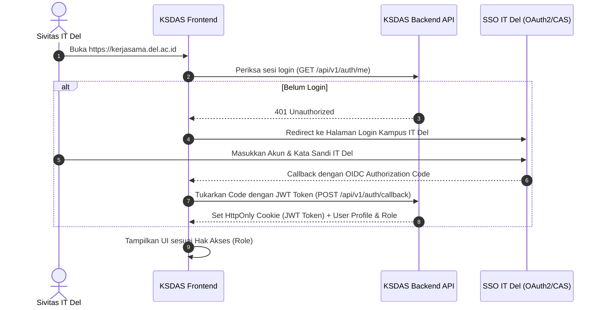
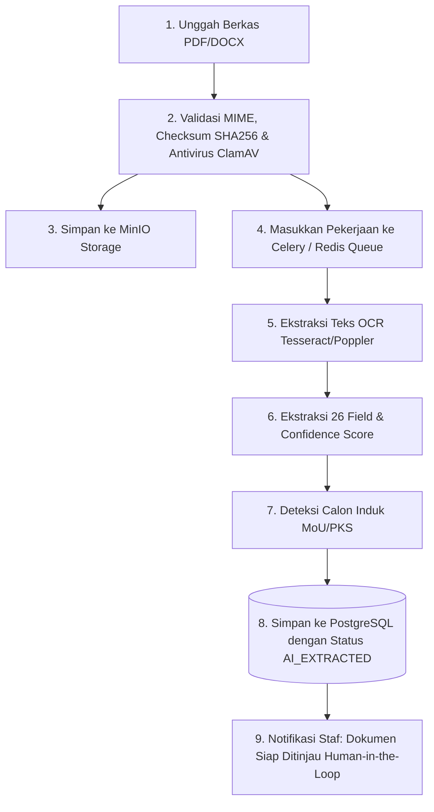

# PANDUAN INTEGRASI SISTEM SERVER KAMPUS (SDI / TSI / DUKTEK)
## Kerja Sama Data & Analytics System (KSDAS) Institut Teknologi Del

**Penyusun:** Samuel Hasudungan Tampubolon  
**Hak Cipta:** Copyright &copy; 2026 Samuel Hasudungan Tampubolon  
**Penerima:** Direktorat Sistem & Data Informasi (SDI) / Teknologi & Sistem Informasi (TSI) / Tim DukTek IT Del  
**Status Dokumen:** Panduan Implementasi Teknis & Integrasi Produksi (*Production Implementation Guide*)  
**Versi Target:** PostgreSQL 14+, Node.js 18+ / Python 3.10+ (FastAPI), MinIO / S3 Storage, Nginx / Docker  

---

## 📌 DAFTAR ISI
1. [Ringkasan Eksekutif untuk Tim Teknis](#1-ringkasan-eksekutif-untuk-tim-teknis)
2. [Pemetaan Komponen: Prototipe vs Produksi](#2-pemetaan-komponen-prototipe-vs-produksi)
3. [Langkah 1: Migrasi Basis Data PostgreSQL](#langkah-1-migrasi-basis-data-postgresql)
4. [Langkah 2: Konfigurasi Penyimpanan Berkas (MinIO / S3 Kampus)](#langkah-2-konfigurasi-penyimpanan-berkas-minio--s3-kampus)
5. [Langkah 3: Integrasi Autentikasi Tunggal (SSO IT Del)](#langkah-3-integrasi-autentikasi-tunggal-sso-it-del)
6. [Langkah 4: Pipeline Pemrosesan Dokumen & AI / OCR](#langkah-4-pipeline-pemrosesan-dokumen--ai--ocr)
7. [Langkah 5: Transisi Frontend (Adapter API REST)](#langkah-5-transisi-frontend-adapter-api-rest)
8. [Spesifikasi REST API Produksi (Kontrak Antarmuka)](#spesifikasi-rest-api-produksi-kontrak-antarmuka)
9. [Deployment Server Kampus Menggunakan Docker Compose](#deployment-server-kampus-menggunakan-docker-compose)
10. [Matriks Checklist Verifikasi Sebelum Go-Live](#matriks-checklist-verifikasi-sebelum-go-live)

---

## 1. RINGKASAN EKSEKUTIF UNTUK TIM TEKNIS

Prototipe KSDAS IT Del telah menyelesaikan 100% perancangan proses bisnis, hierarki relasi dokumen, 26 field metadata ekstraksi, kamus data terstruktur, antarmuka pengguna (UI/UX 13 modul fungsional), dan skema basis data relasional.

> [!NOTE]
> **Tugas Tim SDI / TSI / DukTek:**
> Anda **TIDAK PERLU** merancang ulang antarmuka (UI), menghitung rumus analitik, atau mendefinisikan struktur tabel dari awal. Tugas utama tim teknis adalah:
> 1. Mengeksekusi skrip DDL basis data PostgreSQL yang telah disediakan;
> 2. Membangun REST API backend ringan untuk menghubungkan antarmuka ke database kampus;
> 3. Menghubungkan penyimpanan berkas ke server MinIO internal IT Del;
> 4. Mengintegrasikan login SSO IT Del;
> 5. Menerapkan server container pada jaringan lokal kampus (`https://kerjasama.del.ac.id`).

---

## 2. PEMETAAN KOMPONEN: PROTOTIPE VS PRODUKSI

| Komponen Sistem | Status pada Prototipe Saat Ini | Target Implementasi Tim SDI/TSI | Lokasi Rujukan Teknis |
| :--- | :--- | :--- | :--- |
| **Basis Data** | Browser `localStorage` (JSON reactive) | **PostgreSQL 14 / 16 Enterprise** | [`docs/schema_production_postgres.sql`](schema_production_postgres.sql) |
| **Penyimpanan Berkas** | Simulasi memori peramban / DataURL | **MinIO S3 On-Premise Kampus IT Del** | Bagian 4 panduan ini |
| **Autentikasi** | Role Selector instan (8 Peran Institusi) | **SSO IT Del (Keycloak / OAuth2 / CAS)** | Bagian 5 panduan ini |
| **Ekstraksi AI & OCR** | Deterministic Mock AI (26 field regex/NLP) | **Tesseract OCR / Campus Python Worker** | [`docs/AI_PROCESSING_SPEC.md`](AI_PROCESSING_SPEC.md) |
| **Antarmuka (Frontend)** | HTML5, Vanilla CSS, Modular ES6 | **Digunakan Langsung (Zero Re-write)** | Folder `index.html`, `css/`, `js/` |
| **Komunikasi Data** | Event Bus lokal (`KSDASStore`) | **HTTP REST API Adapter (`fetch`)** | Bagian 7 panduan ini |

---

## 3. LANGKAH 1: MIGRASI BASIS DATA POSTGRESQL

Skrip DDL produksi lengkap telah disiapkan pada berkas [`docs/schema_production_postgres.sql`](schema_production_postgres.sql). Skrip ini mencakup:
- Seluruh tabel relasional (`partners`, `documents`, `signatories`, `activities`, `evidences`, `accreditation_frameworks`, dll.);
- Indeks performa untuk pencarian teks cepat (*trigram / B-tree*);
- Trigger penghitungan masa berlaku kontrak (`days_to_expiry`) dan deteksi dokumen yatim (*orphan agreement*);
- Tabel `audit_logs` mutlak (*immutable audit trail*);
- Role & hak akses PostgreSQL (RBAC).

### Perintah Eksekusi di Server Database Kampus:
```bash
# 1. Masuk ke server database IT Del
ssh admin@db.del.ac.id

# 2. Buat database dan user khusus KSDAS
sudo -u postgres psql -c "CREATE USER ksdas_app WITH PASSWORD 'GantiDenganPasswordAman2026!';"
sudo -u postgres psql -c "CREATE DATABASE ksdas_db OWNER ksdas_app;"

# 3. Jalankan skrip migrasi resmi
psql -U ksdas_app -d ksdas_db -f docs/schema_production_postgres.sql

# 4. Verifikasi tabel berhasil dibuat (output harus 18 tabel)
psql -U ksdas_app -d ksdas_db -c "\dt"
```

---

## 4. LANGKAH 2: KONFIGURASI PENYIMPANAN BERKAS (MINIO / S3 KAMPUS)

Semua naskah asli (MoU, PKS, IA, Proposal, Laporan Akhir) dan berkas bukti fisik (*evidence*) harus disimpan dalam object storage terpusat dengan enkripsi *at-rest* (AES-256).

### Konfigurasi Bucket MinIO:
1. Buat bucket utama: `ksdas-documents` (Private, hanya dapat diakses melalui backend KSDAS).
2. Buat bucket bukti fisik: `ksdas-evidence` (Internal IT Del).
3. Struktur penyimpanan berkas (*Object Key Pattern*):
   ```
   ksdas-documents/{partner_id}/{document_type}/{year}/{document_id}.pdf
   Contoh:
   ksdas-documents/PRT-0001/PKS_MOA/2026/DOC-000002.pdf
   ```

### Alur Unduh Aman Menggunakan Pre-signed URL:
Pengguna tidak boleh mengakses berkas langsung dari link publik statis. Backend menghasilkan URL bertanda tangan dengan masa berlaku singkat:
```
GET /api/v1/documents/:id/download-url
Response: { "downloadUrl": "https://storage.del.ac.id/ksdas-documents/...?signature=xyz&expires=900" }
```

---

## 5. LANGKAH 3: INTEGRASI AUTENTIKASI TUNGGAL (SSO IT Del)

Pada prototipe, pengalihan peran dilakukan melalui elemen dropdown `<select id="header-role-select">`. Untuk produksi kampus, gunakan integrasi SSO resmi kampus IT Del:

### Alur Autentikasi:


### Pemetaan Atribut SSO Kampus ke Peran KSDAS:
| Grup SSO IT Del | Peran KSDAS (`role_id`) | Hak Akses Utama |
| :--- | :--- | :--- |
| `unit_kerjasama_staff` | `ADMIN_STAFF` | Upload, Ekstraksi AI, Koreksi, Validasi, Taut Relasi |
| `kepala_biro_kerjasama`| `BUREAU_HEAD` | Review, Monitoring, Persetujuan Akhir, Analitik |
| `wakil_rektor_3` | `WR3` | Dasbor Eksekutif, Peringatan Kontrak Kritis, Kebijakan |
| `satuan_penjaminan_mutu`| `QUALITY_REVIEWER` | Akreditasi, Verifikasi Evidence, Filter Indikator AMI |
| `dekan_fakultas` | `FACULTY_VIEWER` | Akses data & laporan tingkat fakultas masing-masing |
| `kaprodi` | `PROGRAM_VIEWER` | Akses data & bukti luaran tingkat program studi |
| `rektor / wr1 / wr2` | `EXECUTIVE_VIEWER` | Dasbor Eksekutif makro dan laporan tahunan |

---

## 6. LANGKAH 4: PIPELINE PEMROSESAN DOKUMEN & AI / OCR

Prototipe menggunakan *deterministic mock engine* ([`js/mock-ai.js`](../js/mock-ai.js)) yang telah memetakan aturan ekstraksi 26 field. Tim teknis dapat mengimplementasikan microservice OCR berbasis Python (FastAPI + Tesseract / Poppler) atau server GPU lokal kampus.

### Alur Pemrosesan Dokumen di Backend:


### Aturan Keamanan Utama:
- Berkas yang diunggah wajib dipindai antivirus (*ClamAV daemon*) sebelum disimpan.
- Berkas tidak boleh dijalankan sebagai skrip (*disable execution permissions* pada direktori unggahan).
- Skor keyakinan (*confidence score*) harus dihitung per field (0.00 - 1.00).

---

## 7. LANGKAH 5: TRANSISI FRONTEND (ADAPTER API REST)

Arsitektur prototipe dirancang dengan pola *Repository / Data Store* terpusat pada [`js/store.js`](../js/store.js). Untuk beralih dari `localStorage` ke backend PostgreSQL, tim teknis cukup mengaktifkan mode API pada `js/store.js`.

### Contoh Implementasi Adaptor API (`js/store.js`):
```javascript
// Cukup ubah konfigurasi sumber data:
const CONFIG = {
  USE_BACKEND_API: true, // Ubah ke true saat terhubung ke server kampus
  API_BASE_URL: "/api/v1"
};

class KSDASStore {
  // Method untuk mengambil daftar dokumen dari PostgreSQL
  async fetchDocuments(filterParams = {}) {
    if (CONFIG.USE_BACKEND_API) {
      const query = new URLSearchParams(filterParams).toString();
      const response = await fetch(`${CONFIG.API_BASE_URL}/documents?${query}`, {
        headers: { "Content-Type": "application/json" }
      });
      if (!response.ok) throw new Error("Gagal mengambil data dokumen dari server");
      const result = await response.json();
      this.state.documents = result.data;
      return result.data;
    } else {
      // Fallback lokal (prototipe localStorage)
      return this.getDocuments(filterParams);
    }
  }

  // Method untuk menyimpan persetujuan validasi manusia ke database kampus
  async validateDocument(docId, validatedData) {
    if (CONFIG.USE_BACKEND_API) {
      const response = await fetch(`${CONFIG.API_BASE_URL}/documents/${docId}/validate`, {
        method: "PUT",
        headers: { "Content-Type": "application/json" },
        body: JSON.stringify(validatedData)
      });
      if (!response.ok) throw new Error("Gagal menyimpan data validasi ke database");
      return await response.json();
    } else {
      // Fallback lokal
      return this.localValidateDocument(docId, validatedData);
    }
  }
}
```

Dengan pola adapter ini, **seluruh antarmuka UI, animasi, grafik Chart.js, filter, dan tata letak tidak perlu diubah sama sekali**.

---

## 8. SPESIFIKASI REST API PRODUKSI (KONTRAK ANTARMUKA)

Berikut adalah daftar endpoint minimum yang perlu dibangun oleh tim backend SDI/TSI:

### A. Repositori & Metadata Dokumen
- `GET /api/v1/documents` : Mengambil daftar dokumen dengan parameter filter (`year`, `partner`, `type`, `tri_dharma`, `status`, `page`, `limit`).
- `GET /api/v1/documents/:id` : Mengambil rincian naskah, teks OCR, dan riwayat revisi.
- `POST /api/v1/documents/batch-upload` : Menerima multipart/form-data untuk banyak berkas sekaligus.
- `PUT /api/v1/documents/:id/validate` : Menyimpan keputusan verifikasi staf (Status: `VALIDATED`, `CORRECTED`, `REJECTED`).
- `PUT /api/v1/documents/:id/link-parent` : Menautkan dokumen turunan ke dokumen induk (PKS &rarr; MoU, IA &rarr; PKS).

### B. Master Mitra & Relasi
- `GET /api/v1/partners` : Direktori seluruh mitra kerja sama aktif/inaktif.
- `POST /api/v1/partners` : Menambah entitas mitra baru.
- `GET /api/v1/partners/:id/hierarchy` : Mengambil struktur pohon relasi perjanjian mitra.

### C. Aktivitas, Bukti Fisik & Akreditasi
- `GET /api/v1/activities` : Daftar pelaksanaan kegiatan kerja sama.
- `GET /api/v1/evidences` : Daftar berkas bukti fisik pendukung.
- `PUT /api/v1/evidences/:id/verify` : Verifikasi bukti fisik oleh SPM (*Satuan Penjaminan Mutu*).
- `GET /api/v1/accreditation/frameworks` : Mengambil daftar framework akreditasi (BAN-PT, LAM-INFOKOM).
- `GET /api/v1/accreditation/mapping/:frameworkId` : Mengambil pemetaan indikator akreditasi ke naskah dan bukti fisik.

### D. Analitik & Audit Trail
- `GET /api/v1/analytics/summary` : Ringkasan KPI eksekutif, funnel, dan peringatan kedaluwarsa.
- `GET /api/v1/analytics/cross-tab` : Matriks tabulasi silang (Fakultas vs Tri Dharma).
- `GET /api/v1/audit-logs` : Log transaksi mutlak sistem (*read-only*).

---

## 9. DEPLOYMENT SERVER KAMPUS MENGGUNAKAN DOCKER COMPOSE

Untuk mempermudah tim DukTek menyebarkan sistem pada lingkungan server IT Del (On-Premise / Proxmox / VM IT Del), berkas `docker-compose.yml` telah disediakan:

```bash
# 1. Kloning repositori pada server aplikasi IT Del
git clone https://github.com/samuelhtampubolon/ksdas-itdel.git /opt/ksdas-itdel
cd /opt/ksdas-itdel

# 2. Salin template environment
cp .env.example .env
nano .env # Sesuaikan kredensial dan domain

# 3. Jalankan seluruh stack (Database, Storage, Backend, Frontend)
docker compose up -d

# 4. Periksa status kontainer
docker compose ps
```

Stack Docker KSDAS mencakup:
- **`ksdas-frontend`**: Server Nginx melayani berkas statis antarmuka KSDAS dengan TLS 1.3 dan kompresi Brotli/Gzip.
- **`ksdas-db`**: PostgreSQL 16 dengan volume penyimpanan persisten di `/var/lib/postgresql/data`.
- **`ksdas-storage`**: MinIO S3 Object Storage untuk penyimpanan berkas dokumen PDF.
- **`ksdas-api`**: Container runtime aplikasi REST API.

---

## 10. MATRIKS CHECKLIST VERIFIKASI SEBELUM GO-LIVE

Gunakan checklist ini saat melakukan *User Acceptance Testing (UAT)* bersama tim SDI/TSI dan Unit Kerja Sama:

| No | Komponen Uji | Kriteria Sukses | Status |
| :---: | :--- | :--- | :---: |
| 1 | **Koneksi Database** | Seluruh 18 tabel terbuat dan relasi foreign key berfungsi tanpa circular dependency. | [ ] |
| 2 | **Login SSO IT Del** | Pengguna dapat masuk menggunakan akun resmi IT Del dan mendapatkan peran institusional yang tepat. | [ ] |
| 3 | **Batch Upload Berkas** | Mengunggah 10 file PDF sekaligus berhasil diproses tanpa timeout dan tersimpan di MinIO. | [ ] |
| 4 | **Validasi Manusia** | Koreksi metadata oleh staf tersimpan ke database kampus dan tercatat pada `audit_logs`. | [ ] |
| 5 | **Integritas Relasi** | Menautkan PKS ke MoU induk berhasil mengupdate status orphan menjadi valid. | [ ] |
| 6 | **Penyaringan Data** | Filter multi-kategori (Tahun, Mitra, Tri Dharma, Status) merespons dalam < 300 ms. | [ ] |
| 7 | **Verifikasi Bukti SPM** | Satuan Penjaminan Mutu dapat memverifikasi berkas evidence dan mengekspor indeks akreditasi. | [ ] |
| 8 | **Mode Cetak Laporan** | Laporan eksekutif dapat dicetak rapi (*Print to PDF*) dengan format kop institusi Del. | [ ] |
| 9 | **Keamanan Data** | Pengujian XSS dan pengunggahan berkas executable (.exe, .sh) berhasil diblokir oleh sistem. | [ ] |
| 10 | **Cadangan Terjadwal** | Skrip cron melakukan `pg_dump` otomatis setiap hari pukul 02:00 WIB ke server cadangan IT Del. | [ ] |

---

**Kontak Teknis & Rujukan:**  
- **Perancang Solusi:** Samuel Hasudungan Tampubolon  
- **Unit Pengusul:** Unit Kerja Sama Institut Teknologi Del  
- **Dokumentasi Pendukung:**  
  - [Spesifikasi Arsitektur](ARCHITECTURE.md)  
  - [Kebijakan Keamanan Data](SECURITY.md)  
  - [Kamus Data Lengkap](DATA_DICTIONARY.md)  
  - [Skrip SQL PostgreSQL](schema_production_postgres.sql)
