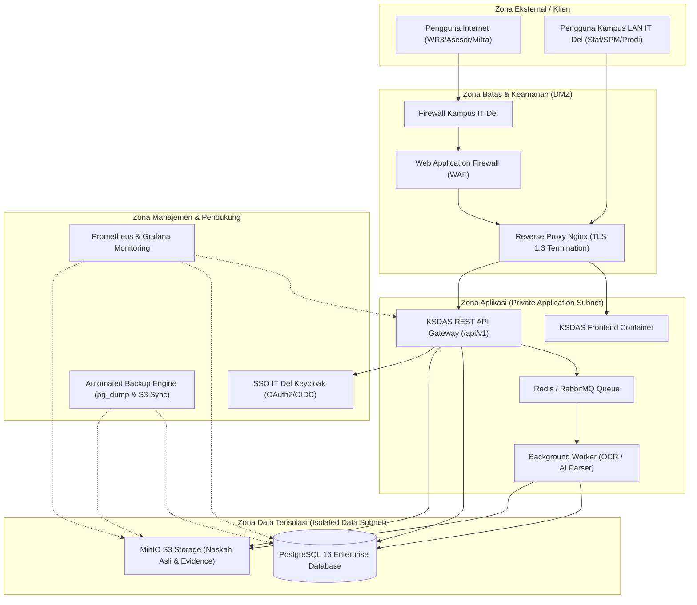
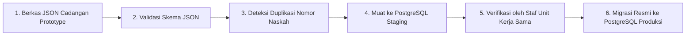

# KSDAS IT DEL - INTEGRATION RUNBOOK FOR SDI / TSI / DUKTEK
## Versi 0.3 &bull; Panduan Teknis Transisi Produksi & Rekayasa Sistem Kampus

**Penyusun:** Samuel Hasudungan Tampubolon (Solution & Integration Architect)  
**Hak Cipta:** Copyright &copy; 2026 Samuel Hasudungan Tampubolon  
**Sasaran:** Direktorat Sistem & Data Informasi (SDI) / Teknologi & Sistem Informasi (TSI) / Tim DukTek IT Del  
**Sifat Dokumen:** Dokumen Kerja Teknis Formal Transisi Prototype ke Sistem Produksi Kampus  

---

## 📌 DAFTAR ISI
1. [Tujuan & Batasan Tanggung Jawab](#1-tujuan--batasan-tanggung-jawab)
2. [Target Mode Penerapan (Deployment Targets)](#2-target-mode-penerapan-deployment-targets)
3. [Topologi Arsitektur Produksi Kampus](#3-topologi-arsitektur-produksi-kampus)
4. [Pemisahan Lingkungan (Environments)](#4-pemisahan-lingkungan-environments)
5. [Rencana Penamaan Domain (DNS Plan)](#5-rencana-penamaan-domain-dns-plan)
6. [Rencana Keamanan Transport (TLS Plan)](#6-rencana-keamanan-transport-tls-plan)
7. [Matriks Aturan Firewall Kampus (Firewall Rules Matrix)](#7-matriks-aturan-firewall-kampus-firewall-rules-matrix)
8. [Reverse Proxy & Gateway API](#8-reverse-proxy--gateway-api)
9. [Integrasi Basis Data Produksi (PostgreSQL)](#9-integrasi-basis-data-produksi-postgresql)
10. [Integrasi Penyimpanan Berkas Objek (MinIO / S3 Storage)](#10-integrasi-penyimpanan-berkas-objek-minio--s3-storage)
11. [Integrasi Single Sign-On (SSO IT Del)](#11-integrasi-single-sign-on-sso-it-del)
12. [Pemetaan Peran Pengguna (RBAC Role Mapping)](#12-pemetaan-peran-pengguna-rbac-role-mapping)
13. [Versi & Kontrak Antarmuka API (/api/v1/)](#13-versi--kontrak-antarmuka-api-apiv1)
14. [Aturan Perancangan API & Standar Respon Kesalahan](#14-aturan-perancangan-api--standar-respon-kesalahan)
15. [Pemrosesan Asinkron (Queue & Worker Pipeline)](#15-pemrosesan-asinkron-queue--worker-pipeline)
16. [Layanan AI / OCR Server Kampus](#16-layanan-ai--ocr-server-kampus)
17. [Mesin Pencarian Data (Search Infrastructure)](#17-mesin-pencarian-data-search-infrastructure)
18. [Mesin Pembuat Laporan Resmi (Report Engine)](#18-mesin-pembuat-laporan-resmi-report-engine)
19. [Alur Migrasi Data (JSON Prototype ke Produksi)](#19-alur-migrasi-data-json-prototype-ke-produksi)
20. [Konfigurasi Variabel Lingkungan & Rahasia](#20-konfigurasi-variabel-lingkungan--rahasia)
21. [Pipeline CI/CD & Pemindaian Keamanan](#21-pipeline-cicd--pemindaian-keamanan)
22. [Pemantauan Sistem & Metrik (Monitoring)](#22-pemantauan-sistem--metrik-monitoring)
23. [Titik Cek Kesehatan (/health & /ready)](#23-titik-cek-kesehatan-health--ready)
24. [Matriks Kontrol Akses (Access Control Matrix)](#24-matriks-kontrol-akses-access-control-matrix)
25. [Pengujian Penerimaan Pengguna (UAT-01 s/d UAT-10)](#25-pengujian-penerimaan-pengguna-uat-01-sd-uat-10)
26. [Daftar Periksa Sebelum Go-Live (Checklist Go-Live)](#26-daftar-periksa-sebelum-go-live-checklist-go-live)
27. [Rencana Pemulihan & Rollback (Rollback Plan)](#27-rencana-pemulihan--rollback-rollback-plan)
28. [Matriks RACI Tata Kelola Sistem](#28-matriks-raci-tata-kelola-sistem)
29. [Paket Serah Terima Final (Final Handoff Package)](#29-paket-serah-terima-final-final-handoff-package)
30. [Keputusan Terbuka bagi Tim SDI / TSI / DukTek (TBD Table)](#30-keputusan-terbuka-bagi-tim-sdi--tsi--duktek-tbd-table)
31. [Prinsip Kerja Sama Akhir](#31-prinsip-kerja-sama-akhir)

---

## 1. TUJUAN & BATASAN TANGGUNG JAWAB

Dokumen ini adalah *technical runbook* resmi yang menjabarkan transisi sistem KSDAS dari prototipe sisi klien (GitHub Pages + `localStorage`) menjadi aplikasi tingkat institusi (*production grade*) di server IT Del.

> **Pembagian Batas Tanggung Jawab Institusional:**
> - **Unit Kerja Sama (Business Owner):** Menentukan *WHAT*, *WHY*, *WHO*, alur proses bisnis kemitraan, definisi kamus data, kriteria penerimaan, dan pengujian naskah.
> - **Direktorat SDI / TSI / DukTek (Technical Owner):** Menentukan *HOW*, *WHERE*, arsitektur infrastruktur, keamanan jaringan, provisioning basis data, deployment server, SSO, dan operasional harian.

---

## 2. TARGET MODE PENERAPAN (DEPLOYMENT TARGETS)

Sistem KSDAS mendukung 4 opsi mode akses jaringan, yang keputusannya diserahkan kepada pimpinan IT Del dan SDI/TSI:

- **Mode A (LAN-Only):** Hanya dapat diakses melalui jaringan lokal kampus IT Del Sitoluama (kabel LAN dan Wi-Fi kampus).
- **Mode B (LAN + VPN):** Dapat diakses dari luar kampus hanya oleh sivitas yang terhubung ke VPN resmi IT Del.
- **Mode C (Internet Publik + SSO):** Dapat diakses dari internet umum melalui domain resmi dengan perlindungan WAF dan autentikasi SSO IT Del.
- **Mode D (Hybrid):** Antarmuka repositori umum dapat diakses publik, namun dokumen berklausul rahasia (*NDA*) dan formulir validasi hanya dapat diakses melalui jaringan LAN/VPN kampus.

---

## 3. TOPOLOGI ARSITEKTUR PRODUKSI KAMPUS



> [!CAUTION]
> **Aturan Keamanan Mutlak:** Basis data PostgreSQL dan MinIO Storage **TIDAK BOLEH** memiliki IP publik atau dapat diakses langsung dari internet. Seluruh akses data wajib melalui lapisan API terotentikasi.

---

## 4. PEMISAHAN LINGKUNGAN (ENVIRONMENTS)

Untuk menjamin keandalan dan stabilitas layanan, pengembangan tidak boleh dilakukan langsung pada server produksi:

| Lingkungan | Domain / Subdomain Konseptual | Basis Data | Fungsi Utama |
| :--- | :--- | :--- | :--- |
| **Development** | `http://localhost:8080` / `dev-ksdas.del.ac.id` | PostgreSQL Lokal / Docker | Pengembangan fitur baru |
| **Staging** | `https://staging-kerjasama.del.ac.id` | PostgreSQL Staging (Data Sintetis) | Pengujian integrasi & UAT |
| **Production** | `https://kerjasama.del.ac.id` | PostgreSQL Produksi (Data Resmi) | Operasional resmi kampus IT Del |

---

## 5. RENCANA PENAMAAN DOMAIN (DNS PLAN)

| Layanan | Nama Domain Target (Konseptual) | Tipe Rekaman | Keterangan |
| :--- | :--- | :---: | :--- |
| **Aplikasi Web KSDAS** | `kerjasama.del.ac.id` | `A` / `CNAME` | Diarahkan ke reverse proxy Nginx DMZ |
| **REST API Gateway** | `kerjasama.del.ac.id/api/v1` | Reverse Proxy Path | Jalur rute ke backend kontainer |
| **Storage Konsol (MinIO)** | `s3-kerjasama.del.ac.id` | `A` (Internal LAN) | Akses manajemen storage oleh tim TSI |
| **Identity Provider** | `sso.del.ac.id` | `A` | Server SSO resmi kampus IT Del |

---

## 6. RENCANA KEAMANAN TRANSPORT (TLS PLAN)

1. Seluruh endpoint produksi wajib menggunakan protokol **HTTPS (TLS 1.3 / TLS 1.2)**.
2. Protokol usang (SSLv2, SSLv3, TLS 1.0, TLS 1.1) wajib dinonaktifkan pada Nginx.
3. Sertifikat digital dapat menggunakan:
   - Sertifikat *Wildcard* resmi kampus IT Del (`*.del.ac.id`) atau Let's Encrypt dengan perpanjangan otomatis (*certbot cron*).
4. Pengaturan *HTTP Strict Transport Security* (HSTS):
   `add_header Strict-Transport-Security "max-age=31536000; includeSubDomains" always;`

---

## 7. MATRIKS ATURAN FIREWALL KAMPUS (FIREWALL RULES MATRIX)

| ID Aturan | Sumber (Source) | Tujuan (Destination) | Port | Protokol | Tindakan | Tujuan / Keterangan |
| :---: | :--- | :--- | :---: | :---: | :---: | :--- |
| **FW-01** | Internet / LAN Kampus | Nginx Reverse Proxy | 443 | TCP | **ALLOW** | Akses web HTTPS pengguna |
| **FW-02** | Internet / LAN Kampus | Nginx Reverse Proxy | 80 | TCP | **ALLOW** | Pengalihan otomatis HTTP &rarr; HTTPS |
| **FW-03** | Reverse Proxy | KSDAS API Gateway | 8080 | TCP | **ALLOW** | Meneruskan permintaan API |
| **FW-04** | KSDAS API Gateway | PostgreSQL Database | 5432 | TCP | **ALLOW** | Kueri data aplikasi |
| **FW-05** | KSDAS API Gateway | MinIO Object Storage | 9000 | TCP | **ALLOW** | Penyimpanan berkas PDF/Docx |
| **FW-06** | KSDAS API Gateway | SSO Keycloak IT Del | 443 | TCP | **ALLOW** | Verifikasi token OAuth2/JWT |
| **FW-07** | **Internet Luar** | **PostgreSQL (5432)** | Any | TCP | **DENY** | **Blokir akses langsung ke database** |
| **FW-08** | **Internet Luar** | **MinIO Storage (9000)**| Any | TCP | **DENY** | **Blokir akses langsung ke storage** |
| **FW-09** | **Internet Luar** | **SSH / Port Admin** | 22 | TCP | **DENY** | Akses SSH hanya dari IP VPN staf TSI |

---

## 8. REVERSE PROXY & GATEWAY API

Konfigurasi reverse proxy resmi disediakan pada berkas [`nginx.conf`](../nginx.conf):
- **TLS Termination:** Mengelola enkripsi sertifikat SSL.
- **Rute Frontend:** Permintaan `/` dialihkan ke antarmuka statis KSDAS.
- **Rute API:** Permintaan `/api/v1/*` dialihkan ke container backend aplikasi.
- **Security Headers:** Menyisipkan `X-Frame-Options`, `X-Content-Type-Options`, `Content-Security-Policy`, dan `Referrer-Policy`.
- **Kompresi:** Mengaktifkan Gzip untuk berkas CSS, JavaScript, dan JSON guna menghemat *bandwidth* kampus.

---

## 9. INTEGRASI BASIS DATA PRODUKSI (POSTGRESQL)

1. Database resmi menggunakan **PostgreSQL 14 atau 16 Enterprise**.
2. Skrip migrasi DDL lengkap tersedia di:  
   [`docs/schema_production_postgres.sql`](schema_production_postgres.sql).
3. **Karakteristik Skema:**
   - 18 tabel relasional normalisasi pihak ketiga (*3NF*);
   - Indeks pencarian teks cepat (*trigram GIN index* pada judul naskah dan nama mitra);
   - Fungsi trigger otomatis: perhitungan `days_to_expiry`, klasifikasi `expiry_bucket`, dan penandaan naskah yatim (*orphan agreements*);
   - Tabel `audit_logs` mutlak (*append-only*, tidak dapat di-edit atau di-delete).

---

## 10. INTEGRASI PENYIMPANAN BERKAS OBJEK (MINIO / S3 STORAGE)

1. Semua naskah asli (MoU, PKS, IA, Proposal, LPJ) dan berkas bukti fisik (*evidence*) disimpan di MinIO On-Premise IT Del.
2. **Pemberian Nama Kunci Objek (*Object Key Convention*):**
   - Naskah Resmi: `documents/{partner_id}/{document_type}/{year}/{document_id}.pdf`
   - Bukti Fisik: `evidences/{activity_id}/{evidence_id}_{hash}.pdf`
3. **Mekanisme Unduh Aman:**
   Pengguna mengunduh dokumen melalui URL bertanda tangan sementara (*pre-signed URL*) dengan batas waktu 15 menit, sehingga tautan berkas tidak dapat disebarkan ke publik yang tidak berhak.

---

## 11. INTEGRASI SINGLE SIGN-ON (SSO IT DEL)

1. KSDAS tidak menyimpan kata sandi pengguna (*zero password storage*).
2. Autentikasi didelegasikan ke penyedia identitas resmi kampus IT Del melalui protokol **OpenID Connect (OIDC) / OAuth2**.
3. **Alur Token JWT:**
   - Frontend mengalihkan pengguna ke `https://sso.del.ac.id`.
   - Setelah login sukses, backend KSDAS memvalidasi tanda tangan JWT menggunakan kunci publik IdP (*JWKS endpoint*).
   - Backend menerbitkan *secure session cookie* (`HttpOnly`, `SameSite=Strict`, `Secure`).

---

## 12. PEMETAAN PERAN PENGGUNA (RBAC ROLE MAPPING)

| Grup Pengguna SSO IT Del | Peran KSDAS (`role_id`) | Hak Akses Utama | Cakupan Data (*Data Scope*) |
| :--- | :--- | :--- | :--- |
| `grp_unit_kerjasama` | `ADMIN_STAFF` | Upload, Ekstraksi AI, Edit, Validasi, Taut Relasi | Seluruh Dokumen Kampus |
| `grp_kepala_biro_kerjasama` | `BUREAU_HEAD` | Review, Monitoring, Otorisasi, Analitik | Seluruh Dokumen Kampus |
| `grp_pimpinan_wr3` | `WR3` | Dasbor Eksekutif, Peringatan Kontrak Kritis, Kebijakan | Seluruh Dokumen Kampus |
| `grp_spm_mutu` | `QUALITY_REVIEWER` | Akreditasi, Verifikasi Evidence, Filter AMI | Seluruh Dokumen & Evidence |
| `grp_dekan_fakultas` | `FACULTY_VIEWER` | Lihat Dokumen, Filter, Unduh Laporan | Dokumen Fakultas Terkait |
| `grp_kaprodi` | `PROGRAM_VIEWER` | Lihat Dokumen, Filter, Unduh Laporan | Dokumen Prodi Terkait |
| `grp_unit_internal` | `UNIT_VIEWER` | Lihat Dokumen Kegiatan Unit Sendiri | Dokumen Unit Terkait |
| `grp_rektorat` | `EXECUTIVE_VIEWER` | Dasbor Makro, Analitik Tren Tahunan | Seluruh Dokumen Kampus |

---

## 13. VERSI & KONTRAK ANTARMUKA API (/api/v1/)

Semua endpoint backend menggunakan awalan `/api/v1/`:

| Method | Endpoint | Fungsi | Hak Akses Minimum |
| :--- | :--- | :--- | :--- |
| `GET` | `/api/v1/documents` | Mengambil daftar dokumen dengan parameter filter | Semua Peran |
| `GET` | `/api/v1/documents/:id` | Mengambil detail naskah, teks OCR, dan metadata | Semua Peran |
| `POST` | `/api/v1/documents/batch` | Menerima batch upload banyak berkas | `ADMIN_STAFF` |
| `POST` | `/api/v1/documents/:id/validate` | Menyimpan keputusan validasi manusia | `ADMIN_STAFF`, `BUREAU_HEAD` |
| `PUT` | `/api/v1/documents/:id/link-parent` | Menautkan dokumen turunan ke induk MoU/PKS | `ADMIN_STAFF` |
| `GET` | `/api/v1/partners` | Mengambil direktori seluruh mitra kerja sama | Semua Peran |
| `POST` | `/api/v1/partners` | Menambahkan data mitra kerja sama baru | `ADMIN_STAFF` |
| `GET` | `/api/v1/activities` | Mengambil daftar aktivitas realisasi Tri Dharma | Semua Peran |
| `GET` | `/api/v1/evidences` | Mengambil repositori berkas bukti fisik | Semua Peran |
| `PUT` | `/api/v1/evidences/:id/verify` | Memverifikasi berkas bukti fisik akreditasi | `QUALITY_REVIEWER` |
| `GET` | `/api/v1/analytics/dashboard` | Mengambil data metrik KPI eksekutif & funnel | Semua Peran |
| `POST` | `/api/v1/analytics/query` | Menerjemahkan kueri bahasa alami (NLP) | Semua Peran |
| `POST` | `/api/v1/reports/generate` | Menghasilkan paket data laporan resmi | `ADMIN_STAFF`, `WR3` |
| `GET` | `/api/v1/audit-logs` | Mengambil riwayat log transaksi sistem | `ADMIN_STAFF`, `BUREAU_HEAD` |

---

## 14. ATURAN PERANCANGAN API & STANDAR RESPON KESALAHAN

Semua respon kesalahan wajib menggunakan format JSON standar:
```json
{
  "success": false,
  "code": "INVALID_DATE_RANGE",
  "message": "Tanggal berakhir naskah harus sama atau setelah tanggal penandatanganan.",
  "timestamp": "2026-10-03T02:00:00Z",
  "details": [
    { "field": "effective_end_date", "issue": "End date earlier than signed date" }
  ]
}
```

---

## 15. PEMROSESAN ASINKRON (QUEUE & WORKER PIPELINE)

Untuk menangani unggahan 50+ dokumen sekaligus tanpa membebani web server:

$$\text{Upload PDF} \longrightarrow \text{Redis Queue} \longrightarrow \text{OCR Worker} \longrightarrow \text{AI Extraction} \longrightarrow \text{Relasi Induk} \longrightarrow \text{Validation Queue}$$

Status siklus pemrosesan naskah:
- `QUEUED`: Berkas diterima di antrean.
- `PROCESSING`: Berkas sedang diekstrak teks OCR dan polanya.
- `PARTIAL_SUCCESS`: Ekstraksi berhasil sebagian dengan skor keyakinan rendah.
- `COMPLETED`: Ekstraksi 26 field selesai, siap divalidasi manusia.
- `FAILED`: Berkas rusak atau tidak dapat dibaca.

---

## 16. LAYANAN AI / OCR SERVER KAMPUS

1. **Pemrosesan OCR:** Menggunakan Tesseract OCR (Bahasa Indonesia + Inggris) atau microservice Python berbasis Poppler pada server lokal IT Del.
2. **Ekstraksi Pola:** Menggunakan aturan heuristik terstandarisasi yang telah divalidasi pada [`docs/AI_PROCESSING_SPEC.md`](AI_PROCESSING_SPEC.md).
3. **Prinsip Keamanan AI:** Naskah dokumen diperlakukan sebagai konten tidak terpercaya (*untrusted payload*). Dokumen tidak boleh dikirimkan ke model AI eksternal komersial tanpa persetujuan tata kelola pimpinan kampus.

---

## 17. MESIN PENCARIAN DATA (SEARCH INFRASTRUCTURE)

- **Fase Awal Produksi:** Menggunakan indeks pencarian teks penuh PostgreSQL (*Full-Text Search tsvector* dan *trigram index pg_trgm*), yang terbukti andal menangani hingga 100.000 naskah dengan latensi < 50ms.
- **Fase Skala Lanjut (Opsional):** Jika volume naskah melampaui ratusan ribu berkas, dapat diintegrasikan dengan OpenSearch / Elasticsearch internal.

---

## 18. MESIN PEMBUAT LAPORAN RESMI (REPORT ENGINE)

- Laporan eksekutif WR3, Dekan, dan SPM dapat di-*generate* langsung ke format PDF menggunakan template resmi bertanda tangan digital kampus IT Del.
- Setiap pembuatan laporan mencatat log transaksi: `user_id`, `filter_scope`, `timestamp`, dan `report_checksum`.

---

## 19. ALUR MIGRASI DATA (JSON PROTOTYPE KE PRODUKSI)



Laporan hasil migrasi wajib merinci:
- Jumlah naskah berhasil diimpor;
- Jumlah naskah dilewati (*skipped*);
- Jumlah naskah duplikat;
- Daftar relasi dokumen yang belum terselesaikan (*unresolved parent*).

---

## 20. KONFIGURASI VARIABEL LINGKUNGAN & RAHASIA

Seluruh konfigurasi server dikelola melalui berkas [`.env`](../.env.example):
- `DATABASE_URL`: String koneksi PostgreSQL aman.
- `STORAGE_ENDPOINT`: Alamat server MinIO kampus.
- `SSO_CLIENT_SECRET`: Kunci privat komunikasi OAuth2.
- **Aturan Mutlak:** Kunci rahasia (*secrets*) **TIDAK BOLEH** disematkan di dalam kode frontend.

---

## 21. PIPELINE CI/CD & PEMINDAIAN KEAMANAN

Tahapan rilis perangkat lunak resmi:
1. `Git Push` ke repositori internal kampus;
2. `Unit Test` & `Integration Test`;
3. `Static Application Security Testing (SAST)` & Pemindaian Dependensi (*Dependabot / Trivy*);
4. `Secret Scanning` (memastikan tidak ada token yang terdorong);
5. *Deploy* otomatis ke server Staging & UAT;
6. Rilis resmi ke server Produksi dengan persetujuan (*approval gate*).

---

## 22. PEMANTAUAN SISTEM & METRIK (MONITORING)

Metrik yang dipantau melalui Prometheus & Grafana kampus IT Del:
- Uptime layanan web dan API (Target: > 99.8%);
- Latensi respon API rata-rata (< 200 ms);
- Tingkat kegagalan *batch upload*;
- Panjang antrean pekerjaan OCR (*queue length*);
- Utilisasi penyimpanan MinIO dan kapasitas database PostgreSQL;
- Masa berlaku sertifikat SSL/TLS (peringatan otomatis < 30 hari).

---

## 23. TITIK CEK KESEHATAN (/health & /ready)

- `GET /health`: Mengembalikan status fungsionalitas web server (Status 200 OK: `{"status": "UP"}`).
- `GET /ready`: Mengembalikan kesiapan koneksi ke database dan storage (`{"status": "READY"}`).
- **Aturan Keamanan:** Endpoint kesehatan **TIDAK BOLEH** menampilkan detail topologi internal, versi database, atau IP server.

---

## 24. MATRIKS KONTROL AKSES (ACCESS CONTROL MATRIX)

| Lokasi Akses | Komponen Tujuan | Port | Kebijakan Akses |
| :--- | :--- | :---: | :---: |
| **LAN Kampus** | Frontend Web & API | 443 | **ALLOW** (Dengan Autentikasi SSO) |
| **Internet Umum** | Frontend Web Publik | 443 | **ALLOW** (Jika Mode Internet Disetujui) |
| **Internet Umum** | Database PostgreSQL | 5432 | **DENY** (Ditolak Mutlak) |
| **Internet Umum** | Storage MinIO API | 9000 | **DENY** (Ditolak Mutlak) |
| **KSDAS Backend** | Database PostgreSQL | 5432 | **ALLOW** (Internal Docker Network) |

---

## 25. PENGUJIAN PENERIMAAN PENGGUNA (UAT-01 S/D UAT-10)

| Kode Uji | Skenario Pengujian | Hasil yang Diharapkan | Status |
| :---: | :--- | :--- | :---: |
| **UAT-01** | Unggah 10 berkas dokumen sekaligus | Semua naskah masuk antrean dan diproses tanpa galat | [ ] |
| **UAT-02** | Ekstraksi 26 metadata field & confidence | Nilai terisi lengkap disertai skor keyakinan dan sumber | [ ] |
| **UAT-03** | Validasi manusia berdampingan (*split-view*) | Koreksi staf tersimpan dan tercatat di `audit_logs` | [ ] |
| **UAT-04** | Penautan relasi hierarki (PKS &rarr; MoU) | Status orphan hilang dan pohon relasi terhubung valid | [ ] |
| **UAT-05** | Penyaringan dinamis multi-kategori | Filter merespon instan dalam < 300 ms | [ ] |
| **UAT-06** | Peninjauan bukti fisik oleh SPM | Satuan Penjaminan Mutu berhasil memverifikasi evidence | [ ] |
| **UAT-07** | Dasbor eksekutif WR3 | Kartu KPI dan alert kontrak kritis (<90 hari) tampil akurat | [ ] |
| **UAT-08** | Generator laporan eksekutif siap cetak | Dokumen tercetak rapi sesuai standar kop surat Del | [ ] |
| **UAT-09** | Pembatasan hak akses berbasis peran (RBAC) | Staf prodi tidak dapat mengedit naskah fakultas lain | [ ] |
| **UAT-10** | Pencadangan & pemulihan data (*Backup/Restore*) | Basis data berhasil dipulihkan dari cadangan harian | [ ] |

---

## 26. DAFTAR PERIKSA SEBELUM GO-LIVE (CHECKLIST GO-LIVE)

- [ ] DNS `kerjasama.del.ac.id` telah diarahkan ke IP server kampus IT Del.
- [ ] Sertifikat SSL/TLS terpasang aktif dengan status HTTPS terenkripsi.
- [ ] Aturan firewall memblokir port 5432 (DB) dan 9000 (MinIO) dari internet publik.
- [ ] Skrip DDL PostgreSQL telah dieksekusi dan 18 tabel terverifikasi.
- [ ] Integrasi login SSO IT Del telah teruji dengan 8 peran institusional.
- [ ] Bucket MinIO `ksdas-documents` dan `ksdas-evidences` telah dibuat dengan hak akses privat.
- [ ] Cron job pencadangan otomatis harian database telah aktif.
- [ ] Pengujian UAT-01 s/d UAT-10 telah ditandatangani oleh Unit Kerja Sama dan SDI/TSI.

---

## 27. RENCANA PEMULIHAN & ROLLBACK (ROLLBACK PLAN)

Jika rilis versi baru mengalami kendala di server produksi:
1. Hentikan kontainer aplikasi versi baru: `docker compose down`.
2. Kembalikan ke image/commit versi stabil sebelumnya: `git checkout tags/v0.2.0-stable`.
3. Periksa kompatibilitas skema database (jalankan skrip rollback migrasi jika ada kolom baru).
4. Jalankan kembali kontainer versi stabil: `docker compose up -d`.
5. Verifikasi integritas data melalui titik kesehatan `/health` dan `/ready`.
6. Informasikan pimpinan Unit Kerja Sama dan catat laporan insiden teknis.

---

## 28. MATRIKS RACI TATA KELOLA SISTEM

| Aktivitas Sistem | Unit Kerja Sama | Direktorat SDI / TSI | Tim DukTek | Satuan Penjaminan Mutu (SPM) | Pimpinan (WR3) |
| :--- | :---: | :---: | :---: | :---: | :---: |
| **Perumusan Kebutuhan & Workflow** | **A / R** | C | I | C | I |
| **Penyediaan Server & Hardware** | I | **A** | **R** | I | I |
| **Pengelolaan Database & Backup** | I | **A / R** | C | I | I |
| **Integrasi Akun SSO IT Del** | I | **A / R** | C | I | I |
| **Operasional Input & Validasi Data**| **A / R** | I | I | I | I |
| **Verifikasi Bukti Akreditasi** | C | I | I | **A / R** | I |
| **Persetujuan Kebijakan Kemitraan** | C | I | I | I | **A / R** |

*Keterangan: R = Responsible, A = Accountable, C = Consulted, I = Informed.*

---

## 29. PAKET SERAH TERIMA FINAL (FINAL HANDOFF PACKAGE)

Seluruh berkas serah terima resmi telah dikemas rapi di repositori:
1. **Kode Sumber Antarmuka Prototipe:** HTML5, CSS3, ES6 Modular (`index.html`, `css/`, `js/`).
2. **Skema Basis Data Produksi:** [`docs/schema_production_postgres.sql`](schema_production_postgres.sql).
3. **Kamus Data Lengkap:** [`docs/DATA_DICTIONARY.md`](DATA_DICTIONARY.md).
4. **Spesifikasi Kebutuhan Fungsional (19 Bab):** [`docs/HANDOFF_SPEC_SDI_TSI.md`](HANDOFF_SPEC_SDI_TSI.md).
5. **Panduan Penerapan Server & Deployment:** [`docs/PANDUAN_DELIVERY_DEPLOYMENT.md`](PANDUAN_DELIVERY_DEPLOYMENT.md).
6. **Laporan Audit Keamanan Siber:** [`docs/CYBERSECURITY_AUDIT.md`](CYBERSECURITY_AUDIT.md).
7. **Naskah Legal Pengajuan Hak Cipta:** [`docs/HAK_CIPTA_LEGAL_DJKI.md`](HAK_CIPTA_LEGAL_DJKI.md).

---

## 30. KEPUTUSAN TERBUKA BAGI TIM SDI / TSI / DUKTEK (TBD TABLE)

Prototipe ini **TIDAK MENGARANG-NGARANG** parameter infrastruktur aktual kampus. Parameter berikut secara transparan ditandai sebagai **TBD (*To Be Determined*)** untuk ditetapkan resmi bersama tim IT Del:

| No | Parameter Keputusan Teknis | Pilihan Rekomendasi Arsitek | Status Keputusan |
| :---: | :--- | :--- | :---: |
| 1 | **Spesifikasi Server Fisik / VM** | 4 vCPU, 8 GB RAM, 100 GB SSD (Proxmox / VMware TSI) | **TBD (TSI)** |
| 2 | **Distribusi Sistem Operasi Server** | Ubuntu Server 22.04 LTS / Debian 12 / Rocky Linux | **TBD (TSI)** |
| 3 | **Mode Akses Jaringan Resmi** | Mode D (Hybrid: Publik HTTPS + Internal LAN Validasi) | **TBD (Pimpinan/TSI)** |
| 4 | **Penyedia Identitas SSO Aktual** | Keycloak Kampus IT Del / CAS Server IT Del | **TBD (SDI)** |
| 5 | **Nama Domain Resmi Kampus** | `kerjasama.del.ac.id` | **TBD (SDI)** |
| 6 | **Penyedia Sertifikat SSL/TLS** | Wildcard `*.del.ac.id` / Let's Encrypt Otomatis | **TBD (TSI)** |
| 7 | **Engine AI/OCR Produksi** | Tesseract Lokal + Python Worker / GPU Campus Server | **TBD (SDI/DukTek)** |
| 8 | **Lokasi Server Cadangan (Off-site)**| Server NAS Ruang Server Gedung FITE / Cloud Backup | **TBD (TSI)** |

---

## 31. PRINSIP KERJA SAMA AKHIR

> **Unit Kerja Sama menetapkan:** *WHAT + WHY + WORKFLOW + ACCEPTANCE CRITERIA*  
> **Tim Teknis (SDI/TSI/DukTek) menetapkan:** *HOW + INFRASTRUCTURE + SECURITY + DEPLOYMENT*  
> **KSDAS IT Del adalah jembatan implementasi yang kokoh, terpercaya, dan andal di antara keduanya.**
