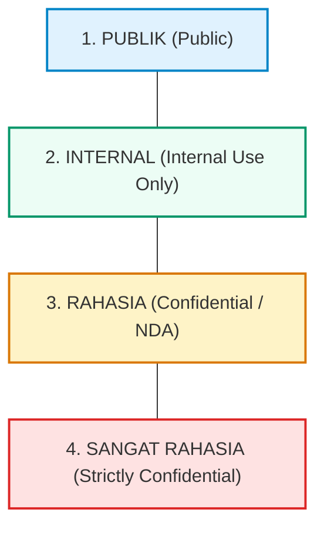

# KSDAS IT DEL - DATA SECURITY, PRIVACY & GOVERNANCE POLICY

**Sistem Informasi Kerja Sama & Analitik Data (KSDAS)**  
**Institut Teknologi Del, Sitoluama, Laguboti, Kabupaten Toba**  
**Versi:** 0.2.0  
**Klasifikasi:** Dokumen Kebijakan & Rujukan Teknis Keamanan  

---

## 1. PENDAHULUAN & LANDASAN HUKUM

Pengelolaan naskah kerja sama dan kemitraan di lingkungan perguruan tinggi melibatkan pertukaran informasi hukum, komitmen keuangan, hak kekayaan intelektual (HAKI), serta data identitas penandatangan. Sistem KSDAS IT Del tunduk pada prinsip keamanan informasi dan peraturan perundang-undangan:

1. **Undang-Undang Republik Indonesia Nomor 27 Tahun 2022 tentang Perlindungan Data Pribadi (UU PDP);**
2. **Undang-Undang Republik Indonesia Nomor 11 Tahun 2008 / UU No. 1 Tahun 2024 tentang Informasi dan Transaksi Elektronik (UU ITE);**
3. **Peraturan dan Standar Sistem Manajemen Mutu Institut Teknologi Del (SPM IT Del);**
4. **Standar Keamanan Siber Direktorat Sistem & Data Informasi (SDI / TSI IT Del).**

---

## 2. KLASIFIKASI KEAMANAN DATA KEMITRAAN

Seluruh data di dalam KSDAS dikelompokkan ke dalam 4 tingkatan klasifikasi:



| Tingkat Klasifikasi | Contoh Objek Data | Batasan Hak Akses | Kebijakan Penyimpanan |
| :--- | :--- | :--- | :--- |
| **1. PUBLIK** | Nama mitra resmi, judul nota kesepahaman (MoU payung), foto kegiatan seremonial, rekapitulasi jumlah kerjasama di website publik IT Del. | Semua civitas akademika dan masyarakat umum. | Server publik / GitHub Pages / Portal Del. |
| **2. INTERNAL** | Rekapitulasi anggaran agregat, statistik per prodi/fakultas, evaluasi capaian IKU, dokumen pemetaan akreditasi BAN-PT/LAM. | Dosen, Dekan, Kaprodi, Auditor Mutu SPM IT Del. | Intranet kampus / Akun terotentikasi SSO Del. |
| **3. RAHASIA** | Naskah Perjanjian Kerja Sama (PKS) terperinci, dokumen Hak Cipta/Paten bersama, rincian biaya operasional hibah riset, draft naskah sebelum pengesahan. | Unit Kerja Sama, Kepala Biro, Wakil Rektor III, Rektor. | Basis data terenkripsi (AES-256) dengan pembatasan hak unduh berkas. |
| **4. SANGAT RAHASIA** | Naskah terikat klausul kerahasiaan ketat (*Non-Disclosure Agreement / NDA*), data pribadi penandatangan (NIK, kontak pribadi, nomor rekening), rahasia dagang mitra industri. | Pejabat berwenang tingkat Rektorat & Legal Officer. | *Air-gapped* atau penyimpanan privat terisolasi dengan akses biometrik/MFA. |

---

## 3. KEAMANAN DATA PADA PROTOTYPE GITHUB PAGES (FASE POC)

Pada tahap pembuktian konsep (*Proof-of-Concept*) saat ini yang berjalan di GitHub Pages:

### A. Penggunaan Data Sintetis (Synthetic Demo Data)
- **Status Data:** Seluruh berkas naskah, nomor dokumen, nama pejabat mitra, alamat email, dan nomor telepon yang disajikan di dalam repositori publik ini adalah **data sintetis simulasi**.
- **Kepatuhan UU PDP:** Tidak ada naskah berklausul NDA nyata atau data pribadi rahasia civitas akademika yang disimpan di repositori publik.

### B. Pencegahan Cross-Site Scripting (DOM XSS)
- Seluruh input pengguna, teks naskah hasil ekstraksi, dan nama berkas yang dirender ke tampilan HTML wajib melalui fungsi sanitasi:
  ```javascript
  escapeHtml(str) {
    return String(str)
      .replace(/&/g, "&amp;")
      .replace(/</g, "&lt;")
      .replace(/>/g, "&gt;")
      .replace(/"/g, "&quot;")
      .replace(/'/g, "&#039;");
  }
  ```

### C. Kebijakan Keamanan Konten (Content Security Policy - CSP)
Header CSP aktif di dalam `<head>` file `index.html` membatasi eksekusi skrip hanya dari sumber lokal (*self*) dan CDN terverifikasi:
```html
<meta http-equiv="Content-Security-Policy" content="default-src 'self'; script-src 'self' 'unsafe-inline' https://cdn.jsdelivr.net; style-src 'self' 'unsafe-inline' https://fonts.googleapis.com; font-src 'self' https://fonts.gstatic.com; img-src 'self' data: https:; connect-src 'self' https:;">
```

### D. Validasi Berkas Unggahan
- Sistem hanya mengizinkan berkas dengan ekstensi `.pdf`, `.docx`, dan `.doc`.
- Berkas berpotensi berbahaya (seperti `.exe`, `.bat`, `.cmd`, `.sh`, `.php`, `.js`, `.vbs`) otomatis **ditolak** oleh fungsi `handleFilesSelected()`.
- Ukuran berkas dibatasi maksimum 25 MB per naskah.

### E. Penanganan Kapasitas Penyimpanan Lokal
- Operasi penyimpanan `localStorage.setItem` dilindungi oleh penanganan eksepsi `QuotaExceededError` agar browser pengguna tidak macet saat data melebihi batas kuota.

---

## 4. SPESIFIKASI KEAMANAN PRODUKSI UNTUK TIM SDI / TSI / DUKTEK

Ketika sistem dialihkan ke server produksi kampus IT Del, Direktorat SDI / TSI wajib mengimplementasikan standar keamanan berikut:

### 1. Transport Layer Security (TLS 1.3)
Seluruh lalu lintas data antara peramban pengguna dan server API wajib dienkripsi menggunakan HTTPS dengan protokol TLS 1.3 dan sertifikat SSL institusi yang valid (*del.ac.id*).

### 2. Autentikasi Terpusat (Central SSO & MFA)
- Mengganti mekanisme pemilihan peran demo dengan **Single Sign-On (SSO) IT Del** berbasis OAuth2 / OpenID Connect.
- Pengguna dengan peran otoritas tinggi (*WR3, Kepala Biro, Admin Unit Kerja Sama*) wajib mengaktifkan *Multi-Factor Authentication (MFA)*.

### 3. Enkripsi Data Saat Istirahat (Encryption at Rest - AES-256)
- **Database Relasional:** PostgreSQL dikonfigurasi dengan enkripsi tablespace atau disk encryption (LUKS / BitLocker).
- **Object Storage (MinIO / S3):** Mengaktifkan *Server-Side Encryption* dengan algoritma AES-256 (SSE-S3). Berkas naskah perjanjian disimpan dengan nama berkas acak (UUID v4) untuk mencegah *path traversal*.

### 4. Pemindaian Antivirus & Malware Otomatis
Setiap berkas PDF atau DOCX yang diunggah wajib melewati pemindaian *antivirus engine* (misal: ClamAV Daemon) sebelum dipindahkan ke penyimpanan permanen.

### 5. Audit Trail Mutlak & Integritas Rekam Jejak
Setiap aksi pengubahan naskah, validasi data, koreksi, pengunduhan berkas rahasia, dan ekspor data wajib dicatat pada tabel `audit_logs` yang tidak dapat dihapus (*append-only log*).

---

## 5. PANDUAN MANUAL BAGI PENGGUNA (ACTION CHECKLIST)

Berikut adalah langkah-langkah pendukung keamanan yang perlu diperhatikan oleh pemilik akun:

### ✅ Langkah 1: Evaluasi Visibilitas Repositori (Public vs Private)
* **Kondisi Saat Ini:** Repositori berstatus **Public** agar fitur GitHub Pages dapat diakses secara instan dan gratis tanpa batasan GitHub Pro.
* **Tindakan Anda:**
  * Jika repositori ini hanya digunakan sebagai **Proof-of-Concept & Demo Kode**, biarkan berstatus Public karena seluruh data di dalamnya adalah data sintetis aman.
  * Jika di masa mendatang Anda ingin memasukkan **data naskah asli kampus Del yang belum dipublikasikan**, Anda dapat mengubah visibilitas repositori menjadi **Private** melalui:  
    `GitHub Repo Settings` &rarr; `General` &rarr; gulir ke bawah ke `Danger Zone` &rarr; klik `Change repository visibility` &rarr; pilih `Make private`.  
    *(Catatan: Untuk GitHub Pages pada repository private memerlukan akun GitHub Pro / Team / Enterprise).*

### ✅ Langkah 2: Aktifkan Perlindungan Branch (Branch Protection Rule)
Untuk mencegah perubahan kode yang tidak disengaja atau *force-push* langsung ke branch utama:
1. Buka halaman repository: [https://github.com/samuelhtampubolon/ksdas-itdel/settings/branches](https://github.com/samuelhtampubolon/ksdas-itdel/settings/branches)
2. Klik tombol **"Add branch protection rule"**.
3. Pada kolom *Branch name pattern*, ketik: `main`.
4. Centang opsi:
   - `Require a pull request before merging`
   - `Require status checks to pass before merging`
5. Klik **"Create"** untuk menyimpan.

### ✅ Langkah 3: Aktifkan Fitur Keamanan GitHub (Code Security)
1. Buka [https://github.com/samuelhtampubolon/ksdas-itdel/settings/security_analysis](https://github.com/samuelhtampubolon/ksdas-itdel/settings/security_analysis)
2. Pastikan fitur berikut aktif:
   - **Dependabot alerts:** Mendeteksi kerentanan pada library pihak ketiga.
   - **Dependabot security updates:** Membuat PR otomatis saat ada perbaikan keamanan.
   - **Secret scanning:** Mendeteksi jika ada token atau API key yang tidak sengaja terdorong.

### ✅ Langkah 4: Penanganan Dokumen Asli IT Del & Rekrutmen Mitra
* Jangan pernah melakukan *commit* berkas PDF asli naskah kerja sama yang memuat klausul rahasia atau tanda tangan basah pejabat tinggi langsung ke git repository publik.
* Untuk data asli, gunakan modul **JSON Import / Export** secara lokal di peramban Anda atau serahkan skrip database PostgreSQL ke tim SDI/TSI untuk dipasang di intranet kampus.

---

## 6. PROSEDUR PELAPORAN INSIDEN KEAMANAN

Bila ditemukan potensi celah keamanan atau paparan data yang tidak diharapkan, laporkan segera ke:
* **Unit Kerja Sama IT Del:** `kemitraan@del.ac.id`
* **Direktorat SDI / TSI IT Del:** `sdi@del.ac.id`
* **Helpdesk Kampus:** Institut Teknologi Del, Sitoluama, Laguboti.
