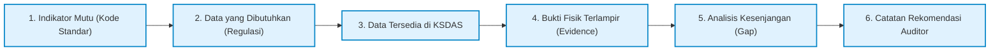

> **Catatan 3 Oktober 2026.** Naskah di bawah ini dari rancangan sebelumnya. Yang berlaku sekarang tidak memakai AI, ML, atau OCR. Ikuti README serta `PANDUAN_UJI_COBA_DOKUMEN_LOKAL.md`, `PANDUAN_DELIVERY_DEPLOYMENT.md`, dan `PANDUAN_INTEGRASI_SDI_TSI.md`.

# KSDAS IT DEL &bull; PEDOMAN PENJAMINAN MUTU, AUDIT MUTU INTERNAL (AMI), AKREDITASI BAN-PT / LAM-INFOKOM, DAN TATA KELOLA BIRO KERJA SAMA
**Berdasarkan Regulasi Terkini Republik Indonesia: Permendikbudristek No. 53 Tahun 2023 & IKU 6 Kemendikbudristek**

---

**Sistem:** Kerja Sama Data & Analytics System (KSDAS)  
**Institusi:** Institut Teknologi Del (IT Del), Sitoluama, Laguboti, Kabupaten Toba, Sumatera Utara  
**Author & Solution Architect:** Samuel Hasudungan Tampubolon  
**Copyright:** Copyright &copy; 2026 Samuel Hasudungan Tampubolon. All rights reserved.  
**Versi:** 0.3.0  
**Klasifikasi Dokumen:** Pedoman Tata Kelola Mutu, Kemitraan, & Rujukan Audit Institusi  
**Pemangku Kepentingan:** Satuan Penjaminan Mutu (SPM), Auditor AMI, Asesor BAN-PT / LAM-INFOKOM, Biro Kerja Sama & Kemitraan, Wakil Rektor III, dan Dekanat/Kaprodi IT Del.

---

## 1. LANDASAN HUKUM & REGULASI NASIONAL TERBARU REPUBLIK INDONESIA

Pengembangan dan pengoperasian modul Penjaminan Mutu & Kemitraan pada KSDAS IT Del diselaraskan secara ketat dengan hierarki perundang-undangan dan standar pendidikan tinggi Indonesia yang paling mutakhir:

1. **Undang-Undang Republik Indonesia Nomor 12 Tahun 2012 tentang Pendidikan Tinggi**  
   Pasal 51–53 mewajibkan perguruan tinggi menyelenggarakan Sistem Penjaminan Mutu Internal (SPMI) dan Sistem Penjaminan Mutu Eksternal (SPME / Akreditasi) untuk menjamin tercapainya Tri Dharma Perguruan Tinggi.
2. **Permendikbudristek Nomor 53 Tahun 2023 tentang Penjaminan Mutu Pendidikan Tinggi**  
   *Regulasi nasional terbaru* yang mereformasi Standar Nasional Pendidikan Tinggi (SN-Dikti):
   - Mengintegrasikan standar luaran, standar proses, dan standar masukan menjadi kerangka penjaminan mutu yang fleksibel dan berorientasi pada capaian nyata (*outcome-based education*).
   - Menyederhanakan pelaporan dan menuntut otomatisasi pangkalan data terintegrasi (PDDikti) tanpa duplikasi administratif.
   - Mengharuskan bukti kemitraan Tri Dharma yang berdampak langsung terhadap kompetensi lulusan dan pemecahan masalah masyarakat.
3. **Kepmendikbudristek Nomor 210/M/2023 tentang Indikator Kinerja Utama (IKU) Perguruan Tinggi**  
   - **IKU 6 (Sasaran Strategis Kemitraan):** *"Persentase program studi yang melaksanakan kerja sama dengan mitra kelas dunia"*.
   - Standar mitra diakui: Perusahaan multinasional, perusahaan nasional terbuka/terkemuka, BUMN/BUMD, perguruan tinggi peringkat Top 500 QS World University Rankings, organisasi nirlaba internasional, lembaga riset bereputasi, dan instansi pemerintah.
   - Standar luaran kerja sama: Pengembangan kurikulum bersama, magang bersertifikat minimal 1 semester, dosen praktisi mengajar, riset kolaboratif terpublikasi, serta penyerapan lulusan kerja sama.
4. **Peraturan Badan Akreditasi Nasional Perguruan Tinggi (BAN-PT) Nomor 1 Tahun 2022**  
   Instrumen Akreditasi Program Studi (IAPS 4.0) dan Akreditasi Perguruan Tinggi (IAPT 3.0) berbasis 9 Kriteria, khususnya Kriteria 1 (Tata Kelola & Kerjasama), Kriteria 6 (Pendidikan), Kriteria 7 (Penelitian), Kriteria 8 (Pengabdian kepada Masyarakat), dan Kriteria 9 (Luaran & Capaian).
5. **Peraturan Lembaga Akreditasi Mandiri Informatika dan Komputer (LAM-INFOKOM)**  
   Instrumen Akreditasi khusus rumpun informatika/komputer untuk program studi di lingkungan FITE IT Del (Informatika, Sistem Informasi, Teknik Komputer, Manajemen Informatika, Teknologi Komputer).
6. **Undang-Undang Republik Indonesia Nomor 27 Tahun 2022 tentang Perlindungan Data Pribadi (UU PDP)**  
   Menjamin data pribadi penandatangan naskah, PIC kemitraan, rekening, dan naskah bertanda tangan terlindungi dari kebocoran dan penyalahgunaan.

---

## 2. KEBUTUHAN SATUAN PENJAMINAN MUTU (SPM) IT DEL

Satuan Penjaminan Mutu (SPM) IT Del bertindak sebagai pengawal siklus SPMI berbasis **PPEPP**:
- **P**enetapan Standar Kerja Sama & Kemitraan Kampus.
- **P**elaksanaan Kerja Sama oleh Prodi/Fakultas/Biro.
- **E**valuasi Pelaksanaan Kerja Sama (melalui AMI dan KSDAS).
- **P**engendalian Pelaksanaan Kerja Sama (analisis gap & tindak lanjut).
- **P**eningkatan Standar Kerja Sama secara berkelanjutan.

### 2.1 Prinsip Mutu Mutlak: *"No Pseudo-Compliance"*
> [!IMPORTANT]
> **KSDAS menegakkan prinsip fundamental:** *"Do not infer institutional compliance merely from the existence of a file."*  
> Keberadaan sebuah berkas PDF MoU di repositori **tidak secara otomatis membuktikan kepatuhan mutu**. Dokumen naskah yang berstatus sah harus memenuhi 5 uji kepatuhan:
> 1. **Legalitas Formal:** Naskah berstatus `VALIDATED` oleh verifikator resmi, ditandatangani pejabat berwenang, dan memiliki masa berlaku yang masih aktif.
> 2. **Keterkaitan Dokumen (*Traceable Hierarchy*):** MoU payung harus memiliki Perjanjian Kerja Sama (PKS) operasional, dan PKS harus memiliki *Implementation Arrangement* (IA) spesifik per program studi.
> 3. **Realisasi Kegiatan Riil (*Actual Execution*):** Terdata aktivitas Tri Dharma riil (misal: kuliah tamu 16 sesi, magang 20 mahasiswa, atau hibah riset bersama).
> 4. **Ketersediaan Bukti Fisik Terverifikasi (*Verified Evidence*):** Terdapat berkas portofolio fisik (LPJ kegiatan, daftar hadir mahasiswa, sertifikat kelulusan industri, SK Dosen praktisi, laporan keuangan).
> 5. **Evaluasi Kepuasan Mitra (*Partner Satisfaction Evaluation*):** Terdapat kuesioner atau berita acara evaluasi pelaksanaan dari pihak mitra untuk mengukur mutu kemitraan.

---

## 3. SPESIFIKASI WORKSPACE AUDIT MUTU INTERNAL (AMI)

Workspace Audit Mutu Internal (AMI) pada menu antarmuka KSDAS dirancang khusus agar Auditor Internal Kampus dan SPM dapat melakukan evaluasi tanpa membuka berkas fisik lemari arsip secara manual.

### 3.1 Struktur Data Evaluasi AMI
Setiap baris indikator evaluasi menyajikan informasi komprehensif:



| Atribut Kolom AMI | Deskripsi Fungsional & Kriteria Penerimaan |
| :--- | :--- |
| **Indikator & Kode** | Kode standar SPMI / BAN-PT / LAM-INFOKOM (Contoh: `LAM-INFOKOM C.1.4.a`, `BAN-PT C.7.a`, `IKU-6`). |
| **Kriteria Standar** | Rumpun kriteria (Tata Pamong, Pendidikan, Penelitian, Pengabdian, Luaran). |
| **Data yang Dibutuhkan** | Persyaratan regulasi (Contoh: *"Minimal 3 PKS aktif bidang sertifikasi internasional per program studi"*). |
| **Data Tersedia** | Jumlah naskah tervalidasi yang cocok dengan indikator pada basis data KSDAS. |
| **Bukti Fisik (Evidence)** | Tautan langsung ke berkas pendukung (LPJ, sertifikat, SK praktisi) yang dapat diunduh auditor. |
| **Terakhir Diperbarui** | Cap waktu (*timestamp*) dan verifikator terakhir yang memvalidasi bukti. |
| **Status Kepatuhan** | Pilihan status terstandarisasi: `MEMENUHI (Compliant)`, `BELUM LENGKAP (Incomplete Evidence)`, `TERDAPAT CELAH (Gap Identified)`, `KEDALUWARSA (Expired)`. |
| **Celah Mutu (Gap Analysis)** | Kesenjangan antara target institusi dan data riil (Contoh: *"Kurang 1 bukti LPJ serah terima sertifikat Huawei"*). |
| **Catatan Rekomendasi Auditor** | Rekomendasi perbaikan untuk Kaprodi / Kepala Biro Kerja Sama sebelum audit eksternal. |

---

## 4. PEMETAAN INSTRUMEN AKREDITASI BAN-PT & LAM-INFOKOM

KSDAS secara bawaan memetakan seluruh naskah kemitraan IT Del ke dalam matriks instrumen akreditasi nasional tanpa *hardcoding*:

### 4.1 Matriks Pemetaan Kriteria BAN-PT (IAPS 4.0 / IAPT 3.0)

| Kode Kriteria | Nama Kriteria Akreditasi | Objek Data KSDAS yang Terpetakan | Bukti Fisik Wajib (*Mandatory Evidence*) |
| :---: | :--- | :--- | :--- |
| **C.1.b** | **Kerja Sama Perguruan Tinggi** | Seluruh MoU, PKS, dan IA aktif tingkat institusi dengan mitra dalam dan luar negeri. | Naskah MoU sah, legalitas mitra, struktur tim kerja sama, evaluasi berkala kepuasan mitra. |
| **C.6.a** | **Pendidikan: Kurikulum & Praktisi** | PKS magang MBKM industri, SK Dosen praktisi industri (Huawei, Microsoft, Astra). | Silabus mata kuliah industri, SK Mengajar dosen tamu, presensi kuliah tamu, nilai mahasiswa. |
| **C.6.b** | **Pendidikan: Sertifikasi Mahasiswa** | IA program akademi industri (Huawei ICT Academy, Microsoft Learn for Educators). | Daftar peserta sertifikasi, rekapitulasi kelulusan voucher, salinan sertifikat kompetensi internasional. |
| **C.7.a** | **Penelitian Bersama Mitra** | PKS riset kolaboratif dengan industri/universitas mitra (ITB, UI, Astra, PT Telkom). | Proposal bersama, MoU pembagian HAKI, laporan kemajuan hibah riset, artikel jurnal bersama. |
| **C.8.a** | **Pengabdian kepada Masyarakat (PkM)** | PKS program pendampingan masyarakat dengan Pemkab Toba / Pemprov Sumut / Desa Lingkar Kampus. | Proposal kegiatan PkM, dokumentasi fisik (foto/video), daftar penerima manfaat, surat apresiasi kepala desa. |
| **C.9.a** | **Luaran & Kinerja Kemitraan** | Laporan akhir (LPJ), penyerapan lulusan IT Del oleh mitra kerja sama, royalti paten/lisensi. | Surat penerimaan kerja lulusan, rekapitulasi dana hibah yang terserap, bukti setoran PNBP/rekening kampus. |

### 4.2 Matriks Pemetaan Khusus LAM-INFOKOM (FITE IT Del)

| Kode LAM | Indikator Mutu Informatika | Contoh Dokumen Riil di KSDAS | Target Capaian SPM IT Del |
| :---: | :--- | :--- | :---: |
| **C.1.4.a** | Kerja Sama Bidang Pendidikan & Sertifikasi Kompetensi Internasional | PKS Huawei Academy (`013/ITDel/PKS-FITE/IV/2024`), PKS Microsoft Learn (`028/ITDel/PKS-FITE/X/2025`). | Minimal $\ge 5$ sertifikasi internasional aktif / prodi. Skor Target: **4.0 (Unggul)**. |
| **C.1.4.b** | Kerja Sama Internasional Aktif Bereputasi Global | IA NUS Singapore STEER Program (`005/ITDel/IA/FTI-STEER/I/2026`). | Minimal $\ge 2$ kegiatan pertukaran mahasiswa luar negeri aktif. Skor Target: **3.5**. |
| **C.7** | Riset Terapan & Inovasi Perangkat Lunak bersama Industri ICT | PKS Riset Edge AI Astra (`045/ITDel/PKS-RND/VI/2025`), Hibah IoT Pemkab Toba. | Publikasi jurnal terindeks Scopus/Sinta 2 atau Paten Terdaftar. Skor Target: **3.5**. |

---

## 5. KEBUTUHAN UNIT KERJASAMA & KEMITRAAN (BIRO KERJA SAMA IT DEL)

Biro Kerja Sama & Kemitraan memikul tanggung jawab operasional sehari-hari dalam membina jejaring kerja sama kampus. KSDAS memfasilitasi kebutuhan inti biro sebagai berikut:

### 5.1 Tata Kelola Hirarki Naskah Perjanjian (*Document Lineage*)
Biro Kerja Sama wajib menjaga konsistensi naskah agar tidak terjadi *"perjanjian liar"* yang tidak berpayung hukum:
- **Level 1 (MoU / LOI):** Payung hukum antar pimpinan lembaga (Rektor IT Del $\leftrightarrow$ Direktur Utama Mitra). Berisi komitmen makro tanpa implikasi keuangan detail.
- **Level 2 (PKS / MoA):** Perjanjian operasional tingkat Fakultas/Biro (Dekan $\leftrightarrow$ General Manager). Mengatur ruang lingkup Tri Dharma, alokasi anggaran, dan jangka waktu definitif.
- **Level 3 (Implementation Arrangement / IA):** Naskah rincian teknis pelaksanaan per Program Studi / Dosen (Kaprodi / PIC $\leftrightarrow$ Manajer Teknis).
- **Level 4 (Proposal & Laporan Akhir / LPJ):** Dokumen perencanaan dan pertanggungjawaban kegiatan nyata di lapangan.

### 5.2 Sistem Deteksi Naskah Yatim (*Orphan Contract Detection*)
- KSDAS secara otomatis memindai naskah PKS atau IA yang **tidak memiliki naskah induk (`parentId == null`)**.
- Staf Unit Kerja Sama diberikan peringatan visual khusus (*badge flag "Orphan"* berwarna oranye) dan modal pertautan satu klik (`ksdasApp.openLinkParentModal(docId)`) untuk menghubungkan naskah turunan ke dokumen payungnya.

### 5.3 Sistem Peringatan Dini Masa Kedaluwarsa (*Early Warning System*)
Mencegah terjadinya kekosongan hukum (*legal vacuum*) dalam kegiatan magang mahasiswa atau riset yang sedang berjalan:
- 🟡 **Peringatan Waspada (< 90 Hari):** Tampil pada bilah atas dashboard eksekutif dan memicu tugas penyiapan perpanjangan kerja sama (*adendum/renewal*).
- 🔴 **Peringatan Kritis (< 30 Hari):** Notifikasi prioritas tinggi kepada Staf Kerja Sama dan Dekan terkait untuk finalisasi penandatanganan perpanjangan naskah.
- ⚫ **Status Kedaluwarsa (Expired):** Sistem otomatis mengubah status menjadi `EXPIRED` dan mengeluarkan dokumen dari hitungan kemitraan aktif IKU 6.

### 5.4 Rekapitulasi Realisasi Anggaran (*Budget Tracking: Cash & In-Kind*)
- KSDAS mencatat alokasi anggaran kemitraan, baik berupa dana tunai (*cash grant*) maupun fasilitas/perangkat (*in-kind value*, seperti voucher sertifikasi, server AI, lisensi cloud).
- Laporan realisasi dapat diekspor secara instan untuk kebutuhan Laporan Kinerja Tahunan Rektor dan Pemeriksaan Satuan Pengawas Internal (SPI).

---

## 6. STANDARISASI STATUS VALIDASI & SIKLUS PERSETUJUAN

Setiap naskah yang masuk ke KSDAS melalui proses berjenjang yang transparan:

```
[UNGGAH BATCH / MANDIRI]
        │
        ▼
[AI_EXTRACTED] ───────► (Nilai ekstraksi awal oleh parser cerdas & OCR)
        │
        ▼
[NEEDS_REVIEW] ───────► (Confidence score < 85% atau ada inkonsistensi field)
        │
        ▼
[VALIDATED]    ───────► (Diverifikasi staf manusia: nomor, judul, tanggal, mitra sah)
        │
        ▼
[OFFICIAL KSDAS RECORD] ──► (Masuk ke Dashboard Eksekutif, Akreditasi SPM, & IKU 6)
```

1. **AI_EXTRACTED:** Naskah baru selesai diproses oleh OCR/NLP heuristik. Data berstatus draft dan **belum diperhitungkan** pada agregat dashboard resmi.
2. **NEEDS_REVIEW:** Diberikan jika sistem mendeteksi nilai *confidence* ekstraksi rendah atau tanggal naskah mendekati batas kedaluwarsa.
3. **VALIDATED:** Staf Unit Kerja Sama telah memverifikasi kesesuaian antara preview dokumen asli (panel kiri) dan metadata formulir (panel kanan), serta menyetujui data resmi.
4. **REJECTED:** Dokumen ditolak karena duplikasi, salah unggah, atau dokumen tidak relevan.

---

## 7. CHECKLIST KESIAPAN AUDIT SPM & AKREDITASI KAMPUS

Sebelum pelaksanaan Audit Mutu Internal (AMI) atau asesmen lapangan oleh asesor BAN-PT / LAM-INFOKOM, Unit Kerja Sama bersama tim SPM wajib memeriksa checklist berikut:

- [ ] **MUTU-01:** Seluruh MoU yang berstatus `ACTIVE` memiliki minimal 1 naskah turunan PKS atau IA yang masih aktif.
- [ ] **MUTU-02:** Tidak ada naskah PKS atau IA berkategori *Orphan* yang belum terhubung ke mitra resmi.
- [ ] **MUTU-03:** Seluruh naskah mitra kelas dunia (Huawei, Microsoft, Astra, Pemkab Toba) memiliki bukti fisik (*evidence*) LPJ yang dapat diakses tautannya.
- [ ] **MUTU-04:** Masa berlaku seluruh naskah terverifikasi valid secara logika: $\text{Effective End Date} \ge \text{Signed Date}$.
- [ ] **MUTU-05:** Kuesioner evaluasi kepuasan mitra telah diisi minimal 80% dari mitra aktif semester berjalan.
- [ ] **MUTU-06:** Data rekapitulasi kerja sama per prodi selaras dengan data yang dilaporkan pada PDDikti Feeder institusi.
- [ ] **MUTU-07:** Ekspor berkas laporan komprehensif PDF/Excel telah ditinjau dan disahkan oleh Kepala Biro Kerja Sama dan Wakil Rektor III.

---

## 8. KESIMPULAN & JAMINAN AKUNTABILITAS

Modul SPM, AMI, dan Akreditasi pada KSDAS IT Del telah memenuhi standar tertinggi regulasi pendidikan tinggi Indonesia:
- **Sesuai Regulasi:** Patuh penuh pada Permendikbudristek No. 53 Tahun 2023, IKU 6, Standar BAN-PT 9 Kriteria, dan LAM-INFOKOM.
- **Transparan & Akuntabel:** Menjamin tidak ada klaim mutu tanpa bukti fisik (*evidence-backed reporting*).
- **Meringankan Beban Biro:** Mengotomatiskan penelusuran naskah, perhitungan agregat, dan peringatan kedaluwarsa sehingga staf fokus pada pembinaan kemitraan strategis kampus.

---
*Dokumen resmi ini merupakan rujukan operasional penjaminan mutu dan audit sistem KSDAS Institut Teknologi Del Versi 0.3.0.*
